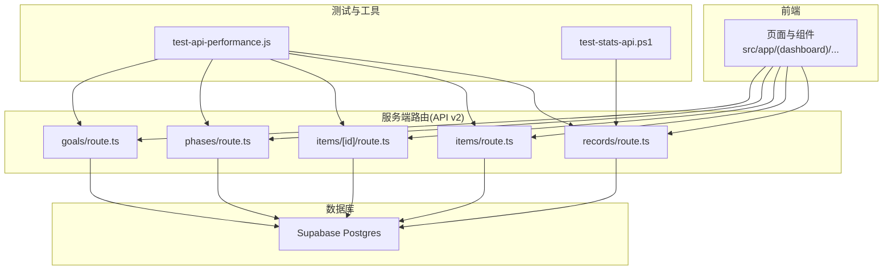
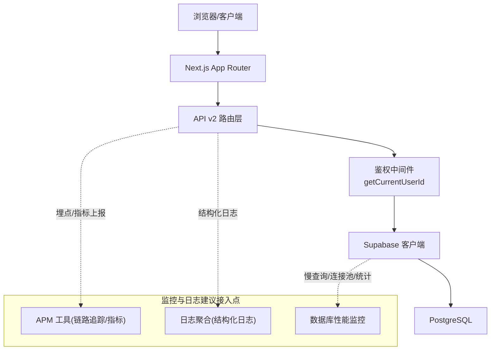
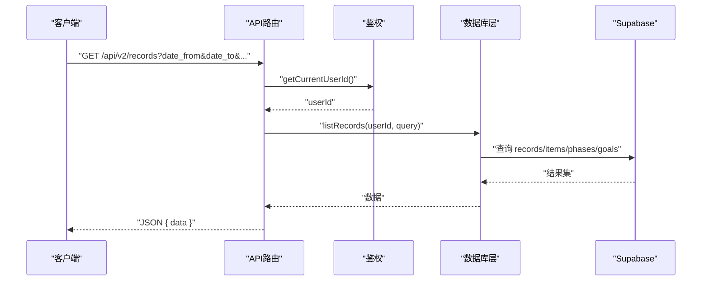
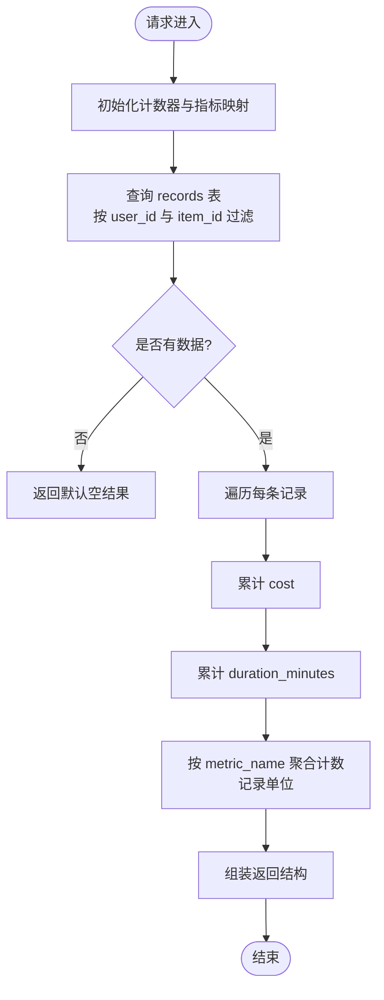
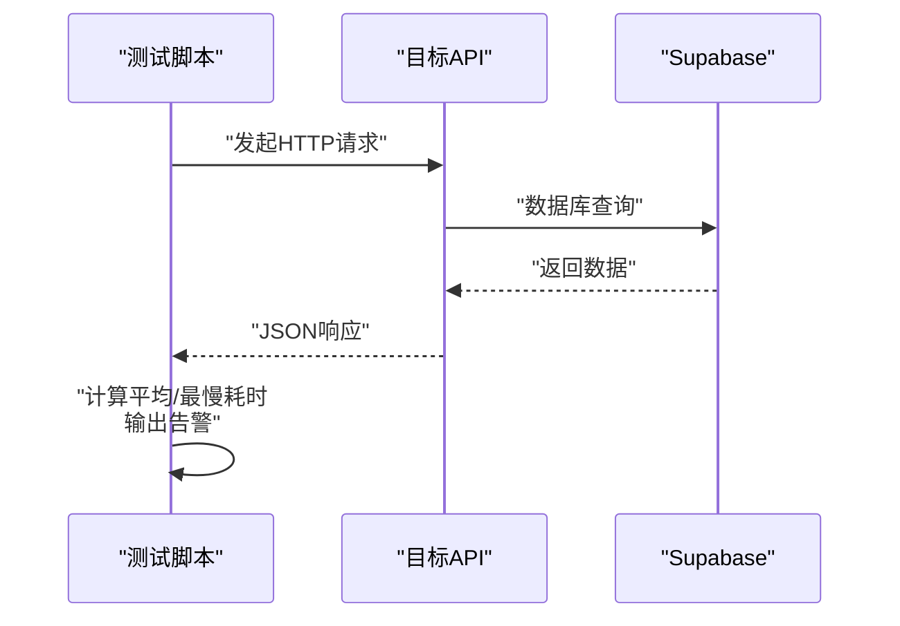
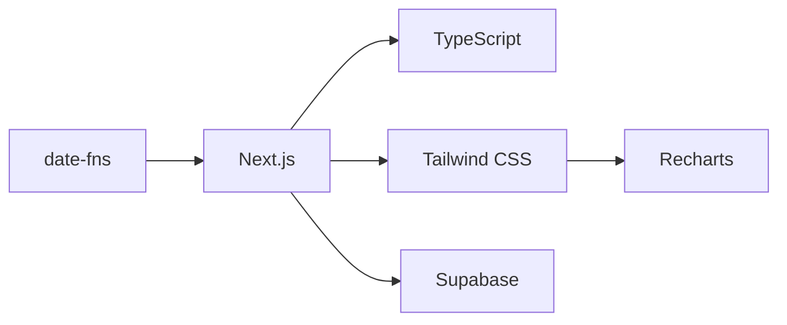

# 监控与日志

<cite>
**本文引用的文件**
- [README.md](file://README.md)
- [package.json](file://package.json)
- [next.config.js](file://next.config.js)
- [src/app/api/v2/records/route.ts](file://src/app/api/v2/records/route.ts)
- [src/app/api/v2/items/route.ts](file://src/app/api/v2/items/route.ts)
- [src/app/api/v2/items/[id]/route.ts](file://src/app/api/v2/items/[id]/route.ts)
- [src/app/api/v2/phases/route.ts](file://src/app/api/v2/phases/route.ts)
- [src/app/api/v2/goals/route.ts](file://src/app/api/v2/goals/route.ts)
- [test/scripts/test-api-performance.js](file://test/scripts/test-api-performance.js)
- [test/scripts/test-stats-api.ps1](file://test/scripts/test-stats-api.ps1)
</cite>

## 目录
1. [简介](#简介)
2. [项目结构](#项目结构)
3. [核心组件](#核心组件)
4. [架构总览](#架构总览)
5. [详细组件分析](#详细组件分析)
6. [依赖关系分析](#依赖关系分析)
7. [性能考虑](#性能考虑)
8. [故障排查指南](#故障排查指南)
9. [结论](#结论)
10. [附录](#附录)

## 简介
本指南面向TETO项目的运维与开发团队，提供一套完整的监控与日志管理方案，覆盖应用性能监控（APM）、日志采集与分析、数据库性能监控、API响应时间与用户体验监控、健康检查与可用性监控、容量规划建议以及故障排查与实时定位方法。文档以现有代码库为基础，结合Next.js与Supabase的技术栈特性，给出可落地的实践建议。

## 项目结构
TETO采用Next.js App Router组织前端与服务端路由，API v2位于src/app/api/v2下，围绕records、items、phases、goals等资源提供REST风格接口；测试脚本位于test/scripts中，用于性能与响应验证；README与package.json提供了技术栈与环境变量说明；next.config.js定义了开发时允许的来源列表。

图示来源
- [src/app/api/v2/records/route.ts:1-86](file://src/app/api/v2/records/route.ts#L1-L86)
- [src/app/api/v2/items/route.ts:1-47](file://src/app/api/v2/items/route.ts#L1-L47)
- [src/app/api/v2/items/[id]/route.ts](file://src/app/api/v2/items/[id]/route.ts#L103-L210)
- [src/app/api/v2/phases/route.ts:1-72](file://src/app/api/v2/phases/route.ts#L1-L72)
- [src/app/api/v2/goals/route.ts:1-49](file://src/app/api/v2/goals/route.ts#L1-L49)
- [test/scripts/test-api-performance.js:46-82](file://test/scripts/test-api-performance.js#L46-L82)
- [test/scripts/test-stats-api.ps1:1-15](file://test/scripts/test-stats-api.ps1#L1-L15)

章节来源
- [README.md:1-126](file://README.md#L1-L126)
- [package.json:1-44](file://package.json#L1-L44)
- [next.config.js:1-4](file://next.config.js#L1-L4)

## 核心组件
- API v2路由层：统一处理鉴权、参数解析、调用数据库层、返回标准化响应，并对认证异常进行分类处理。
- 数据库层：通过Supabase客户端访问PostgreSQL，实现记录、事项、阶段、目标等资源的增删查改。
- 测试脚本：提供API性能测试与响应验证能力，便于基准测试与回归验证。
- 日志与监控：当前代码库未内置APM或集中式日志采集，建议在生产环境引入外部监控平台与日志聚合系统。

章节来源
- [src/app/api/v2/records/route.ts:1-86](file://src/app/api/v2/records/route.ts#L1-L86)
- [src/app/api/v2/items/route.ts:1-47](file://src/app/api/v2/items/route.ts#L1-L47)
- [src/app/api/v2/items/[id]/route.ts](file://src/app/api/v2/items/[id]/route.ts#L103-L210)
- [src/app/api/v2/phases/route.ts:1-72](file://src/app/api/v2/phases/route.ts#L1-L72)
- [src/app/api/v2/goals/route.ts:1-49](file://src/app/api/v2/goals/route.ts#L1-L49)
- [test/scripts/test-api-performance.js:46-82](file://test/scripts/test-api-performance.js#L46-L82)
- [test/scripts/test-stats-api.ps1:1-15](file://test/scripts/test-stats-api.ps1#L1-L15)

## 架构总览
下图展示从前端到API、数据库与测试工具的整体交互路径，以及监控与日志的建议接入点。

图示来源
- [src/app/api/v2/records/route.ts:1-86](file://src/app/api/v2/records/route.ts#L1-L86)
- [src/app/api/v2/items/route.ts:1-47](file://src/app/api/v2/items/route.ts#L1-L47)
- [src/app/api/v2/items/[id]/route.ts](file://src/app/api/v2/items/[id]/route.ts#L103-L210)
- [src/app/api/v2/phases/route.ts:1-72](file://src/app/api/v2/phases/route.ts#L1-L72)
- [src/app/api/v2/goals/route.ts:1-49](file://src/app/api/v2/goals/route.ts#L1-L49)

## 详细组件分析

### API v2 路由层（通用模式）
- 鉴权：统一通过getCurrentUserId获取当前用户ID，未登录时返回401。
- 参数解析：从URL查询参数构造查询对象，支持日期范围、状态、是否置顶、是否加星、搜索关键词、限制数量等。
- 数据访问：调用对应数据库层函数（如listRecords、createRecord等），并在POST场景校验资源归属。
- 错误处理：区分认证错误与服务器错误，返回标准化错误响应。

图示来源
- [src/app/api/v2/records/route.ts:1-86](file://src/app/api/v2/records/route.ts#L1-L86)
- [src/app/api/v2/items/route.ts:1-47](file://src/app/api/v2/items/route.ts#L1-L47)
- [src/app/api/v2/phases/route.ts:1-72](file://src/app/api/v2/phases/route.ts#L1-L72)
- [src/app/api/v2/goals/route.ts:1-49](file://src/app/api/v2/goals/route.ts#L1-L49)

章节来源
- [src/app/api/v2/records/route.ts:1-86](file://src/app/api/v2/records/route.ts#L1-L86)
- [src/app/api/v2/items/route.ts:1-47](file://src/app/api/v2/items/route.ts#L1-L47)
- [src/app/api/v2/phases/route.ts:1-72](file://src/app/api/v2/phases/route.ts#L1-L72)
- [src/app/api/v2/goals/route.ts:1-49](file://src/app/api/v2/goals/route.ts#L1-L49)

### 事项维度指标计算（示例：成本、时长、指标汇总）
该接口按事项聚合记录的成本、持续时间与自定义指标，适合用于洞察用户投入与产出。

图示来源
- [src/app/api/v2/items/[id]/route.ts](file://src/app/api/v2/items/[id]/route.ts#L103-L210)

章节来源
- [src/app/api/v2/items/[id]/route.ts](file://src/app/api/v2/items/[id]/route.ts#L103-L210)

### 性能测试与响应验证
- test-api-performance.js：对指定API端点进行多次请求，统计平均耗时与最慢耗时，输出阈值告警提示。
- test-stats-api.ps1：使用PowerShell调用统计API并保存响应，辅助验证返回结构与字段。

图示来源
- [test/scripts/test-api-performance.js:46-82](file://test/scripts/test-api-performance.js#L46-L82)
- [test/scripts/test-stats-api.ps1:1-15](file://test/scripts/test-stats-api.ps1#L1-L15)

章节来源
- [test/scripts/test-api-performance.js:46-82](file://test/scripts/test-api-performance.js#L46-L82)
- [test/scripts/test-stats-api.ps1:1-15](file://test/scripts/test-stats-api.ps1#L1-L15)

## 依赖关系分析
- 技术栈依赖：Next.js、TypeScript、Tailwind CSS、Supabase（认证+PostgreSQL）、Recharts、date-fns。
- 开发配置：允许特定开发来源，便于局域网联调。
- 环境变量：Supabase URL与匿名密钥为必需，开发模式相关变量可选。

图示来源
- [package.json:15-32](file://package.json#L15-L32)
- [next.config.js:1-4](file://next.config.js#L1-L4)
- [README.md:54-62](file://README.md#L54-L62)

章节来源
- [package.json:1-44](file://package.json#L1-L44)
- [next.config.js:1-4](file://next.config.js#L1-L4)
- [README.md:54-62](file://README.md#L54-L62)

## 性能考虑
- API响应时间监控
  - 使用测试脚本定期压测关键端点，建立基线并设定阈值（例如最慢响应超过1000ms/2000ms触发告警）。
  - 将测试结果纳入CI/CD质量门禁，防止性能回退。
- 数据库性能
  - 对高频查询（如按日期范围、按用户过滤）建立索引与物化视图，减少全表扫描。
  - 监控慢查询日志与连接池使用率，识别热点表与瓶颈SQL。
- 前端体验
  - 利用Recharts等可视化库优化图表渲染性能，避免一次性加载过多数据。
  - 对长列表分页与虚拟滚动，降低首屏渲染压力。
- 缓存策略
  - 对静态或低频变更数据启用边缘缓存与浏览器缓存，减轻后端压力。
- 资源与容量规划
  - 基于历史峰值与增长趋势估算数据库容量与并发连接数，预留20%-30%冗余。
  - 观察CPU、内存、网络带宽与I/O使用率，制定扩容预案。

## 故障排查指南
- 常见错误类型与定位
  - 401未授权：确认鉴权中间件是否正确获取用户ID，检查回调与会话状态。
  - 404资源不存在或归属不符：检查资源查询逻辑与外键约束，确保用户仅能访问自身数据。
  - 500服务器错误：捕获异常并记录上下文（请求ID、用户ID、查询参数），结合APM链路追踪定位根因。
- 实时问题定位
  - 使用APM工具查看端到端链路耗时，识别慢点（数据库、序列化、第三方调用）。
  - 在日志聚合平台按时间窗口检索错误堆栈，关联请求ID快速复现。
- 回归验证
  - 使用测试脚本自动化验证关键API的响应时间与结构，发现异常立即告警。
  - 对统计类API使用PowerShell脚本抓取响应并比对字段，确保稳定性。

章节来源
- [src/app/api/v2/records/route.ts:35-41](file://src/app/api/v2/records/route.ts#L35-L41)
- [src/app/api/v2/items/route.ts:39-45](file://src/app/api/v2/items/route.ts#L39-L45)
- [src/app/api/v2/phases/route.ts:64-70](file://src/app/api/v2/phases/route.ts#L64-L70)
- [test/scripts/test-api-performance.js:66-76](file://test/scripts/test-api-performance.js#L66-L76)
- [test/scripts/test-stats-api.ps1:1-15](file://test/scripts/test-stats-api.ps1#L1-L15)

## 结论
TETO当前具备清晰的API边界与基础的性能测试能力，但缺乏统一的APM与日志聚合体系。建议在生产环境引入链路追踪与指标面板、集中式日志收集与检索、数据库性能监控与告警，配合自动化测试与容量规划，形成闭环的可观测性体系，保障系统稳定性与用户体验。

## 附录

### APM工具集成与配置建议
- 链路追踪
  - 在API路由层注入请求ID，将请求ID贯穿到数据库查询与外部调用。
  - 上报端到端延迟、错误率、分位延迟（P50/P90/P95）。
- 指标监控
  - 关键指标：请求QPS、成功率、平均/分位响应时间、错误分布、数据库查询耗时与慢查询数。
  - 告警阈值：响应时间（P95>1s）、错误率（>1%）、慢查询占比（>5%）。
- 告警设置
  - 分级告警：轻微（邮件/IM）、严重（电话/短信）、致命（全员）。
  - 降噪：同一线索在10分钟内只告警一次，避免风暴。

### 日志收集、存储与分析
- 结构化日志
  - 输出JSON格式日志，包含请求ID、用户ID、端点、方法、参数摘要、耗时、状态码、错误信息。
- 存储与检索
  - 使用日志聚合平台（如ELK/Cloud Logging）集中存储，建立索引与查询DSL。
- 分析与洞察
  - 错误追踪：按错误类型与端点聚合，识别热点与趋势。
  - 用户行为分析：基于事件流分析用户路径与关键转化点。

### 数据库性能监控
- 指标
  - 连接数、活动会话、锁等待、慢查询、缓冲池命中率、磁盘I/O。
- 告警
  - 连接数接近上限、慢查询占比上升、锁等待超时。
- 优化
  - 建立常用查询索引，拆分读写分离，定期分析执行计划。

### API响应时间与用户体验监控
- 前端监控
  - 使用Web Vitals（CLS/LCP/FID/INP）衡量真实用户感知。
- 后端监控
  - 以API路由为粒度统计响应时间与错误率，结合业务关键性分级。
- 用户体验
  - 对关键流程（新增记录、统计报表）设置SLA，超时自动降级或提示重试。

### 健康检查与可用性监控
- 健康检查
  - 提供/health端点，检查数据库连通性、认证服务可用性、关键依赖。
- 可用性
  - 99.9% SLA目标，多区域部署与自动故障转移，RTO/RPO明确。

### 容量规划建议
- 数据增长预估：按月活用户与日均记录数估算存储与IO需求。
- 并发与弹性：根据峰值QPS与响应时间目标评估CPU/内存/网络带宽，配置自动扩缩容。
- 成本控制：利用缓存、压缩、冷热数据分层存储降低运营成本。