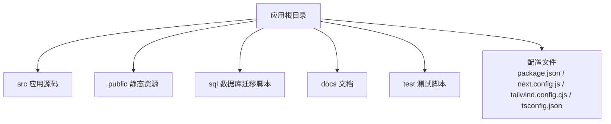
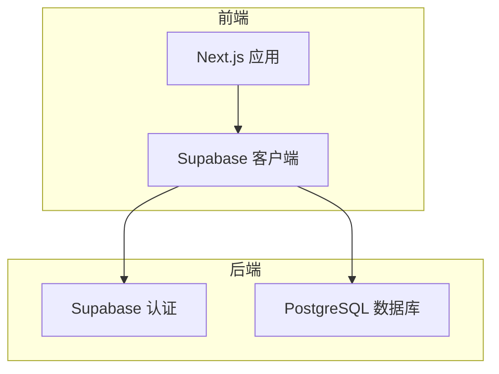
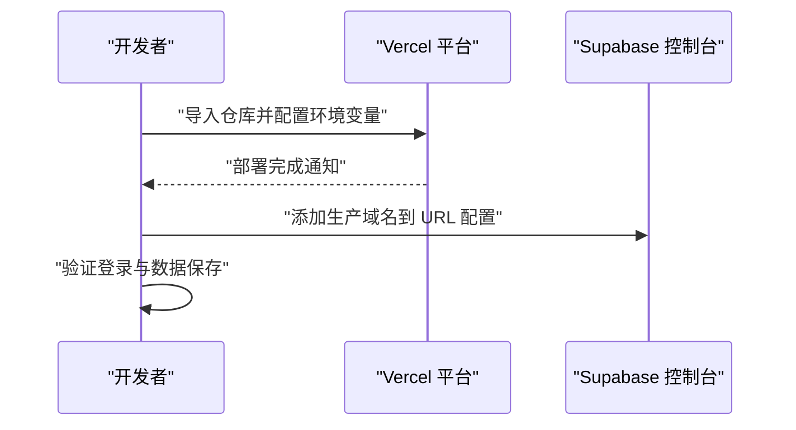
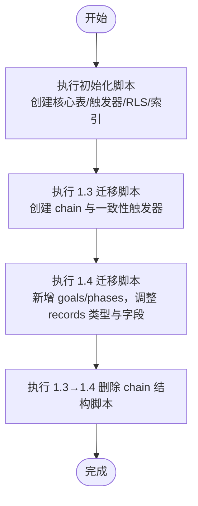
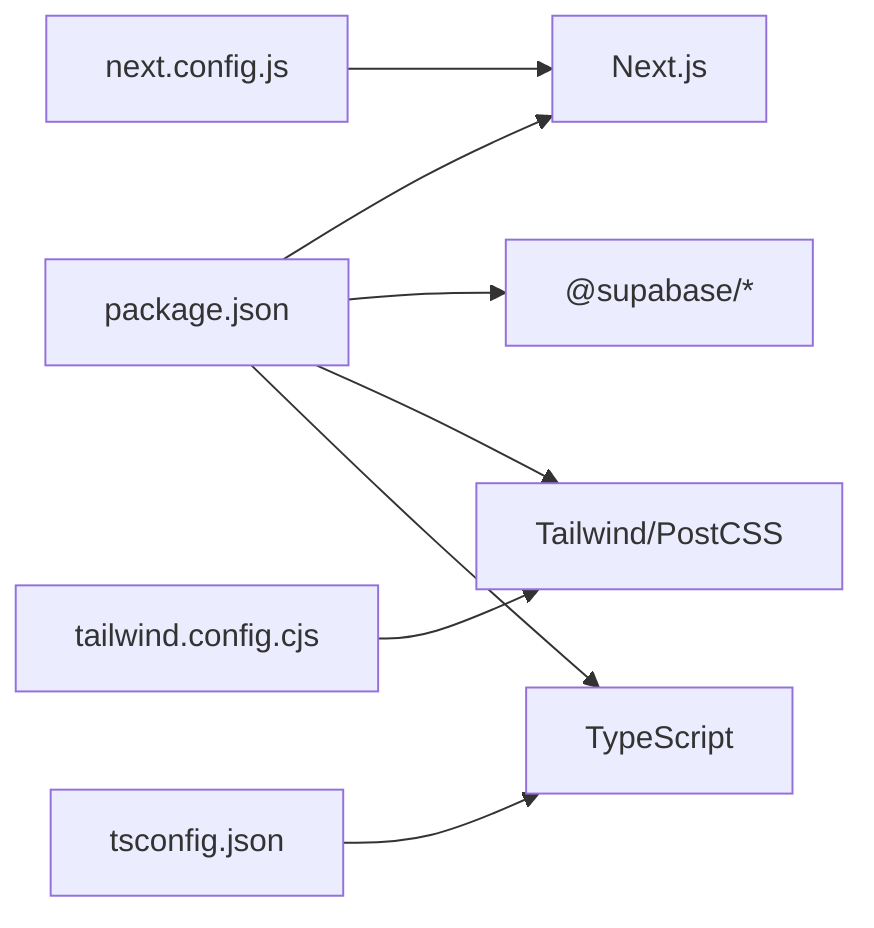

# 部署指南

<cite>
**本文引用的文件**
- [README.md](file://README.md)
- [package.json](file://package.json)
- [next.config.js](file://next.config.js)
- [tailwind.config.cjs](file://tailwind.config.cjs)
- [tsconfig.json](file://tsconfig.json)
- [001_teto_1_3_records_model.sql](file://sql/001_teto_1_3_records_model.sql)
- [002_drop_chain_structure.sql](file://sql/002_drop_chain_structure.sql)
- [003_teto_1_4_phases_and_goals.sql](file://sql/003_teto_1_4_phases_and_goals.sql)
- [004_teto_1_4_record_type_convergence.sql](file://sql/004_teto_1_4_record_type_convergence.sql)
</cite>

## 目录
1. [简介](#简介)
2. [项目结构](#项目结构)
3. [核心组件](#核心组件)
4. [架构总览](#架构总览)
5. [详细组件分析](#详细组件分析)
6. [依赖关系分析](#依赖关系分析)
7. [性能考虑](#性能考虑)
8. [故障排除指南](#故障排除指南)
9. [结论](#结论)
10. [附录](#附录)

## 简介
本指南面向运维与开发团队，提供 TETO 项目的完整部署方案，覆盖开发环境与生产环境（Vercel）、Supabase 数据库初始化、环境变量配置、域名与认证配置、CI/CD 流水线建议、容器化与 Kubernetes 部署思路、部署前后检查清单、回滚机制、性能监控与日志、安全与 SSL、备份策略等。文档严格基于仓库中的配置与说明文件整理，确保可操作性与可追溯性。

## 项目结构
TETO 是一个基于 Next.js 16 App Router 的前端应用，使用 Supabase 提供认证与数据库服务。项目采用 TypeScript、Tailwind CSS，并通过 npm 脚本进行开发、构建与启动。

章节来源
- [package.json:1-44](file://package.json#L1-L44)
- [next.config.js:1-4](file://next.config.js#L1-L4)
- [tailwind.config.cjs:1-61](file://tailwind.config.cjs#L1-L61)
- [tsconfig.json:1-42](file://tsconfig.json#L1-L42)

## 核心组件
- 应用框架与运行时
  - Next.js 16（App Router），TypeScript，Tailwind CSS
  - 开发脚本：dev、build、start；开发依赖包括 Tailwind、PostCSS、TypeScript
- 数据与认证
  - Supabase：Next.js SSR 辅助库、客户端 JS 库；使用匿名密钥与项目 URL
  - RLS（行级安全）策略保障用户数据隔离
- 构建与样式
  - Tailwind 配置定义主题色板、圆角、字体族
  - TypeScript 编译配置启用严格模式与 bundler 解析

章节来源
- [package.json:6-11](file://package.json#L6-L11)
- [package.json:15-32](file://package.json#L15-L32)
- [package.json:33-42](file://package.json#L33-L42)
- [README.md:13-21](file://README.md#L13-L21)
- [README.md:54-62](file://README.md#L54-L62)
- [README.md:81-90](file://README.md#L81-L90)
- [tailwind.config.cjs:8-58](file://tailwind.config.cjs#L8-L58)
- [tsconfig.json:2-29](file://tsconfig.json#L2-L29)

## 架构总览
TETO 的运行时架构由前端应用与 Supabase 后端组成。前端通过 Supabase 客户端进行认证与数据访问，数据库层采用 Postgres 并启用 RLS 策略实现用户隔离。

图示来源
- [README.md:13-21](file://README.md#L13-L21)
- [README.md:54-62](file://README.md#L54-L62)

## 详细组件分析

### 开发环境部署
- 依赖安装与开发启动
  - 使用 npm 安装依赖
  - 本地开发服务器启动
- 环境变量
  - 本地需创建 .env.local，包含 Supabase 项目 URL 与匿名密钥
  - 可选开发模式开关与测试用户 ID
- 构建检查
  - 发布前执行构建检查

章节来源
- [README.md:22-52](file://README.md#L22-L52)
- [README.md:54-62](file://README.md#L54-L62)

### 生产环境部署（Vercel）
- 部署前准备
  - 本地构建成功
  - 代码已推送至 GitHub
  - Supabase SQL 脚本已在控制台执行
- 部署步骤
  - 登录 Vercel，导入项目并配置环境变量（Supabase URL 与匿名密钥）
- 部署后配置
  - 在 Supabase 控制台将 Vercel 生产域名加入 URL 配置
  - 验证登录与数据保存功能

图示来源
- [README.md:92-114](file://README.md#L92-L114)

章节来源
- [README.md:92-114](file://README.md#L92-L114)

### 数据库初始化与迁移
- 初始化脚本
  - 核心表：记录模型（record_days、items、records、tags、record_tags）
  - 触发器：updated_at 自动更新、chain/item 一致性校验（1.3 版本）
  - RLS：为各表启用行级安全策略
  - 索引：按 user_id/date、user_id/record_day_id 等建立索引
- 迁移脚本
  - 1.3 → 1.4：新增 goals 与 phases 表，为 items/records 添加 goal_id 外键
  - 记录类型收敛：统一 type 值域，新增 cost 字段并建立索引
  - 1.3 → 1.4：删除 chain 结构（触发器、字段、表、索引）

图示来源
- [001_teto_1_3_records_model.sql:14-300](file://sql/001_teto_1_3_records_model.sql#L14-L300)
- [002_drop_chain_structure.sql:15-49](file://sql/002_drop_chain_structure.sql#L15-L49)
- [003_teto_1_4_phases_and_goals.sql:13-130](file://sql/003_teto_1_4_phases_and_goals.sql#L13-L130)
- [004_teto_1_4_record_type_convergence.sql:7-20](file://sql/004_teto_1_4_record_type_convergence.sql#L7-L20)

章节来源
- [001_teto_1_3_records_model.sql:14-300](file://sql/001_teto_1_3_records_model.sql#L14-L300)
- [002_drop_chain_structure.sql:15-49](file://sql/002_drop_chain_structure.sql#L15-L49)
- [003_teto_1_4_phases_and_goals.sql:13-130](file://sql/003_teto_1_4_phases_and_goals.sql#L13-L130)
- [004_teto_1_4_record_type_convergence.sql:7-20](file://sql/004_teto_1_4_record_type_convergence.sql#L7-L20)

### 环境变量配置
- 必填项
  - NEXT_PUBLIC_SUPABASE_URL：Supabase 项目 URL
  - NEXT_PUBLIC_SUPABASE_ANON_KEY：Supabase 匿名密钥
- 可选项
  - NEXT_PUBLIC_DEV_MODE：启用开发模式（跳过登录）
  - NEXT_PUBLIC_DEV_USER_ID：开发模式使用的测试用户 ID

章节来源
- [README.md:54-62](file://README.md#L54-L62)

### 认证与域名配置
- Supabase 认证
  - 在控制台配置 Site URL 与 Redirect URLs
  - 启用 Magic Link 登录方式
- 生产域名
  - 在 Supabase 控制台添加 Vercel 生产域名到 URL 配置

章节来源
- [README.md:75-80](file://README.md#L75-L80)
- [README.md:110-114](file://README.md#L110-L114)

### CI/CD 流水线与自动化部署
- 建议流程
  - 触发条件：推送至默认分支或打标签
  - 步骤：安装依赖、运行构建、执行测试脚本（如可用）、部署到 Vercel
  - 关键产物：构建输出（Next.js 输出目录）
- 环境变量注入
  - 在 CI 系统中配置 NEXT_PUBLIC_SUPABASE_URL、NEXT_PUBLIC_SUPABASE_ANON_KEY 等
- 部署平台
  - Vercel：支持 GitHub 导入与环境变量配置，适合 Next.js 应用

章节来源
- [README.md:92-114](file://README.md#L92-L114)
- [package.json:6-11](file://package.json#L6-L11)

### 容器化与 Kubernetes 部署（思路）
- 容器镜像
  - 基于官方 Node.js 镜像，复制依赖与源码，安装依赖，构建 Next.js，使用生产命令启动
- Kubernetes 部署
  - Deployment：副本数、探针（liveness/readiness）、资源限制
  - Service：ClusterIP/LoadBalancer
  - ConfigMap：环境变量（NEXT_PUBLIC_* 仅用于前端构建期，运行时建议通过 Secret 注入）
  - Secret：敏感变量（如 Supabase 密钥）
  - Ingress：暴露域名与 TLS
- 注意
  - 前端 Next.js 构建期读取 NEXT_PUBLIC_*，运行时应通过后端代理或环境注入
  - 与 Supabase 的连接建议通过后端代理或服务网格实现更安全的密钥管理

（本节为概念性部署思路，未直接映射具体源文件）

### 部署前检查清单
- 本地验证
  - 依赖安装、开发服务器启动、构建通过
- Supabase
  - 初始化脚本执行完毕，RLS 已启用
  - 认证 URL 配置正确，Magic Link 已启用
- 平台
  - Vercel 项目导入成功，环境变量配置正确
- 安全
  - 生产域名已添加到 URL 配置
  - 未泄露敏感密钥

章节来源
- [README.md:37-47](file://README.md#L37-L47)
- [README.md:75-80](file://README.md#L75-L80)
- [README.md:92-114](file://README.md#L92-L114)

### 部署后验证步骤
- 功能验证
  - 登录（Magic Link）、数据录入、列表与详情页加载
- 性能验证
  - 首屏加载时间、路由切换流畅度
- 安全验证
  - 用户数据隔离（RLS）、跨域与 CSP 设置（如需要）

章节来源
- [README.md:110-114](file://README.md#L110-L114)

### 回滚机制
- Vercel 回滚
  - 在 Vercel 控制台选择历史部署进行回滚
- 数据回滚
  - 通过 Supabase 控制台的 SQL Editor 执行回滚脚本或使用备份恢复
- 代码回滚
  - 切换到上一个稳定提交并重新部署

章节来源
- [README.md:110-114](file://README.md#L110-L114)

### 性能监控与日志
- 性能监控
  - 使用浏览器性能工具与网络面板观察首屏与交互延迟
  - Next.js 构建产物分析与缓存策略优化
- 日志
  - 前端错误可通过浏览器控制台与 Sentry（如接入）收集
  - 后端（Supabase）可通过控制台查看请求与错误日志

（本节为通用实践建议）

### 故障排除指南
- 登录失败
  - 检查 Supabase URL 与匿名密钥是否正确
  - 确认站点 URL 与重定向 URL 已配置
- 数据无法保存
  - 确认 RLS 已启用且用户已登录
  - 检查数据库迁移脚本是否完整执行
- 构建失败
  - 清理 node_modules 与缓存后重试
  - 确认 TypeScript 与 Tailwind 配置无误

章节来源
- [README.md:54-62](file://README.md#L54-L62)
- [README.md:75-80](file://README.md#L75-L80)
- [README.md:37-47](file://README.md#L37-L47)
- [tsconfig.json:2-29](file://tsconfig.json#L2-L29)
- [tailwind.config.cjs:8-58](file://tailwind.config.cjs#L8-L58)

### 安全配置、SSL 与备份
- 安全配置
  - 使用 Supabase RLS 保护数据
  - 限制开发 Origin（如需要），参考 next.config.js 中的 allowedDevOrigins
- SSL 证书
  - Vercel 默认提供 HTTPS；如自建域名，可在平台配置 TLS
- 备份策略
  - Supabase 提供自动备份与手动快照；定期导出关键数据与 SQL 脚本作为补充

章节来源
- [README.md:63-90](file://README.md#L63-L90)
- [next.config.js:2-4](file://next.config.js#L2-L4)

## 依赖关系分析
- 应用依赖
  - Next.js、React、Tailwind、Recharts、date-fns、Supabase 客户端
- 构建与开发依赖
  - Tailwind、PostCSS、TypeScript、类型声明
- 配置依赖
  - next.config.js、tailwind.config.cjs、tsconfig.json 影响构建与运行时行为

图示来源
- [package.json:15-42](file://package.json#L15-L42)
- [next.config.js:1-4](file://next.config.js#L1-L4)
- [tailwind.config.cjs:1-61](file://tailwind.config.cjs#L1-L61)
- [tsconfig.json:1-42](file://tsconfig.json#L1-L42)

章节来源
- [package.json:15-42](file://package.json#L15-L42)
- [next.config.js:1-4](file://next.config.js#L1-L4)
- [tailwind.config.cjs:1-61](file://tailwind.config.cjs#L1-L61)
- [tsconfig.json:1-42](file://tsconfig.json#L1-L42)

## 性能考虑
- 构建优化
  - 使用 Next.js 内置优化与静态生成（如适用）
  - Tailwind 按需引入与 Tree Shaking
- 数据访问
  - 合理使用索引（如按 user_id/date、user_id/record_day_id）
  - RLS 查询尽量减少不必要的列与 JOIN
- 前端体验
  - 图表与列表懒加载、分页与虚拟滚动（如需要）

（本节提供通用指导）

## 故障排除指南
- 常见问题定位
  - 网络与认证：确认 Supabase URL/密钥与控制台配置一致
  - 数据一致性：检查迁移脚本执行顺序与 RLS 策略
  - 构建与样式：核对 tsconfig 与 tailwind 配置
- 回滚与恢复
  - 使用 Vercel 历史部署回滚
  - 数据层面通过 Supabase 控制台 SQL 或备份恢复

章节来源
- [README.md:54-62](file://README.md#L54-L62)
- [README.md:75-80](file://README.md#L75-L80)
- [README.md:92-114](file://README.md#L92-L114)
- [tsconfig.json:2-29](file://tsconfig.json#L2-L29)
- [tailwind.config.cjs:8-58](file://tailwind.config.cjs#L8-L58)

## 结论
本指南提供了从开发到生产的完整部署路径，结合 Supabase 的认证与数据库能力，以及 Vercel 的一键部署优势。通过严格的环境变量管理、数据库迁移与 RLS 策略、CI/CD 流水线与回滚机制，可确保系统稳定可靠地交付与维护。

## 附录
- 术语
  - RLS：行级安全策略，用于按用户隔离数据
  - SSR：服务器端渲染，Next.js 提供的同构渲染能力
- 参考
  - Next.js 16 App Router、Supabase 官方文档与 Vercel 平台说明