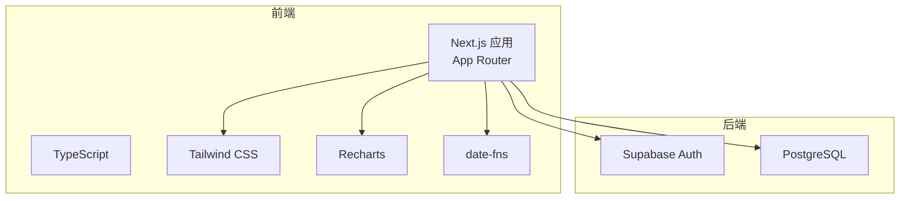
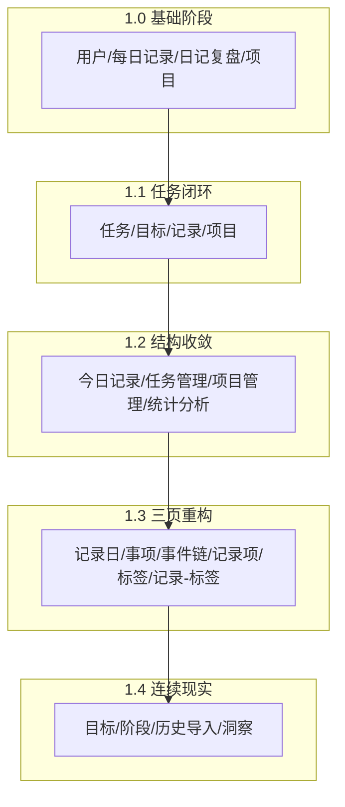
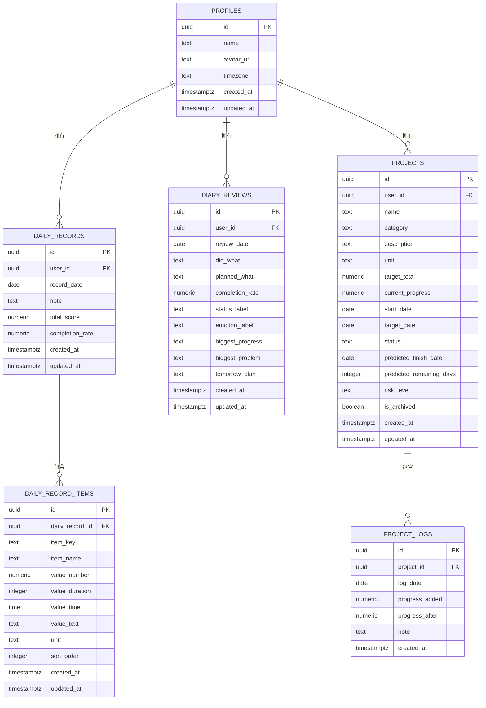
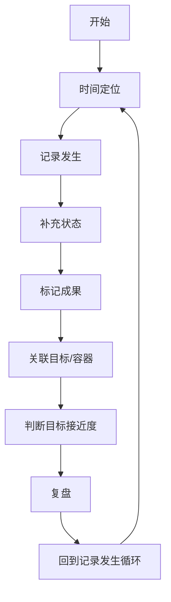
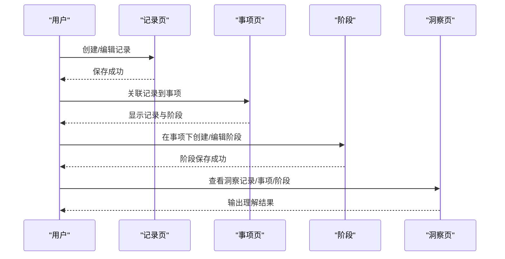
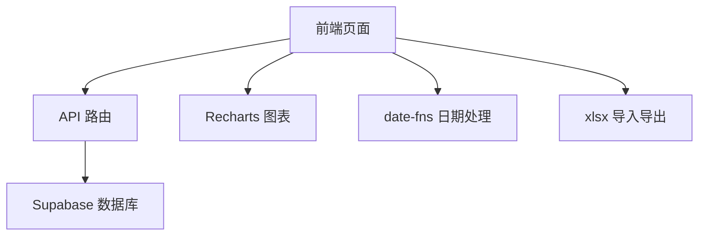

# 发展历程

<cite>
**本文引用的文件**
- [README.md](file://README.md)
- [package.json](file://package.json)
- [src/app/layout.tsx](file://src/app/layout.tsx)
- [docs/01-生效版本/TETO 1.3/《TETO 1.3 构思总纲》.md](file://docs/01-生效版本/TETO 1.3/《TETO 1.3 构思总纲》.md)
- [docs/01-生效版本/TETO 1.3/《TETO 1.3新阶段总规（完整正式版）》.md](file://docs/01-生效版本/TETO 1.3/《TETO 1.3新阶段总规（完整正式版）》.md)
- [docs/01-生效版本/TETO 1.4/TETO 1.4 开发规则.md](file://docs/01-生效版本/TETO 1.4/TETO 1.4 开发规则.md)
- [docs/10-版本归档/TETO 1.0.0/《TETO 1.0 数据表设计（正式版）》.md](file://docs/10-版本归档/TETO 1.0.0/《TETO 1.0 数据表设计（正式版）》.md)
- [docs/10-版本归档/TETO 1.0.0/《TETO 1.0 页面结构详细稿（正式版）》.md](file://docs/10-版本归档/TETO 1.0.0/《TETO 1.0 页面结构详细稿（正式版）》.md)
- [docs/10-版本归档/TETO 1.0.1/TETO 1.0.1 开发清单.md](file://docs/10-版本归档/TETO 1.0.1/TETO 1.0.1 开发清单.md)
- [docs/10-版本归档/TETO 1.1.0/TETO 1.1 开发规则.md](file://docs/10-版本归档/TETO 1.1.0/TETO 1.1 开发规则.md)
- [docs/10-版本归档/TETO 1.2/TETO 1.2 完成报告.md](file://docs/10-版本归档/TETO 1.2/TETO 1.2 完成报告.md)
- [sql/001_teto_1_3_records_model.sql](file://sql/001_teto_1_3_records_model.sql)
- [sql/003_teto_1_4_phases_and_goals.sql](file://sql/003_teto_1_4_phases_and_goals.sql)
</cite>

## 目录
1. [简介](#简介)
2. [项目结构](#项目结构)
3. [核心组件](#核心组件)
4. [架构总览](#架构总览)
5. [详细组件分析](#详细组件分析)
6. [依赖分析](#依赖分析)
7. [性能考量](#性能考量)
8. [故障排查指南](#故障排查指南)
9. [结论](#结论)
10. [附录](#附录)

## 简介
本文件系统梳理 TETO 从 1.0 到当前版本的发展历程，覆盖各重要里程碑与版本变更，重点阐述 TETO 1.3 与 1.4 的设计理念与架构调整，说明从概念设计到实际开发的完整过程，包括需求分析、技术选型、架构设计与实现细节，以及版本迭代的驱动力与改进方向。同时，结合项目文档与数据库演进，给出团队组织结构、开发流程与质量保证措施的实践要点，并提供版本发布计划与路线图，帮助读者理解项目的未来发展方向。

## 项目结构
TETO 项目采用现代前端技术栈，基于 Next.js App Router 构建，使用 Supabase 提供认证与数据库能力，Tailwind CSS 实现界面样式，Recharts 进行图表展示，date-fns 处理日期。项目采用“文档驱动 + 数据库脚本”的版本演进方式，通过文档与 SQL 脚本共同定义版本边界与数据模型。

- 技术栈与版本
  - Next.js 16.2.0（App Router）
  - TypeScript
  - Tailwind CSS
  - Supabase（Auth + PostgreSQL）
  - Recharts（图表）
  - date-fns（日期处理）

- 项目入口与全局样式
  - 全局布局位于 src/app/layout.tsx
  - 全局样式位于 src/app/globals.css

- 数据库演进
  - 1.0：核心表（profiles、daily_records、daily_record_items、diary_reviews、projects、project_logs）
  - 1.3：三页重构（record_days、items、chains、records、tags、record_tags）
  - 1.4：新增目标与阶段（goals、phases），并为 items、records 增加 goal_id 外键

**图表来源**
- [package.json:15-32](file://package.json#L15-L32)
- [src/app/layout.tsx:1-13](file://src/app/layout.tsx#L1-L13)

**章节来源**
- [README.md:13-21](file://README.md#L13-L21)
- [package.json:15-32](file://package.json#L15-L32)
- [src/app/layout.tsx:1-13](file://src/app/layout.tsx#L1-L13)

## 核心组件
- 认证与数据库
  - Supabase 提供用户认证与 PostgreSQL 数据库存储，启用行级安全策略（RLS）保障数据隔离。
- 前端应用
  - Next.js App Router 提供页面路由与数据流管理，组件化设计支持模块化扩展。
- 数据模型
  - 1.0：围绕“用户、每日记录、日记复盘、项目”四大核心对象建模。
  - 1.3：引入“记录日、事项、事件链、记录项、标签、记录-标签”六表模型，强化“记录—事项—复盘”的三页结构。
  - 1.4：新增“目标、阶段”模型，并为“事项、记录”增加目标关联，形成“记录—事项—阶段—洞察”的连续现实结构。

**章节来源**
- [README.md:81-90](file://README.md#L81-L90)
- [docs/10-版本归档/TETO 1.0.0/《TETO 1.0 数据表设计（正式版）》.md:72-86](file://docs/10-版本归档/TETO 1.0.0/《TETO 1.0 数据表设计（正式版）》.md#L72-L86)
- [sql/001_teto_1_3_records_model.sql:18-85](file://sql/001_teto_1_3_records_model.sql#L18-L85)
- [sql/003_teto_1_4_phases_and_goals.sql:16-61](file://sql/003_teto_1_4_phases_and_goals.sql#L16-L61)

## 架构总览
TETO 的架构演进体现了从“功能碎片化”到“结构收敛”，再到“逻辑统一”的阶段性目标。1.0 建立了基础的数据模型与页面结构；1.1 引入任务与目标，形成“任务—目标—记录—项目”的闭环；1.2 完成结构整理，统一入口与职责；1.3 以“记录—规则—展示”三层逻辑重构三页结构；1.4 补齐“阶段—历史导入—洞察”，形成连续人生现实系统。

**图表来源**
- [docs/10-版本归档/TETO 1.0.0/《TETO 1.0 数据表设计（正式版）》.md:72-86](file://docs/10-版本归档/TETO 1.0.0/《TETO 1.0 数据表设计（正式版）》.md#L72-L86)
- [docs/10-版本归档/TETO 1.1.0/TETO 1.1 开发规则.md:165-171](file://docs/10-版本归档/TETO 1.1.0/TETO 1.1 开发规则.md#L165-L171)
- [docs/10-版本归档/TETO 1.2/TETO 1.2 完成报告.md:61-70](file://docs/10-版本归档/TETO 1.2/TETO 1.2 完成报告.md#L61-L70)
- [docs/01-生效版本/TETO 1.3/《TETO 1.3新阶段总规（完整正式版）》.md:120-143](file://docs/01-生效版本/TETO 1.3/《TETO 1.3新阶段总规（完整正式版）》.md#L120-L143)
- [docs/01-生效版本/TETO 1.4/TETO 1.4 开发规则.md:78-84](file://docs/01-生效版本/TETO 1.4/TETO 1.4 开发规则.md#L78-L84)

## 详细组件分析

### TETO 1.0：基础数据模型与页面结构
- 数据模型
  - 核心表：profiles、daily_records、daily_record_items、diary_reviews、projects、project_logs
  - 设计原则：先保证可用、清晰、稳定，不追求一开始就完美数据模型
- 页面结构
  - 五大主页面：仪表盘、每日记录、日记复盘、项目、统计
  - 页面围绕“记录→复盘→更新项目→看结果→调整行为”的主线展开
- 技术选型
  - Next.js 16.2.0、TypeScript、Tailwind CSS、Supabase、Recharts、date-fns

**图表来源**
- [docs/10-版本归档/TETO 1.0.0/《TETO 1.0 数据表设计（正式版）》.md:92-450](file://docs/10-版本归档/TETO 1.0.0/《TETO 1.0 数据表设计（正式版）》.md#L92-L450)

**章节来源**
- [docs/10-版本归档/TETO 1.0.0/《TETO 1.0 数据表设计（正式版）》.md:19-86](file://docs/10-版本归档/TETO 1.0.0/《TETO 1.0 数据表设计（正式版）》.md#L19-L86)
- [docs/10-版本归档/TETO 1.0.0/《TETO 1.0 页面结构详细稿（正式版）》.md:20-150](file://docs/10-版本归档/TETO 1.0.0/《TETO 1.0 页面结构详细稿（正式版）》.md#L20-L150)
- [README.md:13-21](file://README.md#L13-L21)

### TETO 1.1：任务闭环与结构升级
- 阶段目标
  - 围绕“任务定义→目标设置→每日记录→完成度计算→项目关联”建立新的核心使用闭环
- 允许新增
  - 任务系统、目标值系统、每日任务记录系统、项目与任务关联、一级子项目、导入能力、页面区块排序偏好
- 开发顺序
  - 主闭环基础（数据结构落地、Tasks 页面、Task Detail/Edit 页面、Records 页面）→ 汇总与关联（Dashboard 页面、Projects 页面、Project Detail 页面）→ 增强能力（Import 页面、Layout Preferences/区块排序）

**章节来源**
- [docs/10-版本归档/TETO 1.1.0/TETO 1.1 开发规则.md:165-171](file://docs/10-版本归档/TETO 1.1.0/TETO 1.1 开发规则.md#L165-L171)
- [docs/10-版本归档/TETO 1.1.0/TETO 1.1 开发规则.md:226-266](file://docs/10-版本归档/TETO 1.1.0/TETO 1.1 开发规则.md#L226-L266)
- [docs/10-版本归档/TETO 1.1.0/TETO 1.1 开发规则.md:339-372](file://docs/10-版本归档/TETO 1.1.0/TETO 1.1 开发规则.md#L339-L372)

### TETO 1.2：结构整理与页面归位
- 阶段定位
  - 对 1.1 已落地内容进行结构收敛、页面归位、功能去重、表达校准的整理阶段
- 完成成果
  - 一级结构稳定为“今日记录、任务管理、项目管理、统计分析”
  - 默认首页切换为“今日记录”
  - 页面职责明确，重复结构清理，表达统一
- 完成标准
  - 页面能打开、一级结构明确、默认首页正确、重复页面已删除或并入、用户知道去哪里做记录/配任务/看项目/看统计、数据能真实保存/读取/回显、Supabase 中能看到对应记录、页面展示与数据库真实一致

**章节来源**
- [docs/10-版本归档/TETO 1.2/TETO 1.2 完成报告.md:41-56](file://docs/10-版本归档/TETO 1.2/TETO 1.2 完成报告.md#L41-L56)
- [docs/10-版本归档/TETO 1.2/TETO 1.2 完成报告.md:144-167](file://docs/10-版本归档/TETO 1.2/TETO 1.2 完成报告.md#L144-L167)
- [docs/10-版本归档/TETO 1.2/TETO 1.2 完成报告.md:218-236](file://docs/10-版本归档/TETO 1.2/TETO 1.2 完成报告.md#L218-L236)

### TETO 1.3：三页重构与“记录—规则—展示”三层逻辑
- 设计理念
  - 在 1.2 已稳定的四模块结构基础上，建立“记录层—规则层—展示层”三层逻辑，让系统从“结构收敛”推进到“内部逻辑真正打通”
  - 系统本质：面向个人完整现实生活连续流的现实系统
- 核心对象
  - 时间段、发生项、成果项、状态、目标、容器
- 主链路
  - 时间定位 → 记录发生 → 补充状态 → 标记成果 → 关联目标/容器 → 判断目标接近度 → 复盘
- 页面体系
  - 默认首页：今日/当日流
  - 发生页：原始现实页
  - 成果页：结果层
  - 目标页：方向层
  - 容器页：统一承载组织工具
  - 复盘页：理解层

**图表来源**
- [docs/01-生效版本/TETO 1.3/《TETO 1.3新阶段总规（完整正式版）》.md:450-522](file://docs/01-生效版本/TETO 1.3/《TETO 1.3新阶段总规（完整正式版）》.md#L450-L522)

**章节来源**
- [docs/01-生效版本/TETO 1.3/《TETO 1.3 构思总纲》.md:166-181](file://docs/01-生效版本/TETO 1.3/《TETO 1.3 构思总纲》.md#L166-L181)
- [docs/01-生效版本/TETO 1.3/《TETO 1.3 构思总纲》.md:184-210](file://docs/01-生效版本/TETO 1.3/《TETO 1.3 构思总纲》.md#L184-L210)
- [docs/01-生效版本/TETO 1.3/《TETO 1.3新阶段总规（完整正式版）》.md:66-84](file://docs/01-生效版本/TETO 1.3/《TETO 1.3新阶段总规（完整正式版）》.md#L66-L84)
- [docs/01-生效版本/TETO 1.3/《TETO 1.3新阶段总规（完整正式版）》.md:120-143](file://docs/01-生效版本/TETO 1.3/《TETO 1.3新阶段总规（完整正式版）》.md#L120-L143)
- [docs/01-生效版本/TETO 1.3/《TETO 1.3新阶段总规（完整正式版）》.md:450-522](file://docs/01-生效版本/TETO 1.3/《TETO 1.3新阶段总规（完整正式版）》.md#L450-L522)
- [docs/01-生效版本/TETO 1.3/《TETO 1.3新阶段总规（完整正式版）》.md:524-618](file://docs/01-生效版本/TETO 1.3/《TETO 1.3新阶段总规（完整正式版）》.md#L524-L618)

### TETO 1.4：阶段与历史导入深化
- 阶段定位
  - 在 1.3“记录—事项—洞察”骨架之上，补上“阶段”和“历史导入”能力，使系统从“现实入口已成立”进一步推进为“连续人生现实开始成立”的系统
- 核心对象
  - 记录、事项、阶段、洞察、历史
- 主链路
  - 记录现实 → 归入事项 → 形成或补录阶段 → 回看长期变化 → 生成洞察
- 历史导入
  - 两条主路径：历史具体记录（记录）、历史阶段补录（阶段）
  - 历史导入后，用户必须能在事项页中统一回看
- 页面职责
  - 记录页：快速输入当下现实、浏览记录流、编辑记录、基础筛选、关联事项
  - 事项页：展示事项基本信息、关联记录、阶段列表、新建/编辑阶段、近期与历史变化
  - 洞察页：记录分布、事项活跃情况、阶段变化、近期与历史对照
  - 历史导入：新建历史事项、导入历史具体记录、补录历史阶段、校验挂载关系

**图表来源**
- [docs/01-生效版本/TETO 1.4/TETO 1.4 开发规则.md:358-383](file://docs/01-生效版本/TETO 1.4/TETO 1.4 开发规则.md#L358-L383)
- [docs/01-生效版本/TETO 1.4/TETO 1.4 开发规则.md:385-506](file://docs/01-生效版本/TETO 1.4/TETO 1.4 开发规则.md#L385-L506)
- [docs/01-生效版本/TETO 1.4/TETO 1.4 开发规则.md:508-574](file://docs/01-生效版本/TETO 1.4/TETO 1.4 开发规则.md#L508-L574)

**章节来源**
- [docs/01-生效版本/TETO 1.4/TETO 1.4 开发规则.md:50-77](file://docs/01-生效版本/TETO 1.4/TETO 1.4 开发规则.md#L50-L77)
- [docs/01-生效版本/TETO 1.4/TETO 1.4 开发规则.md:79-142](file://docs/01-生效版本/TETO 1.4/TETO 1.4 开发规则.md#L79-L142)
- [docs/01-生效版本/TETO 1.4/TETO 1.4 开发规则.md:144-206](file://docs/01-生效版本/TETO 1.4/TETO 1.4 开发规则.md#L144-L206)
- [docs/01-生效版本/TETO 1.4/TETO 1.4 开发规则.md:302-356](file://docs/01-生效版本/TETO 1.4/TETO 1.4 开发规则.md#L302-L356)
- [docs/01-生效版本/TETO 1.4/TETO 1.4 开发规则.md:385-506](file://docs/01-生效版本/TETO 1.4/TETO 1.4 开发规则.md#L385-L506)

### 数据库演进与实现细节
- 1.3 核心记录模型
  - 建表：record_days、items、chains、records、tags、record_tags
  - 触发器：chain/item 一致性检查、updated_at 自动更新
  - RLS：为六张表启用行级安全策略
  - 索引：针对 user_id/date、user_id/record_day_id、item_id、chain_id 等建立索引
- 1.4 目标与阶段模型
  - 建表：goals、phases，并为 items、records 添加 goal_id 外键
  - 触发器：goals、phases updated_at 自动更新
  - RLS：为 goals、phases 启用行级安全策略
  - 索引：goals(user_id,status)、phases(item_id,goal_id)、items(goal_id)、records(goal_id)

**章节来源**
- [sql/001_teto_1_3_records_model.sql:11-300](file://sql/001_teto_1_3_records_model.sql#L11-L300)
- [sql/003_teto_1_4_phases_and_goals.sql:9-130](file://sql/003_teto_1_4_phases_and_goals.sql#L9-L130)

## 依赖分析
- 组件耦合与内聚
  - 前端页面通过 Next.js App Router 组织，组件间通过 props 与状态管理解耦
  - 数据层通过 Supabase 客户端与数据库交互，RLS 保障数据隔离
- 外部依赖与集成点
  - Supabase Auth 与 PostgreSQL 提供认证与数据存储
  - Recharts 用于统计与趋势展示
  - date-fns 用于日期处理
  - XLSX 用于导入导出（1.1 导入能力）
- 潜在循环依赖
  - 项目采用单向数据流与页面职责分离，未发现循环依赖迹象
- 接口契约与实现
  - API 路由遵循 Next.js App Router 约定，控制器与服务层分离

**图表来源**
- [package.json:15-32](file://package.json#L15-L32)

**章节来源**
- [package.json:15-32](file://package.json#L15-L32)

## 性能考量
- 数据库性能
  - 1.3/1.4 建议索引：record_days(user_id,date)、records(user_id,record_day_id)、items(user_id,status)、phases(item_id,goal_id) 等
  - RLS 策略启用后，查询需确保索引命中，避免全表扫描
- 前端性能
  - 使用 Next.js App Router 的并行数据流与缓存策略
  - Recharts 图表按需渲染，避免大数据量时的重绘
- 可扩展性
  - 1.3/1.4 的三层逻辑与三页结构为后续扩展提供稳定基础
  - 1.4 的历史导入与阶段模型支持长期连续性数据增长

## 故障排查指南
- 常见问题
  - 页面无法打开：检查路由与页面职责是否符合 1.2/1.3/1.4 的定义
  - 数据无法保存/读取：确认 Supabase RLS 策略与用户身份一致
  - 记录/阶段/洞察不一致：核对 1.3/1.4 的数据理解顺序与主链路
- 质量保证
  - 验收标准以“真实可验证”为准，涵盖页面访问、数据创建/保存/读取/编辑/回显、Supabase 记录、计算结果一致性
  - 1.0.1 的维护清单明确了“小修补”优先级与范围边界，避免功能膨胀

**章节来源**
- [docs/10-版本归档/TETO 1.0.1/TETO 1.0.1 开发清单.md:279-291](file://docs/10-版本归档/TETO 1.0.1/TETO 1.0.1 开发清单.md#L279-L291)
- [docs/10-版本归档/TETO 1.2/TETO 1.2 完成报告.md:218-236](file://docs/10-版本归档/TETO 1.2/TETO 1.2 完成报告.md#L218-L236)
- [docs/01-生效版本/TETO 1.4/TETO 1.4 开发规则.md:708-758](file://docs/01-生效版本/TETO 1.4/TETO 1.4 开发规则.md#L708-L758)

## 结论
TETO 的发展历程体现了从“功能碎片化”到“结构收敛”，再到“逻辑统一”的渐进式演进。1.0 建立了基础数据模型与页面结构；1.1 引入任务闭环；1.2 完成结构整理；1.3 以“记录—规则—展示”三层逻辑重构三页结构；1.4 补齐“阶段—历史导入—洞察”，形成连续人生现实系统。通过文档驱动与数据库脚本演进，项目在保持稳定的同时持续深化核心逻辑，为后续版本提供坚实基础。

## 附录
- 版本发布计划与路线图
  - 1.0：基础可用版本，聚焦核心闭环
  - 1.1：任务闭环建设，增强结构化记录
  - 1.2：结构收敛，职责明确
  - 1.3：三页重构，逻辑统一
  - 1.4：阶段与历史导入，连续现实
  - 后续版本：在 1.4 基础上深化洞察与长期连续性，探索更丰富的现实表达与理解能力

- 团队组织与开发流程
  - 文档体系：《TETO AI 协作总则（总控版）》→ 阶段规则文档 → 开发清单 → 页面/数据/SQL/实现文档
  - 开发原则：单主闭环、单任务块推进、最小可用闭环、简单稳定优先、不顺手扩展、数据闭环验证
  - 质量保证：真实可验证，页面访问、数据创建/保存/读取/编辑/回显、Supabase 记录、计算结果一致性

**章节来源**
- [docs/10-版本归档/TETO 1.1.0/TETO 1.1 开发规则.md:521-522](file://docs/10-版本归档/TETO 1.1.0/TETO 1.1 开发规则.md#L521-L522)
- [docs/10-版本归档/TETO 1.2/TETO 1.2 完成报告.md:144-167](file://docs/10-版本归档/TETO 1.2/TETO 1.2 完成报告.md#L144-L167)
- [docs/01-生效版本/TETO 1.4/TETO 1.4 开发规则.md:648-687](file://docs/01-生效版本/TETO 1.4/TETO 1.4 开发规则.md#L648-L687)