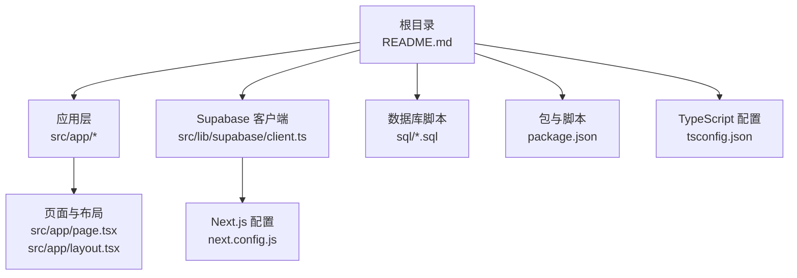
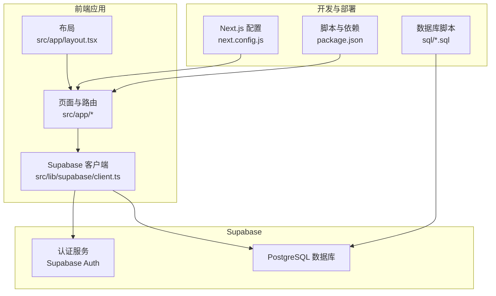
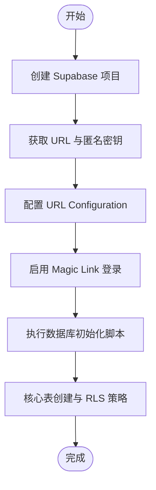
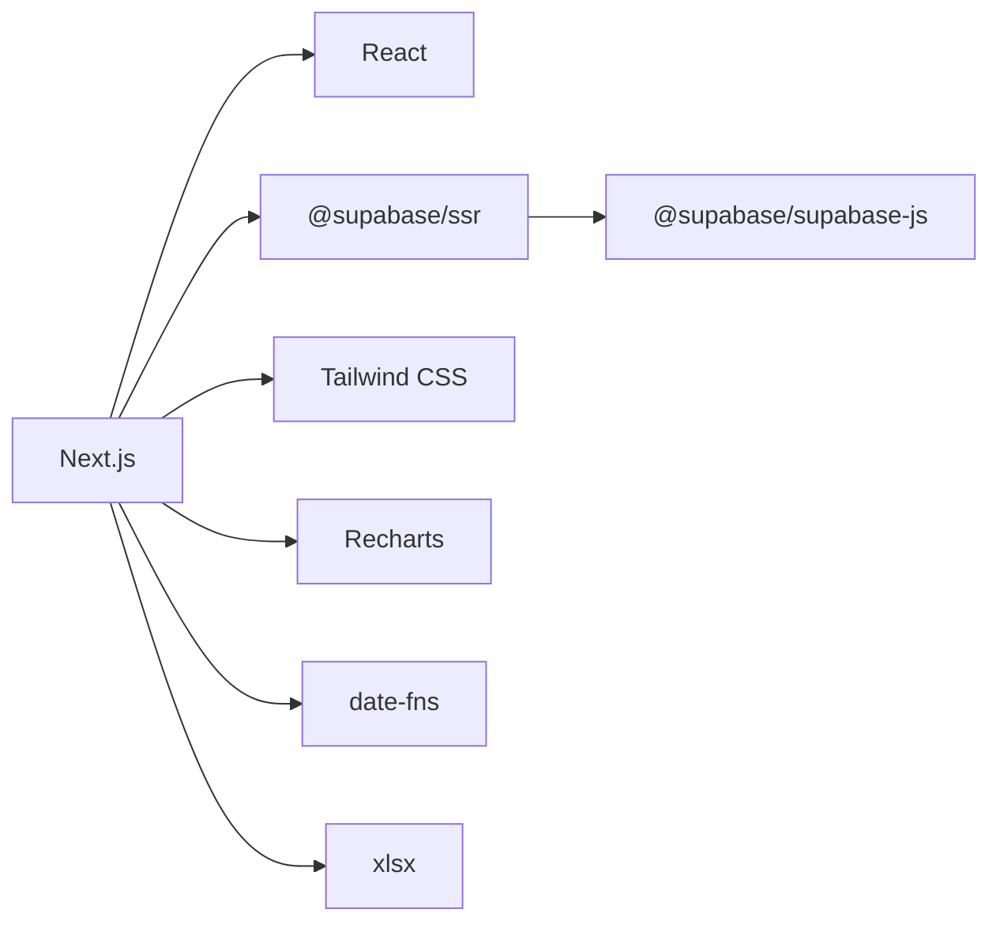

# 快速开始

<cite>
**本文引用的文件**
- [README.md](file://README.md)
- [package.json](file://package.json)
- [next.config.js](file://next.config.js)
- [tsconfig.json](file://tsconfig.json)
- [src/lib/supabase/client.ts](file://src/lib/supabase/client.ts)
- [src/app/layout.tsx](file://src/app/layout.tsx)
- [src/app/page.tsx](file://src/app/page.tsx)
- [sql/001_teto_1_3_records_model.sql](file://sql/001_teto_1_3_records_model.sql)
- [sql/002_drop_chain_structure.sql](file://sql/002_drop_chain_structure.sql)
</cite>

## 目录
1. [简介](#简介)
2. [项目结构](#项目结构)
3. [核心组件](#核心组件)
4. [架构总览](#架构总览)
5. [详细组件分析](#详细组件分析)
6. [依赖分析](#依赖分析)
7. [性能考虑](#性能考虑)
8. [故障排除指南](#故障排除指南)
9. [结论](#结论)
10. [附录](#附录)

## 简介
本指南面向首次接触 TETO 项目的开发者，帮助你在最短时间内完成本地开发环境搭建、Supabase 配置、数据库初始化、本地服务启动、构建检查与部署前准备，并提供开发模式配置与调试技巧。TETO 是一个基于 Next.js App Router 的个人效率追踪系统，采用 Supabase 提供的认证与数据库能力，结合 TypeScript、Tailwind CSS、Recharts 等技术栈实现。

## 项目结构
- 顶层说明与部署指引位于根目录的说明文档中，包含本地启动、环境变量、Supabase 配置、数据库初始化、构建检查与 Vercel 部署流程。
- 应用层采用 Next.js App Router 结构，页面与 API 路由分别位于 src/app 下的不同子目录。
- Supabase 客户端封装在 src/lib/supabase 中，负责浏览器端客户端实例化。
- 数据库初始化脚本位于 sql 目录，包含建表、触发器、RLS 策略与索引等。

**图示来源**
- [README.md](file://README.md)
- [src/app/page.tsx](file://src/app/page.tsx)
- [src/app/layout.tsx](file://src/app/layout.tsx)
- [src/lib/supabase/client.ts](file://src/lib/supabase/client.ts)
- [next.config.js](file://next.config.js)
- [package.json](file://package.json)
- [tsconfig.json](file://tsconfig.json)

**章节来源**
- [README.md](file://README.md)
- [package.json](file://package.json)
- [next.config.js](file://next.config.js)
- [tsconfig.json](file://tsconfig.json)

## 核心组件
- 本地开发与构建脚本：通过 package.json 中的脚本命令启动开发服务器、生成生产构建与启动生产服务。
- Next.js 配置：允许特定开发源以支持跨设备联调。
- TypeScript 配置：启用严格模式、路径别名 @/* 指向 src/*，并使用 Bundler 模块解析。
- Supabase 客户端：在浏览器端通过环境变量初始化 Supabase 客户端，用于认证与数据库操作。
- 应用入口与重定向：首页直接重定向至记录页面，保证默认访问路径一致。

**章节来源**
- [package.json](file://package.json)
- [next.config.js](file://next.config.js)
- [tsconfig.json](file://tsconfig.json)
- [src/lib/supabase/client.ts](file://src/lib/supabase/client.ts)
- [src/app/page.tsx](file://src/app/page.tsx)
- [src/app/layout.tsx](file://src/app/layout.tsx)

## 架构总览
下图展示了前端应用、Supabase 客户端与数据库之间的交互关系，以及本地开发与部署的关键节点。

**图示来源**
- [src/app/layout.tsx](file://src/app/layout.tsx)
- [src/lib/supabase/client.ts](file://src/lib/supabase/client.ts)
- [next.config.js](file://next.config.js)
- [package.json](file://package.json)
- [sql/001_teto_1_3_records_model.sql](file://sql/001_teto_1_3_records_model.sql)

## 详细组件分析

### 本地开发环境搭建
- 系统要求与工具
  - Node.js 与 npm：用于安装依赖与运行脚本。
  - 文本编辑器或 IDE：建议启用 TypeScript 与 ESLint 支持。
- 安装依赖
  - 使用 npm install 安装项目依赖与开发依赖。
- 启动开发服务器
  - 使用 npm run dev 启动 Next.js 开发服务器，默认监听端口为 3000。
  - 访问 http://localhost:3000 查看应用。

**章节来源**
- [README.md](file://README.md)
- [package.json](file://package.json)

### 环境变量与配置
- 环境变量
  - NEXT_PUBLIC_SUPABASE_URL：Supabase 项目 URL。
  - NEXT_PUBLIC_SUPABASE_ANON_KEY：Supabase 匿名访问密钥。
  - NEXT_PUBLIC_DEV_MODE（可选）：设为 true 可启用开发模式（跳过登录）。
  - NEXT_PUBLIC_DEV_USER_ID（可选）：开发模式使用的测试用户 ID。
- Next.js 配置
  - allowedDevOrigins：允许的开发源地址列表，便于局域网联调。
- TypeScript 配置
  - 严格模式开启，路径别名 @/* 指向 src/*，模块解析使用 Bundler。

**章节来源**
- [README.md](file://README.md)
- [next.config.js](file://next.config.js)
- [tsconfig.json](file://tsconfig.json)

### Supabase 配置与数据库初始化
- 项目创建与控制台
  - 在 Supabase 控制台中创建项目，获取项目 URL 与匿名密钥。
- URL 配置
  - 在 Supabase 控制台的 URL Configuration 中配置站点 URL 与回调 URL。
- 认证设置
  - 在 Authentication → URL Configuration 中配置回调地址。
  - 启用 Magic Link 登录方式以便快速登录。
- 数据库表初始化
  - 在 SQL Editor 中按顺序执行数据库初始化脚本：
    - 初始化核心表：sql/001_teto_1_3_records_model.sql
    - 删除链式结构（如适用）：sql/002_drop_chain_structure.sql
  - 脚本包含建表、触发器、RLS 策略与索引，确保数据一致性与安全性。
- RLS 说明
  - 所有表均启用行级安全策略，用户仅能访问自己的数据。

**图示来源**
- [README.md](file://README.md)
- [sql/001_teto_1_3_records_model.sql](file://sql/001_teto_1_3_records_model.sql)
- [sql/002_drop_chain_structure.sql](file://sql/002_drop_chain_structure.sql)

**章节来源**
- [README.md](file://README.md)
- [sql/001_teto_1_3_records_model.sql](file://sql/001_teto_1_3_records_model.sql)
- [sql/002_drop_chain_structure.sql](file://sql/002_drop_chain_structure.sql)

### 本地开发服务器启动与验证
- 启动命令
  - 使用 npm run dev 启动开发服务器。
- 访问与验证
  - 浏览器访问 http://localhost:3000，应重定向至记录页面并显示内容。
- 常见问题
  - 端口占用：修改 Next.js 端口或释放 3000 端口。
  - 环境变量缺失：确认 .env.local 中的 Supabase URL 与匿名密钥配置正确。
  - CORS 或跨域：检查 allowedDevOrigins 设置是否包含当前开发机 IP。

**章节来源**
- [README.md](file://README.md)
- [next.config.js](file://next.config.js)
- [src/app/page.tsx](file://src/app/page.tsx)

### 构建检查与部署前准备
- 构建检查
  - 在本地执行 npm run build，确保无错误与警告。
- 部署前准备
  - 确保本地构建通过。
  - 将代码推送至 GitHub 仓库。
  - 在 Supabase 控制台中执行数据库初始化脚本。
- Vercel 部署
  - 登录 Vercel，导入项目仓库。
  - 配置环境变量：NEXT_PUBLIC_SUPABASE_URL、NEXT_PUBLIC_SUPABASE_ANON_KEY。
  - 点击 Deploy，等待部署完成。
- 部署后配置
  - 在 Supabase 控制台添加 Vercel 生产域名到 URL Configuration。
  - 验证登录与数据保存功能。

**章节来源**
- [README.md](file://README.md)

### 开发模式配置与调试技巧
- 开发模式
  - 设置 NEXT_PUBLIC_DEV_MODE=true 可跳过登录流程，便于快速验证界面与逻辑。
  - 设置 NEXT_PUBLIC_DEV_USER_ID 指定测试用户 ID，统一测试数据归属。
- 调试建议
  - 使用浏览器开发者工具检查网络请求与 Supabase 返回值。
  - 在 Supabase 控制台的 SQL Editor 中直接查询与验证数据一致性。
  - 利用 Next.js 的热重载特性，在 src/app 下修改页面与组件即时生效。
- 路由与入口
  - 首页会自动重定向至记录页面，确保默认访问路径一致。

**章节来源**
- [README.md](file://README.md)
- [src/app/page.tsx](file://src/app/page.tsx)

## 依赖分析
- 依赖关系概览
  - 前端框架：Next.js 16.2.0（App Router）、React 19.x。
  - 数据库与认证：@supabase/ssr、@supabase/supabase-js。
  - UI 与样式：Tailwind CSS 4.x、Lucide React、Recharts。
  - 工具库：date-fns、xlsx、class-variance-authority、clsx、tailwind-merge。
  - 类型与开发：TypeScript 5.x、@types/*、Tailwind PostCSS 插件。
- 关键依赖与用途
  - @supabase/ssr：在浏览器端创建 Supabase 客户端，支持 SSR/CSR 场景。
  - next：提供开发服务器、构建与运行时。
  - recharts：用于统计与可视化展示。
  - date-fns：日期处理与格式化。
  - xlsx：电子表格导入导出（如涉及）。

**图示来源**
- [package.json](file://package.json)

**章节来源**
- [package.json](file://package.json)

## 性能考虑
- 构建优化
  - 使用 Next.js 内置的构建与代码分割，减少首屏加载时间。
- 数据访问
  - 合理使用索引与查询条件，避免全表扫描；RLS 策略会增加权限判断开销，尽量在查询中限定用户与时间范围。
- 图表与渲染
  - 对于大量数据的图表，建议分页或按时间窗口加载，避免一次性渲染过多节点。
- 本地开发
  - 在开发模式下启用热重载，减少频繁重启带来的等待时间。

## 故障排除指南
- 无法连接 Supabase
  - 检查 NEXT_PUBLIC_SUPABASE_URL 与 NEXT_PUBLIC_SUPABASE_ANON_KEY 是否正确写入 .env.local。
  - 确认 Supabase 控制台中的 URL Configuration 已包含当前开发或生产域名。
- 登录失败或回调异常
  - 确认 Magic Link 登录已启用，回调 URL 与站点 URL 配置正确。
- 数据库初始化失败
  - 按顺序执行 sql/001_teto_1_3_records_model.sql 与 sql/002_drop_chain_structure.sql，确保无语法错误与权限问题。
- 构建失败
  - 执行 npm run build 并根据错误信息修复类型或导入路径问题；检查 tsconfig.json 的路径别名与模块解析配置。
- 端口冲突或跨域问题
  - 修改 Next.js 端口或调整 allowedDevOrigins；确保代理与防火墙未阻断本地回环。

**章节来源**
- [README.md](file://README.md)
- [next.config.js](file://next.config.js)
- [tsconfig.json](file://tsconfig.json)

## 结论
通过本快速开始指南，你可以在本地完成 TETO 项目的环境搭建、Supabase 配置与数据库初始化，并成功启动开发服务器。建议在本地先完成构建检查与基本功能验证，再进行 Vercel 部署与后续迭代。遇到问题时，优先检查环境变量、URL 配置与数据库脚本执行情况，并利用 Next.js 与 Supabase 的调试工具定位问题。

## 附录
- 快速核对清单
  - 已安装依赖并执行 npm run dev 成功启动。
  - 已在 Supabase 控制台创建项目并配置 URL 与认证。
  - 已在 SQL Editor 中执行数据库初始化脚本。
  - 已在 .env.local 中配置 NEXT_PUBLIC_SUPABASE_URL 与 NEXT_PUBLIC_SUPABASE_ANON_KEY。
  - 已执行 npm run build 无错误。
  - 已在 Vercel 导入仓库并配置环境变量完成部署。