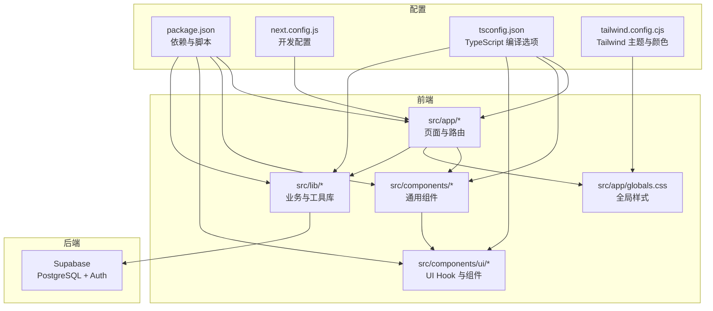
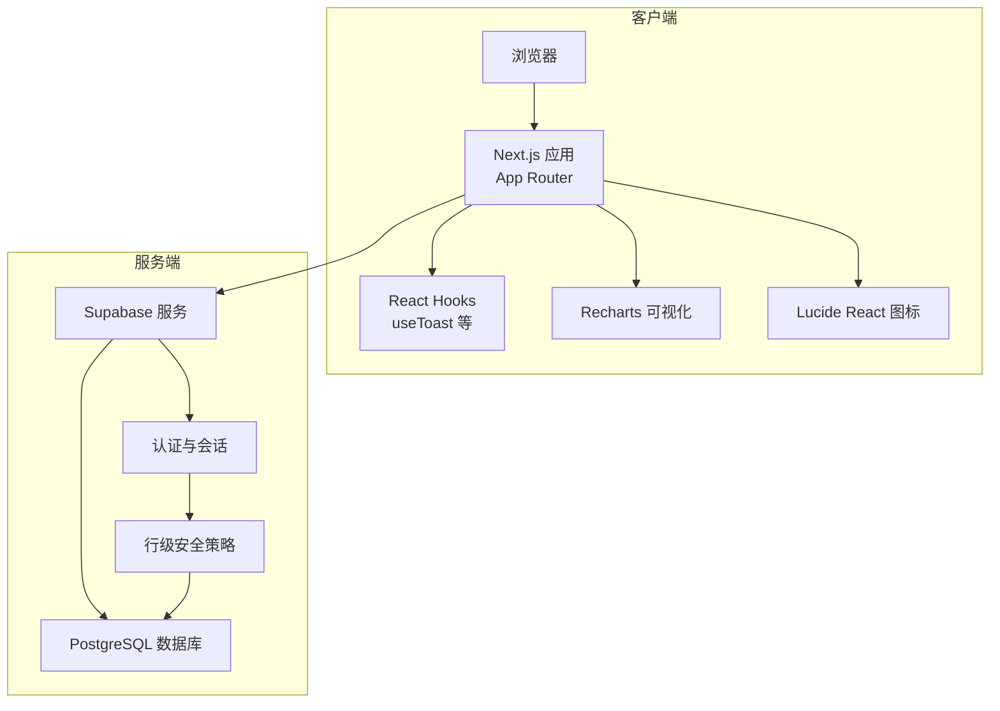
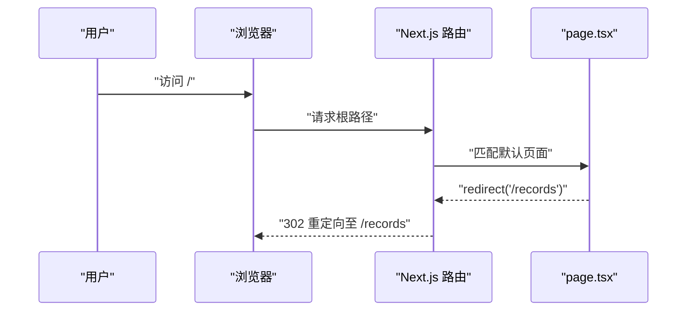
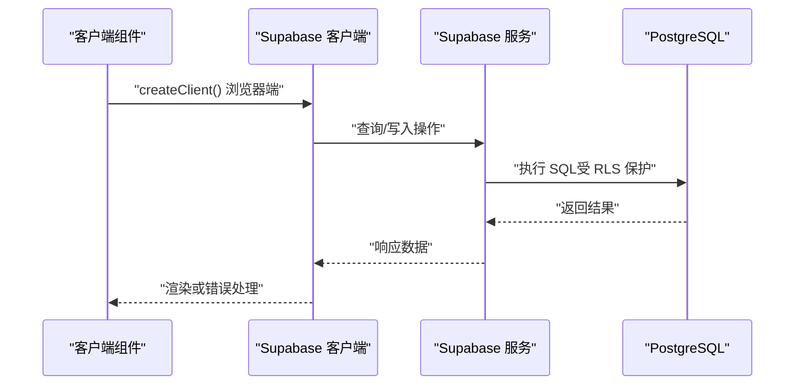
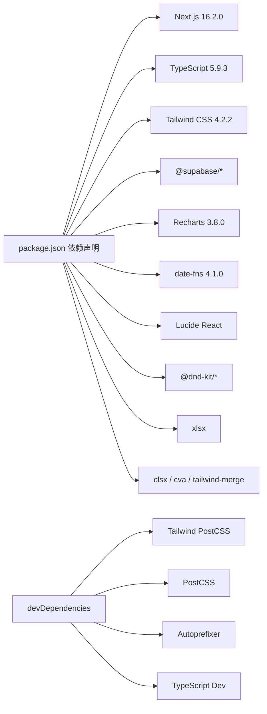

# 技术栈说明

<cite>
**本文引用的文件**
- [package.json](file://package.json)
- [next.config.js](file://next.config.js)
- [tsconfig.json](file://tsconfig.json)
- [tailwind.config.cjs](file://tailwind.config.cjs)
- [src/app/layout.tsx](file://src/app/layout.tsx)
- [src/app/globals.css](file://src/app/globals.css)
- [src/lib/supabase/client.ts](file://src/lib/supabase/client.ts)
- [src/lib/supabase/server.ts](file://src/lib/supabase/server.ts)
- [src/app/page.tsx](file://src/app/page.tsx)
- [src/components/ui/use-toast.tsx](file://src/components/ui/use-toast.tsx)
- [README.md](file://README.md)
</cite>

## 目录
1. [引言](#引言)
2. [项目结构](#项目结构)
3. [核心组件](#核心组件)
4. [架构总览](#架构总览)
5. [详细组件分析](#详细组件分析)
6. [依赖分析](#依赖分析)
7. [性能考量](#性能考量)
8. [故障排查指南](#故障排查指南)
9. [结论](#结论)
10. [附录](#附录)

## 引言
本文件面向技术决策者与开发者，系统阐述 TETO 项目的全栈技术栈与架构理念。项目采用 Next.js 16.2.0（App Router）、TypeScript、Tailwind CSS 作为前端基础；后端采用 Supabase（基于 PostgreSQL）提供认证与数据库能力；图表与可视化使用 Recharts，日期处理使用 date-fns。本文将从技术选型动机、版本兼容性、性能与扩展性、组件协作关系等方面进行深入说明，并给出替代方案对比与实践建议。

## 项目结构
TETO 项目遵循 Next.js App Router 的目录约定，前端资源集中在 src/app 与 src/components，样式通过 Tailwind CSS 与自定义 CSS 实现，数据库与认证由 Supabase 提供，TypeScript 提供类型安全保障。关键配置文件包括包管理、构建与样式配置等。

**图表来源**
- [src/app/layout.tsx:1-13](file://src/app/layout.tsx#L1-L13)
- [src/app/globals.css:1-88](file://src/app/globals.css#L1-L88)
- [package.json:1-44](file://package.json#L1-L44)
- [next.config.js:1-4](file://next.config.js#L1-L4)
- [tsconfig.json:1-42](file://tsconfig.json#L1-L42)
- [tailwind.config.cjs:1-61](file://tailwind.config.cjs#L1-L61)

**章节来源**
- [package.json:1-44](file://package.json#L1-L44)
- [next.config.js:1-4](file://next.config.js#L1-L4)
- [tsconfig.json:1-42](file://tsconfig.json#L1-L42)
- [tailwind.config.cjs:1-61](file://tailwind.config.cjs#L1-L61)
- [src/app/layout.tsx:1-13](file://src/app/layout.tsx#L1-L13)
- [src/app/globals.css:1-88](file://src/app/globals.css#L1-L88)

## 核心组件
- 前端框架与路由：Next.js 16.2.0（App Router），提供页面路由、SSR/SSG、API 路由与构建优化。
- 类型系统：TypeScript 5.9.3，严格模式与 bundler 解析，保障类型安全与开发体验。
- 样式系统：Tailwind CSS 4.2.2，结合自定义主题与 oklch 色彩空间，实现一致的视觉语言与暗色模式适配。
- 数据与认证：Supabase（@supabase/ssr、@supabase/supabase-js），提供浏览器与服务端客户端，支持行级安全策略（RLS）。
- 图表与可视化：Recharts 3.8.0，用于统计与洞察页面的数据可视化。
- 日期处理：date-fns 4.1.0，轻量、函数式、可组合的日期工具库。
- 其他：Lucide React（图标）、xlsx（表格导入）、@dnd-kit（拖拽交互）等。

**章节来源**
- [package.json:15-32](file://package.json#L15-L32)
- [tsconfig.json:2-28](file://tsconfig.json#L2-L28)
- [tailwind.config.cjs:8-59](file://tailwind.config.cjs#L8-L59)
- [src/lib/supabase/client.ts:1-9](file://src/lib/supabase/client.ts#L1-L9)
- [src/lib/supabase/server.ts:1-35](file://src/lib/supabase/server.ts#L1-L35)

## 架构总览
TETO 采用“前端 Next.js + 后端 Supabase”的现代全栈架构。前端负责页面渲染、交互与可视化，后端提供数据库与认证服务。开发模式下可通过环境变量启用“开发模式”，服务端可使用服务角色密钥绕过 RLS 以提升调试效率；生产模式下依赖匿名密钥与会话认证，保证数据隔离与安全。

**图表来源**
- [src/lib/supabase/client.ts:1-9](file://src/lib/supabase/client.ts#L1-L9)
- [src/lib/supabase/server.ts:1-35](file://src/lib/supabase/server.ts#L1-L35)
- [src/components/ui/use-toast.tsx:1-69](file://src/components/ui/use-toast.tsx#L1-L69)
- [package.json:19-29](file://package.json#L19-L29)

**章节来源**
- [src/lib/supabase/client.ts:1-9](file://src/lib/supabase/client.ts#L1-L9)
- [src/lib/supabase/server.ts:1-35](file://src/lib/supabase/server.ts#L1-L35)
- [src/components/ui/use-toast.tsx:1-69](file://src/components/ui/use-toast.tsx#L1-L69)

## 详细组件分析

### 前端框架与路由（Next.js 16.2.0）
- 选择理由：App Router 提供文件系统路由、布局嵌套、并行加载与流式传输等能力；与 React 19 生态契合，利于未来升级。
- 版本特性：支持 Server Components、Suspense、Streaming 等，适合 TETO 的数据驱动页面与实时图表场景。
- 在项目中的作用：页面组织、重定向逻辑、API 路由、全局样式注入与开发配置。

**图表来源**
- [src/app/page.tsx:1-5](file://src/app/page.tsx#L1-L5)

**章节来源**
- [src/app/page.tsx:1-5](file://src/app/page.tsx#L1-L5)
- [next.config.js:1-4](file://next.config.js#L1-L4)

### 类型系统（TypeScript）
- 严格模式与 bundler 解析：提升类型安全与 IDE 支持，减少运行时错误。
- 路径别名：@/* 指向 src/*，简化导入路径，增强可读性与可维护性。
- 目标与增量编译：ES2017 目标与增量编译提升开发与构建效率。

**章节来源**
- [tsconfig.json:2-28](file://tsconfig.json#L2-L28)

### 样式系统（Tailwind CSS）
- 内容扫描：覆盖 app、components、pages 下的 TS/TSX/JS/MDX，确保按需生成样式。
- 主题扩展：oklch 色彩空间、圆角、字体族、图表与侧边栏主题色，统一视觉语言。
- 全局样式：毛玻璃卡片、桌面背景网格、微光晕与柔和阴影等实用类，配合组件使用。

**章节来源**
- [tailwind.config.cjs:3-61](file://tailwind.config.cjs#L3-L61)
- [src/app/globals.css:1-88](file://src/app/globals.css#L1-L88)

### 数据与认证（Supabase）
- 浏览器客户端：通过 NEXT_PUBLIC_SUPABASE_URL 与 NEXT_PUBLIC_SUPABASE_ANON_KEY 初始化，用于前端直接调用。
- 服务端客户端：在 cookies 上下文中创建，开发模式下可使用服务角色密钥绕过 RLS，便于调试；生产模式使用匿名密钥与会话。
- 行级安全策略（RLS）：确保用户仅能访问自身数据，保障数据隔离。

**图表来源**
- [src/lib/supabase/client.ts:1-9](file://src/lib/supabase/client.ts#L1-L9)
- [src/lib/supabase/server.ts:1-35](file://src/lib/supabase/server.ts#L1-L35)

**章节来源**
- [src/lib/supabase/client.ts:1-9](file://src/lib/supabase/client.ts#L1-L9)
- [src/lib/supabase/server.ts:1-35](file://src/lib/supabase/server.ts#L1-L35)

### 图表与可视化（Recharts）
- 使用场景：统计分析页面的数据趋势与分布展示，与 date-fns 结合进行时间序列处理。
- 依赖与引擎要求：Node >= 18，与 React 16–19 兼容，提供丰富的图表组件与响应式布局能力。

**章节来源**
- [package.json:29](file://package.json#L29)
- [package.json:2315-2344](file://package.json#L2315-L2344)

### 日期处理（date-fns）
- 选择理由：函数式、无副作用、Tree-shaking 友好，适合 TETO 的时间筛选与聚合场景。
- 典型用途：日期范围选择、周/月粒度统计、时间格式化与比较。

**章节来源**
- [package.json:23](file://package.json#L23)

### 错误提示与通知（use-toast）
- 统一错误提示：use client 模式下的 Toast Hook，支持自动消失与手动关闭。
- 样式与定位：固定顶部居中，动画入场，红色强调错误语义。

**章节来源**
- [src/components/ui/use-toast.tsx:1-69](file://src/components/ui/use-toast.tsx#L1-L69)

### 其他前端依赖
- 图标：Lucide React，提供简洁线性图标集。
- 拖拽：@dnd-kit，用于目标与时间线的排序与拖拽。
- 导入：xlsx，支持历史记录导入模板解析。
- 工具类：clsx、class-variance-authority、tailwind-merge，提升类名合并与变体控制的可维护性。

**章节来源**
- [package.json:16-31](file://package.json#L16-L31)

## 依赖分析
- 前端生态：Next.js 16.2.0 与 React 19 配合，TypeScript 提供类型保障；Tailwind CSS 4.2.2 提供原子化样式。
- 后端生态：Supabase 提供认证与数据库，@supabase/ssr 与 @supabase/supabase-js 分别用于浏览器与服务端。
- 可视化与工具：Recharts 3.8.0、date-fns 4.1.0、Lucide React、@dnd-kit、xlsx 等。
- 开发工具链：Tailwind PostCSS 插件、Autoprefixer、PostCSS、TailwindCSS、TypeScript。

**图表来源**
- [package.json:15-42](file://package.json#L15-L42)

**章节来源**
- [package.json:15-42](file://package.json#L15-L42)

## 性能考量
- 构建与运行
  - Next.js App Router 支持并行加载与流式传输，有助于首屏渲染与交互延迟降低。
  - Tailwind CSS 4.2.2 与 PostCSS/Autoprefixer 组合，按需生成样式，避免冗余 CSS。
- 数据访问
  - Supabase 提供连接池与边缘缓存能力，结合 RLS 与索引设计，可降低不必要的查询开销。
  - 开发模式下服务端可绕过 RLS，但需注意生产环境务必启用 RLS 以避免越权。
- 可视化与日期处理
  - Recharts 与 date-fns 均为轻量库，建议在数据量较大时进行分页与懒加载优化。
- 类型与构建
  - TypeScript 的严格模式与增量编译可减少构建时间与潜在错误。

[本节为通用性能建议，不直接分析特定文件]

## 故障排查指南
- 环境变量未配置
  - 症状：无法连接 Supabase 或登录失败。
  - 排查：确认 NEXT_PUBLIC_SUPABASE_URL 与 NEXT_PUBLIC_SUPABASE_ANON_KEY 是否正确设置；如启用开发模式，需同时配置开发相关变量。
- 开发模式与 RLS
  - 症状：开发时可访问全部数据，生产环境权限异常。
  - 排查：检查 NEXT_PUBLIC_DEV_MODE 与服务端密钥配置；生产环境必须使用匿名密钥与会话认证。
- 构建与样式
  - 症状：样式未生效或 Tailwind 未生成。
  - 排查：确认 tailwind.config.cjs 的 content 路径包含当前组件；重新执行构建。
- 依赖版本冲突
  - 症状：Node 版本不满足 Recharts/Supabase 要求。
  - 排查：根据 package.json 中的 engines 与 peerDependencies 要求升级 Node 版本。

**章节来源**
- [README.md:54-62](file://README.md#L54-L62)
- [src/lib/supabase/server.ts:4-15](file://src/lib/supabase/server.ts#L4-L15)
- [tailwind.config.cjs:3-7](file://tailwind.config.cjs#L3-L7)
- [package.json:2336-2344](file://package.json#L2336-L2344)

## 结论
TETO 的技术栈围绕“快速迭代、类型安全、低运维成本”展开：Next.js 16.2.0 提供现代化前端体验；TypeScript 保障质量；Tailwind CSS 实现一致的视觉体系；Supabase 将认证与数据库整合为一体化后端；Recharts 与 date-fns 则分别满足可视化与日期处理需求。整体架构清晰、边界明确，具备良好的扩展性与可维护性。

[本节为总结性内容，不直接分析特定文件]

## 附录

### 技术选型决策依据与替代方案对比
- Next.js vs 其他框架
  - 优势：App Router、Server Components、内置 API 路由与构建优化。
  - 替代：Remix/Vite/VercelKit 等，但 Next.js 在生态与部署上更成熟。
- Supabase vs 自建后端
  - 优势：零运维、认证与数据库一体化、RLS、实时订阅。
  - 替代：AWS Amplify/Firebase/自建 Node/K8s，但需要额外的认证与数据库运维。
- Tailwind CSS vs 其他样式方案
  - 优势：原子化、主题一致性、暗色模式友好。
  - 替代：Styled Components/CSS Modules，但 Tailwind 更契合快速原型与团队协作。
- Recharts vs ECharts/Chart.js
  - 优势：与 React 生态契合、组件化、可定制性强。
  - 替代：ECharts/Chart.js，但 Recharts 在 Next.js 场景下更易集成。
- date-fns vs dayjs/Moment
  - 优势：函数式、Tree-shaking 友好、无副作用。
  - 替代：dayjs/Moment，但 date-fns 在现代打包工具下体积更小。

[本节为概念性对比，不直接分析特定文件]