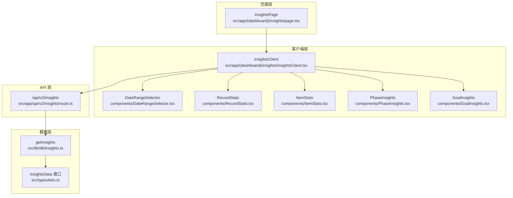
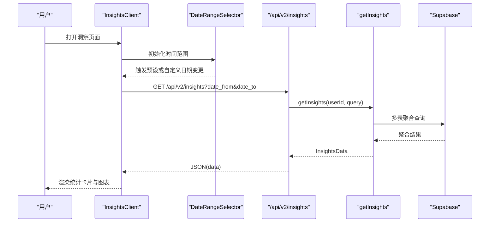
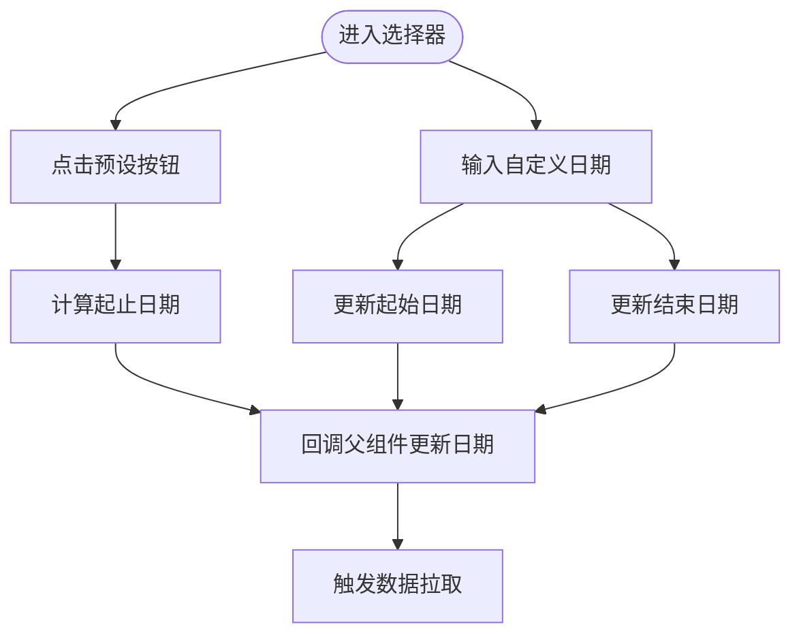
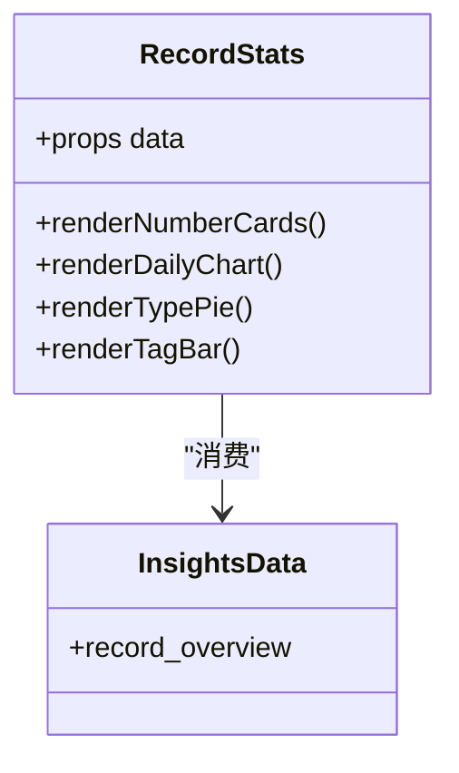
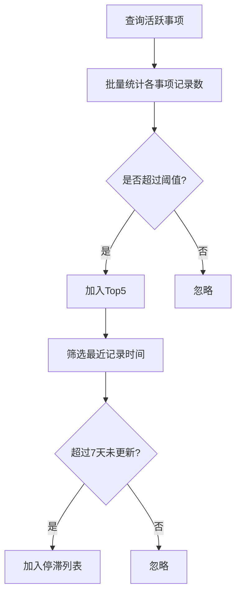
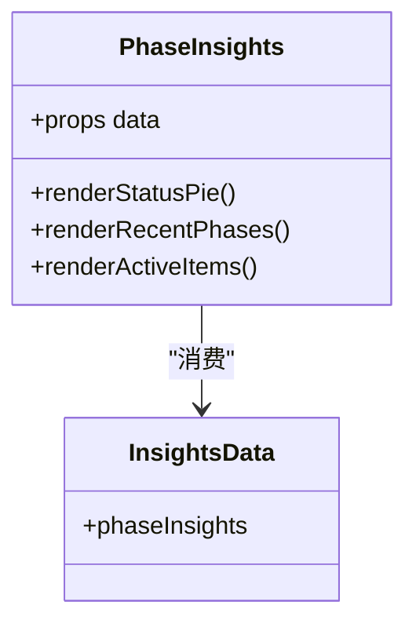
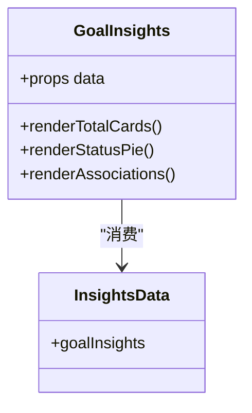
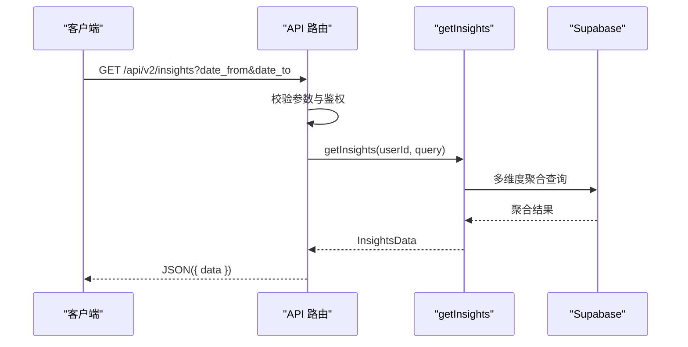
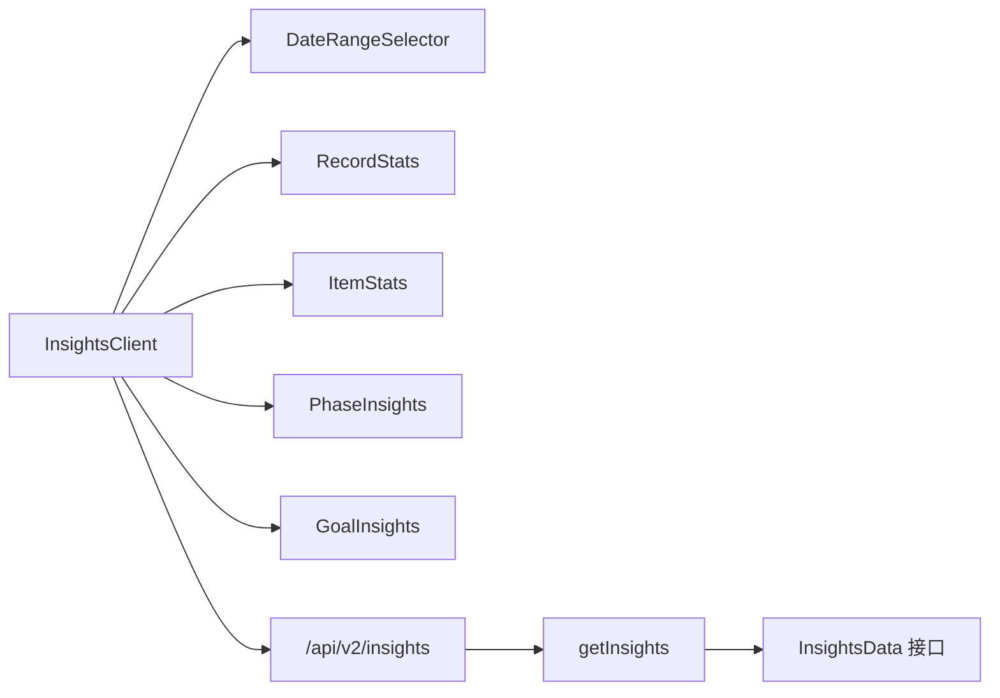

# 仪表盘与洞察分析

<cite>
**本文引用的文件**
- [src/app/(dashboard)/insights/page.tsx](file://src/app/(dashboard)/insights/page.tsx)
- [src/app/(dashboard)/insights/InsightsClient.tsx](file://src/app/(dashboard)/insights/InsightsClient.tsx)
- [src/app/(dashboard)/insights/components/DateRangeSelector.tsx](file://src/app/(dashboard)/insights/components/DateRangeSelector.tsx)
- [src/app/(dashboard)/insights/components/RecordStats.tsx](file://src/app/(dashboard)/insights/components/RecordStats.tsx)
- [src/app/(dashboard)/insights/components/ItemStats.tsx](file://src/app/(dashboard)/insights/components/ItemStats.tsx)
- [src/app/(dashboard)/insights/components/PhaseInsights.tsx](file://src/app/(dashboard)/insights/components/PhaseInsights.tsx)
- [src/app/(dashboard)/insights/components/GoalInsights.tsx](file://src/app/(dashboard)/insights/components/GoalInsights.tsx)
- [src/app/api/v2/insights/route.ts](file://src/app/api/v2/insights/route.ts)
- [src/lib/db/insights.ts](file://src/lib/db/insights.ts)
- [src/types/teto.ts](file://src/types/teto.ts)
</cite>

## 目录
1. [简介](#简介)
2. [项目结构](#项目结构)
3. [核心组件](#核心组件)
4. [架构总览](#架构总览)
5. [详细组件分析](#详细组件分析)
6. [依赖分析](#依赖分析)
7. [性能考量](#性能考量)
8. [故障排查指南](#故障排查指南)
9. [结论](#结论)
10. [附录](#附录)

## 简介
本文件面向 TETO 系统的“仪表盘与洞察分析”模块，系统性阐述仪表盘概览的设计理念与信息架构，涵盖今日状态、快捷入口与关键指标展示；深入解析洞察分析的时间范围选择器、统计数据组件与趋势图表功能；说明记录统计、项目统计与阶段洞察等多维度数据分析方法；解释数据聚合算法、图表渲染逻辑与前端刷新机制；提供洞察报告的解读指南与决策支持建议；介绍个性化配置与自定义分析的使用方法，并阐释洞察数据在个人成长与效率提升中的应用价值。

## 项目结构
洞察分析模块采用“页面容器 + 客户端组件 + 图表组件 + API 路由 + 数据聚合”的分层组织方式：
- 页面层：负责路由与容器渲染，将客户端组件组合为完整的洞察页面。
- 客户端层：负责时间范围选择、数据拉取、错误与加载状态管理、UI 呈现。
- 组件层：按维度拆分的统计卡片与图表组件，分别负责记录、项目、阶段、目标的可视化。
- API 层：提供统一的洞察数据接口，校验参数并返回标准化数据结构。
- 数据层：封装数据库查询与聚合逻辑，按维度产出洞察数据。

**图表来源**
- [src/app/(dashboard)/insights/page.tsx:1-6](file://src/app/(dashboard)/insights/page.tsx#L1-L6)
- [src/app/(dashboard)/insights/InsightsClient.tsx:1-149](file://src/app/(dashboard)/insights/InsightsClient.tsx#L1-L149)
- [src/app/(dashboard)/insights/components/DateRangeSelector.tsx:1-65](file://src/app/(dashboard)/insights/components/DateRangeSelector.tsx#L1-L65)
- [src/app/(dashboard)/insights/components/RecordStats.tsx:1-125](file://src/app/(dashboard)/insights/components/RecordStats.tsx#L1-L125)
- [src/app/(dashboard)/insights/components/ItemStats.tsx:1-111](file://src/app/(dashboard)/insights/components/ItemStats.tsx#L1-L111)
- [src/app/(dashboard)/insights/components/PhaseInsights.tsx:1-139](file://src/app/(dashboard)/insights/components/PhaseInsights.tsx#L1-L139)
- [src/app/(dashboard)/insights/components/GoalInsights.tsx:1-143](file://src/app/(dashboard)/insights/components/GoalInsights.tsx#L1-L143)
- [src/app/api/v2/insights/route.ts:1-32](file://src/app/api/v2/insights/route.ts#L1-L32)
- [src/lib/db/insights.ts:1-346](file://src/lib/db/insights.ts#L1-L346)
- [src/types/teto.ts:275-299](file://src/types/teto.ts#L275-L299)

**章节来源**
- [src/app/(dashboard)/insights/page.tsx:1-6](file://src/app/(dashboard)/insights/page.tsx#L1-L6)
- [src/app/(dashboard)/insights/InsightsClient.tsx:1-149](file://src/app/(dashboard)/insights/InsightsClient.tsx#L1-L149)

## 核心组件
- 仪表盘页面容器：仅负责引入客户端组件，保持页面层极简。
- 客户端容器：集中管理时间范围、数据拉取、错误与加载状态、组件渲染顺序。
- 时间范围选择器：提供预设范围与自定义日期输入，触发数据刷新。
- 统计与图表组件：按维度拆分，分别渲染数字卡片、趋势图与分布图。
- API 路由：校验参数、鉴权、调用数据层并返回标准化结果。
- 数据聚合层：实现多维度聚合算法，输出固定结构的洞察数据。

**章节来源**
- [src/app/(dashboard)/insights/page.tsx:1-6](file://src/app/(dashboard)/insights/page.tsx#L1-L6)
- [src/app/(dashboard)/insights/InsightsClient.tsx:1-149](file://src/app/(dashboard)/insights/InsightsClient.tsx#L1-L149)
- [src/app/api/v2/insights/route.ts:1-32](file://src/app/api/v2/insights/route.ts#L1-L32)
- [src/lib/db/insights.ts:1-346](file://src/lib/db/insights.ts#L1-L346)
- [src/types/teto.ts:275-299](file://src/types/teto.ts#L275-L299)

## 架构总览
洞察分析采用前后端分离的轻量架构：前端负责交互与可视化，后端负责数据聚合与权限控制。客户端组件通过 fetch 调用 API，API 路由校验参数与用户身份后，委托数据层执行聚合查询，最终以固定结构返回给前端渲染。

**图表来源**
- [src/app/(dashboard)/insights/InsightsClient.tsx:55-80](file://src/app/(dashboard)/insights/InsightsClient.tsx#L55-L80)
- [src/app/api/v2/insights/route.ts:6-23](file://src/app/api/v2/insights/route.ts#L6-L23)
- [src/lib/db/insights.ts:14-345](file://src/lib/db/insights.ts#L14-L345)

## 详细组件分析

### 时间范围选择器
- 功能：提供“近7天”“近30天”“本月”预设与自定义日期输入；切换预设时自动计算起止日期；自定义时允许手动输入日期。
- 交互：预设按钮高亮当前选中；日期输入框支持双向联动更新。
- 数据流：回调通知父组件更新日期范围，触发数据刷新。

**图表来源**
- [src/app/(dashboard)/insights/components/DateRangeSelector.tsx:19-64](file://src/app/(dashboard)/insights/components/DateRangeSelector.tsx#L19-L64)
- [src/app/(dashboard)/insights/InsightsClient.tsx:82-95](file://src/app/(dashboard)/insights/InsightsClient.tsx#L82-L95)

**章节来源**
- [src/app/(dashboard)/insights/components/DateRangeSelector.tsx:1-65](file://src/app/(dashboard)/insights/components/DateRangeSelector.tsx#L1-L65)
- [src/app/(dashboard)/insights/InsightsClient.tsx:16-37](file://src/app/(dashboard)/insights/InsightsClient.tsx#L16-L37)

### 记录维度统计（RecordStats）
- 指标：近7天与近30天记录总数、按类型分布饼图、按标签分布水平柱状图、每日记录数趋势柱状图。
- 聚合算法：
  - 近7/30天总数：基于 record_days 的日期范围筛选，统计对应 record_day_id 的记录数量。
  - 类型分布：按 record_day_id 范围内 records 的 type 聚合计数。
  - 标签分布：通过 record_tags 关联标签，按标签名称计数。
  - 每日趋势：按 record_days 的 date 聚合 records 数量。
- 图表渲染：使用 Recharts，支持响应式容器、工具提示与标签百分比显示。

**图表来源**
- [src/app/(dashboard)/insights/components/RecordStats.tsx:39-124](file://src/app/(dashboard)/insights/components/RecordStats.tsx#L39-L124)
- [src/types/teto.ts:275-283](file://src/types/teto.ts#L275-L283)

**章节来源**
- [src/app/(dashboard)/insights/components/RecordStats.tsx:1-125](file://src/app/(dashboard)/insights/components/RecordStats.tsx#L1-L125)
- [src/lib/db/insights.ts:23-141](file://src/lib/db/insights.ts#L23-L141)

### 项目维度统计（ItemStats）
- 指标：当前活跃事项数、Top 5 事项（按记录数排序）、停滞事项（超过7天未更新）。
- 聚合算法：
  - 活跃事项：items.status ∈ {'活跃','推进中'} 的计数。
  - Top 5：按 record_day_id 范围内 records 的 item_id 聚合计数，取前5。
  - 停滞事项：对活跃事项查询其最近记录时间，超过7天未更新即视为停滞。
- UI：数字卡片、列表卡片与人性化时间格式化。

**图表来源**
- [src/app/(dashboard)/insights/components/ItemStats.tsx:40-110](file://src/app/(dashboard)/insights/components/ItemStats.tsx#L40-L110)
- [src/lib/db/insights.ts:146-211](file://src/lib/db/insights.ts#L146-L211)

**章节来源**
- [src/app/(dashboard)/insights/components/ItemStats.tsx:1-111](file://src/app/(dashboard)/insights/components/ItemStats.tsx#L1-L111)
- [src/lib/db/insights.ts:146-211](file://src/lib/db/insights.ts#L146-L211)

### 阶段洞察（PhaseInsights）
- 指标：阶段状态分布饼图、最近创建的阶段列表、近期阶段变化活跃的事项 Top 5。
- 聚合算法：
  - 状态分布：按 phases.status 聚合计数。
  - 最近阶段：按 created_at 降序取前5。
  - 阶段变化活跃事项：统计最近30天内新增阶段的事项数量，取前5。
- UI：中文状态标签与颜色映射，列表卡片展示状态色点与创建日期。

**图表来源**
- [src/app/(dashboard)/insights/components/PhaseInsights.tsx:32-138](file://src/app/(dashboard)/insights/components/PhaseInsights.tsx#L32-L138)
- [src/types/teto.ts:289-293](file://src/types/teto.ts#L289-L293)

**章节来源**
- [src/app/(dashboard)/insights/components/PhaseInsights.tsx:1-139](file://src/app/(dashboard)/insights/components/PhaseInsights.tsx#L1-L139)
- [src/lib/db/insights.ts:214-259](file://src/lib/db/insights.ts#L214-L259)

### 目标洞察（GoalInsights）
- 指标：目标总数、有关联的目标准备数、目标状态分布饼图、目标关联统计（事项数与记录数）。
- 聚合算法：
  - 总数与状态分布：按 goals.status 聚合计数。
  - 有关联的目标：批量查询 items 与 records 的 goal_id，统计每个目标的关联数量，取前若干。
- UI：数字卡片、中文状态标签与颜色映射、列表卡片展示关联详情。

**图表来源**
- [src/app/(dashboard)/insights/components/GoalInsights.tsx:29-142](file://src/app/(dashboard)/insights/components/GoalInsights.tsx#L29-L142)
- [src/types/teto.ts:294-298](file://src/types/teto.ts#L294-L298)

**章节来源**
- [src/app/(dashboard)/insights/components/GoalInsights.tsx:1-143](file://src/app/(dashboard)/insights/components/GoalInsights.tsx#L1-L143)
- [src/lib/db/insights.ts:262-319](file://src/lib/db/insights.ts#L262-L319)

### API 路由与数据聚合
- API 路由：接收 date_from 与 date_to 参数，校验必填；获取当前用户 ID；调用 getInsights 并返回标准化结构。
- 数据聚合：按维度实现多表联结与计数，确保在空数据时返回空数组或零值，避免前端异常。

**图表来源**
- [src/app/api/v2/insights/route.ts:6-31](file://src/app/api/v2/insights/route.ts#L6-L31)
- [src/lib/db/insights.ts:14-345](file://src/lib/db/insights.ts#L14-L345)

**章节来源**
- [src/app/api/v2/insights/route.ts:1-32](file://src/app/api/v2/insights/route.ts#L1-L32)
- [src/lib/db/insights.ts:1-346](file://src/lib/db/insights.ts#L1-L346)

## 依赖分析
- 组件耦合：客户端容器集中管理状态与副作用，子组件仅关注渲染，降低耦合度。
- 外部依赖：Recharts 用于图表渲染；Lucide React 用于图标；Tailwind CSS 用于样式。
- 数据契约：InsightsData 接口定义了固定的数据结构，保证前后端一致的契约。

**图表来源**
- [src/app/(dashboard)/insights/InsightsClient.tsx:3-12](file://src/app/(dashboard)/insights/InsightsClient.tsx#L3-L12)
- [src/app/api/v2/insights/route.ts:2-4](file://src/app/api/v2/insights/route.ts#L2-L4)
- [src/lib/db/insights.ts:1-2](file://src/lib/db/insights.ts#L1-L2)
- [src/types/teto.ts:275-299](file://src/types/teto.ts#L275-L299)

**章节来源**
- [src/app/(dashboard)/insights/InsightsClient.tsx:1-149](file://src/app/(dashboard)/insights/InsightsClient.tsx#L1-L149)
- [src/types/teto.ts:275-299](file://src/types/teto.ts#L275-L299)

## 性能考量
- 查询优化：按日期范围先筛选 record_days，再基于 dayIds 进行二次查询，减少无关扫描。
- 聚合策略：使用 groupby 与计数聚合，避免一次性加载大量明细数据。
- 图表渲染：使用响应式容器与轻量 tooltip，避免频繁重绘。
- 缓存与刷新：当前为每次日期变更触发请求，建议在高频切换场景下增加节流与缓存策略（可在客户端层扩展）。
- 错误与加载：提供加载指示与错误提示，保障用户体验。

[本节为通用性能建议，不直接分析具体文件]

## 故障排查指南
- 参数缺失：API 路由会返回 400 错误，提示 date_from 与 date_to 为必填。
- 未登录：鉴权失败时返回 401，需检查认证流程与环境变量。
- 服务器错误：捕获异常并返回 500，检查数据库连接与查询逻辑。
- 数据为空：组件对空数据进行友好提示，确认时间范围与用户数据是否存在。

**章节来源**
- [src/app/api/v2/insights/route.ts:14-30](file://src/app/api/v2/insights/route.ts#L14-L30)
- [src/app/(dashboard)/insights/InsightsClient.tsx:67-73](file://src/app/(dashboard)/insights/InsightsClient.tsx#L67-L73)

## 结论
TETO 的洞察分析模块通过清晰的分层设计与稳定的契约接口，实现了从记录、项目、阶段到目标的多维度数据可视化。客户端组件聚焦交互与渲染，API 路由负责鉴权与参数校验，数据层承担复杂聚合逻辑。该架构既满足当前需求，也为未来扩展（如实时更新、个性化配置、更细粒度的自定义分析）提供了良好基础。

[本节为总结性内容，不直接分析具体文件]

## 附录

### 洞察报告解读与决策支持
- 记录维度：关注近7/30天趋势与类型分布，识别记录习惯与偏好；若标签分布不均衡，可调整记录模板或标签体系。
- 项目维度：结合活跃事项与停滞事项，优先处理停滞事项；Top 5 事项代表当前重心，可据此优化时间分配。
- 阶段维度：关注状态分布与近期变化，评估阶段性进展与资源投入；对“进行中”占比过低的情况，考虑分解任务或调整目标。
- 目标维度：统计目标总数与有关联的目标，评估目标与行动的耦合度；对“已达成”比例偏低的情况，加强目标设定与里程碑管理。

[本节为通用指导，不直接分析具体文件]

### 个性化配置与自定义分析
- 时间范围：通过预设与自定义日期灵活切换，适配短期回顾与长期趋势分析。
- 维度筛选：当前按用户维度聚合；未来可扩展按项目、阶段、标签等维度进行交叉分析。
- 图表定制：可基于现有组件扩展新的图表类型（如折线图、热力图），并在客户端层进行组合。

[本节为通用指导，不直接分析具体文件]

### 仪表盘概览与信息架构
- 今日状态：通过“记录维度统计”中的近7/30天总数与每日趋势，快速了解当前记录密度与波动。
- 快捷入口：结合“项目维度统计”的 Top 5 与“阶段洞察”的最近阶段，快速定位当前重点事项与阶段。
- 关键指标：以“目标洞察”的状态分布与“项目维度”的活跃度为核心，形成闭环反馈。

[本节为通用指导，不直接分析具体文件]