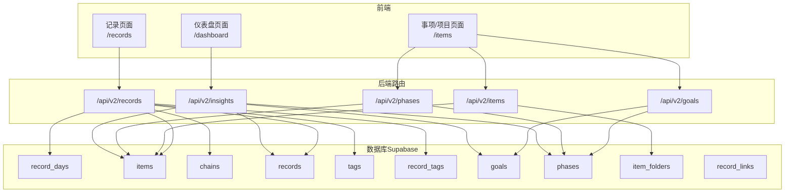
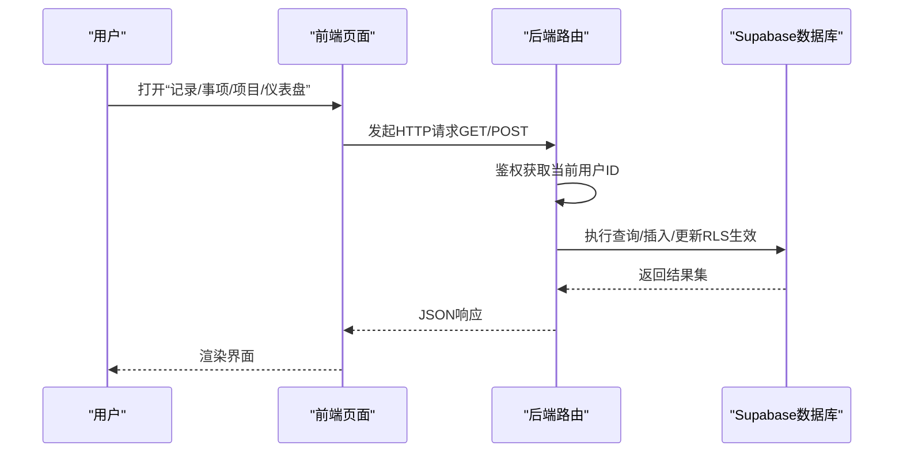
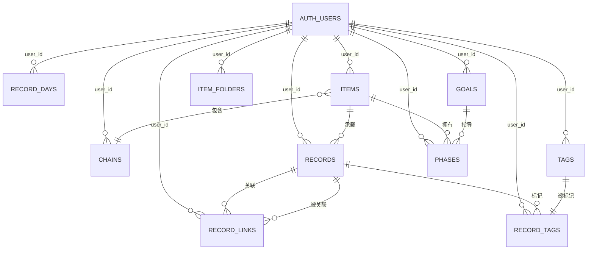
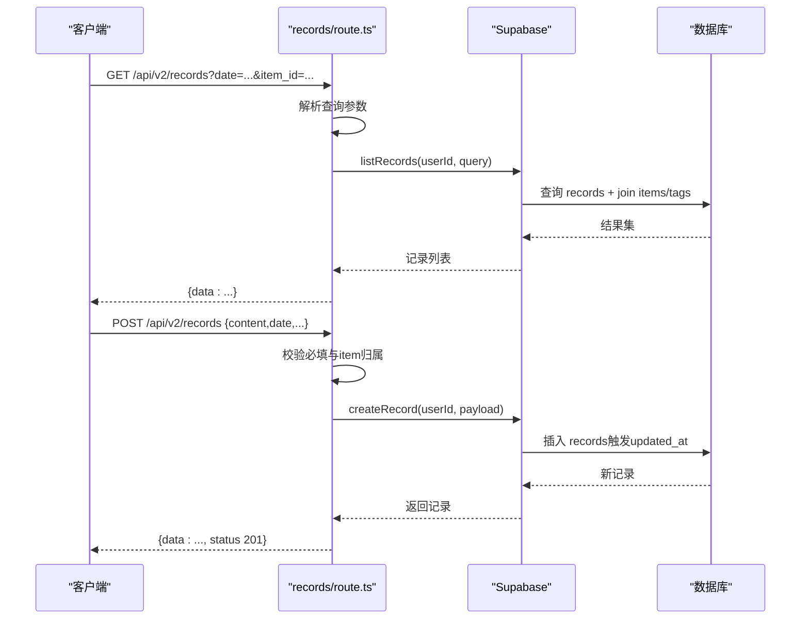
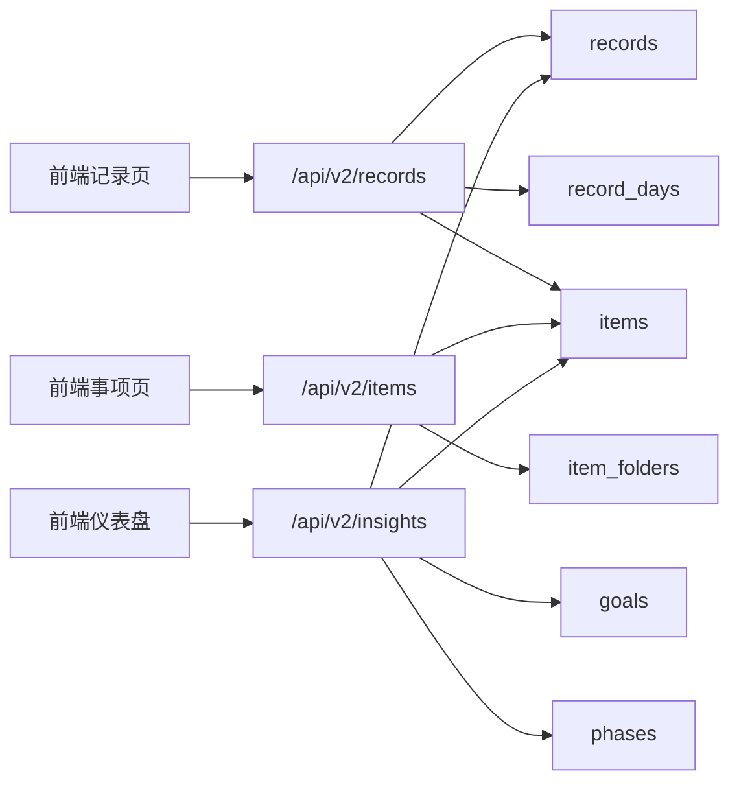

# 数据集成与流转

<cite>
**本文引用的文件**
- [README.md](file://README.md)
- [DATA_RULES.md](file://DATA_RULES.md)
- [teto.ts](file://src/types/teto.ts)
- [semantic.ts](file://src/types/semantic.ts)
- [001_teto_1_3_records_model.sql](file://sql/001_teto_1_3_records_model.sql)
- [003_teto_1_4_phases_and_goals.sql](file://sql/003_teto_1_4_phases_and_goals.sql)
- [007_record_metric_fields.sql](file://sql/007_record_metric_fields.sql)
- [008_record_links_and_batch.sql](file://sql/008_record_links_and_batch.sql)
- [006_item_folders.sql](file://sql/006_item_folders.sql)
- [records/route.ts](file://src/app/api\v2\records\route.ts)
- [items/route.ts](file://src/app/api\v2\items\route.ts)
- [goals/route.ts](file://src/app/api\v2\goals\route.ts)
- [phases/route.ts](file://src/app/api\v2\phases\route.ts)
- [insights/route.ts](file://src/app/api\v2\insights\route.ts)
</cite>

## 目录
1. [简介](#简介)
2. [项目结构](#项目结构)
3. [核心组件](#核心组件)
4. [架构总览](#架构总览)
5. [详细组件分析](#详细组件分析)
6. [依赖分析](#依赖分析)
7. [性能考虑](#性能考虑)
8. [故障排查指南](#故障排查指南)
9. [结论](#结论)
10. [附录](#附录)

## 简介
本文件面向TETO系统的数据集成与流转机制，聚焦以下目标：
- 明确“每日记录”“日记复盘”“项目管理”“仪表盘分析”的数据关系与流转路径
- 解释数据模型设计原理、实体关系图与字段约束规则
- 说明数据一致性保障机制（RLS、触发器、索引）、事务与错误恢复策略
- 提供数据迁移与版本升级方案，确保历史数据完整与兼容
- 给出备份与恢复最佳实践、性能优化索引策略
- 解释数据安全与隐私保护（行级安全策略）

## 项目结构
TETO采用Next.js App Router + Supabase（PostgreSQL）+ TypeScript的前后端分离架构。前端通过REST风格API调用后端路由，后端路由通过Supabase客户端访问数据库。数据模型以SQL脚本演进为主，配合TypeScript类型定义。

图表来源
- [records/route.ts:1-86](file://src/app/api\v2\records\route.ts#L1-L86)
- [items/route.ts:1-47](file://src/app/api\v2\items\route.ts#L1-L47)
- [goals/route.ts:1-49](file://src/app/api\v2\goals\route.ts#L1-L49)
- [phases/route.ts:1-72](file://src/app/api\v2\phases\route.ts#L1-L72)
- [insights/route.ts:1-32](file://src/app/api\v2\insights\route.ts#L1-L32)
- [001_teto_1_3_records_model.sql:18-109](file://sql/001_teto_1_3_records_model.sql#L18-L109)
- [003_teto_1_4_phases_and_goals.sql:16-61](file://sql/003_teto_1_4_phases_and_goals.sql#L16-L61)
- [006_item_folders.sql:8-19](file://sql/006_item_folders.sql#L8-L19)
- [007_record_metric_fields.sql:8-19](file://sql/007_record_metric_fields.sql#L8-L19)
- [008_record_links_and_batch.sql:7-31](file://sql/008_record_links_and_batch.sql#L7-L31)

章节来源
- [README.md:1-126](file://README.md#L1-L126)

## 核心组件
- 记录模型（1.3模型）：record_days、records、items、chains、tags、record_tags
- 1.4扩展：goals、phases、item_folders、record_links、生命周期状态与度量字段
- API路由：records/items/goals/phases/insights
- 类型系统：teto.ts、semantic.ts

章节来源
- [001_teto_1_3_records_model.sql:18-109](file://sql/001_teto_1_3_records_model.sql#L18-L109)
- [003_teto_1_4_phases_and_goals.sql:16-61](file://sql/003_teto_1_4_phases_and_goals.sql#L16-L61)
- [006_item_folders.sql:8-19](file://sql/006_item_folders.sql#L8-L19)
- [007_record_metric_fields.sql:8-19](file://sql/007_record_metric_fields.sql#L8-L19)
- [008_record_links_and_batch.sql:7-31](file://sql/008_record_links_and_batch.sql#L7-L31)
- [teto.ts:28-121](file://src/types/teto.ts#L28-L121)
- [semantic.ts:18-65](file://src/types/semantic.ts#L18-L65)

## 架构总览
数据从“记录”出发，经由“事项/阶段/目标”组织，最终在“仪表盘洞察”中聚合呈现。API路由负责鉴权与参数校验，数据库通过RLS保障数据隔离，触发器与索引保障一致性与性能。

图表来源
- [records/route.ts:7-42](file://src/app/api\v2\records\route.ts#L7-L42)
- [items/route.ts:6-26](file://src/app/api\v2\items\route.ts#L6-L26)
- [goals/route.ts:6-28](file://src/app/api\v2\goals\route.ts#L6-L28)
- [phases/route.ts:7-30](file://src/app/api\v2\phases\route.ts#L7-L30)
- [insights/route.ts:6-23](file://src/app/api\v2\insights\route.ts#L6-L23)

## 详细组件分析

### 数据模型与实体关系
- 核心三层：
  - 天容器：record_days（按日期聚合）
  - 事项容器：items（主题/项目）
  - 记录项：records（最小事实单元）
- 1.4扩展：
  - 目标：goals（方向层）
  - 阶段：phases（时间段内持续现实）
  - 事项文件夹：item_folders（分类收纳）
  - 记录微关联：record_links（计划/发生/衍生/推迟等）
  - 度量字段：metric_value/unit/name/duration_minutes
  - 生命周期状态：lifecycle_status（active/completed/postponed/cancelled）
- 约束与一致性：
  - 外键约束：records.record_day_id、records.item_id、chains.item_id、record_tags.record_id/tag_id、phases.item_id/goals.id、items.goal_id、items.folder_id
  - 触发器：updated_at自动更新；记录与链路一致性校验
  - RLS：所有表启用行级安全，按user_id隔离

图表来源
- [001_teto_1_3_records_model.sql:18-109](file://sql/001_teto_1_3_records_model.sql#L18-L109)
- [003_teto_1_4_phases_and_goals.sql:16-61](file://sql/003_teto_1_4_phases_and_goals.sql#L16-L61)
- [006_item_folders.sql:8-19](file://sql/006_item_folders.sql#L8-L19)
- [007_record_metric_fields.sql:8-19](file://sql/007_record_metric_fields.sql#L8-L19)
- [008_record_links_and_batch.sql:7-31](file://sql/008_record_links_and_batch.sql#L7-L31)

章节来源
- [001_teto_1_3_records_model.sql:18-109](file://sql/001_teto_1_3_records_model.sql#L18-L109)
- [003_teto_1_4_phases_and_goals.sql:16-61](file://sql/003_teto_1_4_phases_and_goals.sql#L16-L61)
- [006_item_folders.sql:8-19](file://sql/006_item_folders.sql#L8-L19)
- [007_record_metric_fields.sql:8-19](file://sql/007_record_metric_fields.sql#L8-L19)
- [008_record_links_and_batch.sql:7-31](file://sql/008_record_links_and_batch.sql#L7-L31)

### 数据规则与统计口径
- 真源定义：
  - 任务管理=配置真源（目标、单位、是否参与统计、起始日期、项目归属、状态、排序）
  - 今日记录=原始事实真源（日期、任务/事项、完成状态、数值、备注、情绪/状态）
  - 记录总表=原始记录总览视图（非统计真源）
  - 统计分析=聚合计算结果（基于配置与原始记录统一计算）
- 开始时间优先级：手动配置 > 首次有效记录 > 任务创建时间
- 目标值优先级：直接配置 > 推导（周=日×7、月=日×当月天数）
- 完成值口径：当日/本周/当月/累计汇总
- 统计规则：差额=目标-完成，进度=完成/目标×100%，允许超限；任务类型：完成/未完成、次数型、数值型；备注型不参与统计；情绪需数值化后方可进入统计

章节来源
- [DATA_RULES.md:3-126](file://DATA_RULES.md#L3-L126)

### API工作流与数据流转

#### 记录API（GET/POST）
- GET：解析查询参数（日期/日期区间/事项/类型/标签/收藏/搜索/限制），调用listRecords，返回记录列表
- POST：校验content/date必填，校验item归属，调用createRecord，返回新建记录

图表来源
- [records/route.ts:7-86](file://src/app/api\v2\records\route.ts#L7-L86)
- [001_teto_1_3_records_model.sql:115-189](file://sql/001_teto_1_3_records_model.sql#L115-L189)

章节来源
- [records/route.ts:7-86](file://src/app/api\v2\records\route.ts#L7-L86)

#### 事项API（GET/POST）
- GET：解析status/is_pinned，调用listItems
- POST：校验title，调用createItem

章节来源
- [items/route.ts:6-46](file://src/app/api\v2\items\route.ts#L6-L46)

#### 目标API（GET/POST）
- GET：解析status/item_id/phase_id，调用getGoals
- POST：校验title，调用createGoal

章节来源
- [goals/route.ts:6-48](file://src/app/api\v2\goals\route.ts#L6-L48)

#### 阶段API（GET/POST）
- GET：解析item_id/status/is_historical，调用getPhases
- POST：校验item_id/title，校验事项归属，调用createPhase

章节来源
- [phases/route.ts:7-71](file://src/app/api\v2\phases\route.ts#L7-L71)

#### 仪表盘洞察API（GET）
- GET：校验date_from/date_to，调用getInsights，返回记录/事项/阶段/目标的聚合数据

章节来源
- [insights/route.ts:6-31](file://src/app/api\v2\insights\route.ts#L6-L31)

### 数据一致性与事务处理
- 行级安全（RLS）：所有表启用RLS，策略按user_id强制隔离，确保用户只能访问自身数据
- 触发器：
  - updated_at自动更新：对record_days/items/chains/records/goals/phases/item_folders设置触发器
  - 记录与链路一致性：records的chain_id与item_id必须一致，否则抛异常
- 事务与错误恢复：
  - Supabase在单请求内保证原子性；路由层捕获异常并返回401/500
  - 建议：批量写入使用单事务（Supabase RPC或服务端事务封装），失败回滚

章节来源
- [001_teto_1_3_records_model.sql:115-189](file://sql/001_teto_1_3_records_model.sql#L115-L189)
- [003_teto_1_4_phases_and_goals.sql:67-79](file://sql/003_teto_1_4_phases_and_goals.sql#L67-L79)
- [006_item_folders.sql:21-26](file://sql/006_item_folders.sql#L21-L26)
- [records/route.ts:35-41](file://src/app/api\v2\records\route.ts#L35-L41)

### 数据迁移与版本升级
- 版本脚本顺序（示例）：001_teto_1_3_records_model.sql → 003_teto_1_4_phases_and_goals.sql → 006_item_folders.sql → 007_record_metric_fields.sql → 008_record_links_and_batch.sql
- 升级策略：
  - 逐个执行SQL脚本，先建表/加列，再触发器/RLS/索引
  - 对历史数据：在新增列时使用默认值或NULL，后续通过后台任务补齐
  - 兼容性：新增列/索引不破坏既有查询；枚举值变更需在应用层与数据库双侧兼容
- 历史数据完整性：
  - 通过唯一约束（如record_days(user_id,date)、record_tags(record_id,tag_id)）避免重复
  - 外键级联策略：ON DELETE CASCADE/SET NULL确保删除时数据不孤立

章节来源
- [001_teto_1_3_records_model.sql:18-109](file://sql/001_teto_1_3_records_model.sql#L18-L109)
- [003_teto_1_4_phases_and_goals.sql:54-61](file://sql/003_teto_1_4_phases_and_goals.sql#L54-L61)
- [006_item_folders.sql:18-19](file://sql/006_item_folders.sql#L18-L19)
- [007_record_metric_fields.sql:8-19](file://sql/007_record_metric_fields.sql#L8-L19)
- [008_record_links_and_batch.sql:24-31](file://sql/008_record_links_and_batch.sql#L24-L31)

### 数据安全与隐私
- 行级安全（RLS）：所有表启用RLS，SELECT/INSERT/UPDATE/DELETE策略均要求auth.uid() = user_id
- 认证：Magic Link登录，回调URL在Supabase控制台配置
- 传输安全：通过Supabase提供的HTTPS与匿名密钥访问
- 最佳实践：避免在前端暴露敏感字段；后端严格校验资源归属

章节来源
- [README.md:75-90](file://README.md#L75-L90)
- [001_teto_1_3_records_model.sql:197-276](file://sql/001_teto_1_3_records_model.sql#L197-L276)

## 依赖分析
- 前端页面依赖后端路由（/api/v2/*）
- 后端路由依赖Supabase客户端与数据库表
- 数据库表之间通过外键与触发器建立强依赖关系
- 类型系统（teto.ts/semantic.ts）贯穿前后端，确保字段与约束一致

图表来源
- [records/route.ts:1-86](file://src/app/api\v2\records\route.ts#L1-L86)
- [items/route.ts:1-47](file://src/app/api\v2\items\route.ts#L1-L47)
- [insights/route.ts:1-32](file://src/app/api\v2\insights\route.ts#L1-L32)
- [001_teto_1_3_records_model.sql:18-109](file://sql/001_teto_1_3_records_model.sql#L18-L109)
- [003_teto_1_4_phases_and_goals.sql:16-61](file://sql/003_teto_1_4_phases_and_goals.sql#L16-L61)
- [006_item_folders.sql:8-19](file://sql/006_item_folders.sql#L8-L19)

## 性能考虑
- 索引策略（建议）：
  - record_days：(user_id,date)
  - records：(user_id,record_day_id)、(user_id,occurred_at)、item_id、chain_id、goal_id、batch_id
  - items：(user_id,status)、folder_id、goal_id
  - phases：(user_id,item_id)、item_id、goal_id、sort_order
  - tags：(user_id,name)
  - record_tags：(record_id)、(tag_id)
  - record_links：(source_id)、(target_id)
- 查询优化：
  - 使用分页与limit
  - 尽量使用复合索引覆盖查询条件
  - 聚合查询（仪表盘）建议物化视图或定期统计表（P2/P3规划）
- 写入优化：
  - 批量插入时合并事务
  - 避免频繁更新updated_at（触发器成本）

章节来源
- [001_teto_1_3_records_model.sql:282-299](file://sql/001_teto_1_3_records_model.sql#L282-L299)
- [003_teto_1_4_phases_and_goals.sql:117-129](file://sql/003_teto_1_4_phases_and_goals.sql#L117-L129)
- [006_item_folders.sql:35-37](file://sql/006_item_folders.sql#L35-L37)
- [008_record_links_and_batch.sql:21-22](file://sql/008_record_links_and_batch.sql#L21-L22)

## 故障排查指南
- 认证失败（401）：检查NEXT_PUBLIC_SUPABASE_URL与NEXT_PUBLIC_SUPABASE_ANON_KEY；确认Magic Link登录流程与回调URL配置
- 资源归属错误（404/400）：POST记录/阶段时需校验item归属；若返回“事项不存在或不属于当前用户”，检查item_id与当前用户是否匹配
- 数据重复/唯一冲突：检查唯一约束（如record_days(user_id,date)、record_tags(record_id,tag_id)）
- 统计异常：核对开始时间规则、目标值优先级与统计口径（完成值按当日/本周/当月/累计汇总）

章节来源
- [records/route.ts:59-74](file://src/app/api\v2\records\route.ts#L59-L74)
- [phases/route.ts:47-60](file://src/app/api\v2\phases\route.ts#L47-L60)
- [001_teto_1_3_records_model.sql:25-26](file://sql/001_teto_1_3_records_model.sql#L25-L26)
- [001_teto_1_3_records_model.sql:108-109](file://sql/001_teto_1_3_records_model.sql#L108-L109)

## 结论
TETO通过清晰的三层记录模型与1.4扩展的目标/阶段/文件夹/微关联体系，实现了从“记录事实”到“项目组织”再到“仪表盘洞察”的完整数据闭环。RLS与触发器保障了数据隔离与一致性，API路由提供了稳定的接入点。建议在P2/P3阶段完善物化统计与索引策略，并持续演进导入/导出与多端同步能力。

## 附录
- 术语
  - 真源：不可再分解的事实来源
  - 统计：基于真源的聚合计算结果
  - 生命周期状态：记录的Todo流转状态（进行中/已完成/推迟/取消）
- 参考
  - 数据规则与统计口径详见数据规则文档
  - 技术栈与部署说明详见README

章节来源
- [DATA_RULES.md:3-126](file://DATA_RULES.md#L3-L126)
- [README.md:13-21](file://README.md#L13-L21)