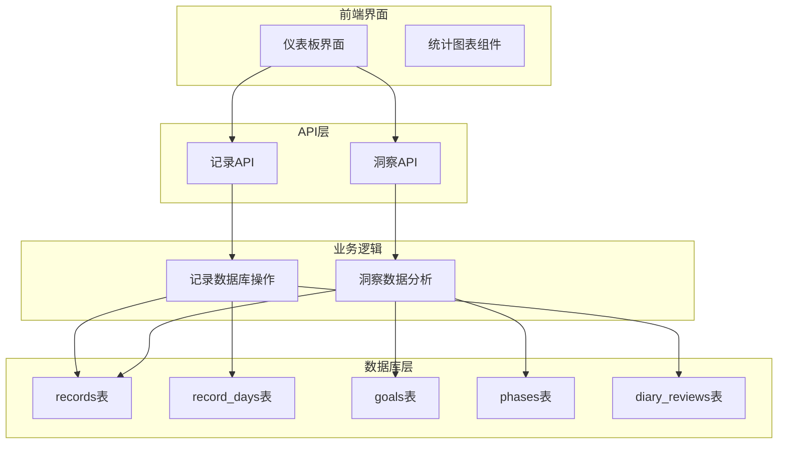
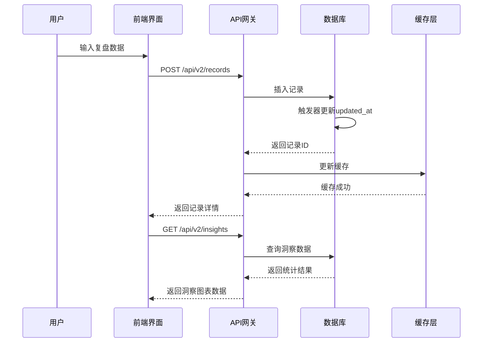
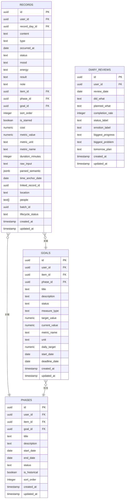
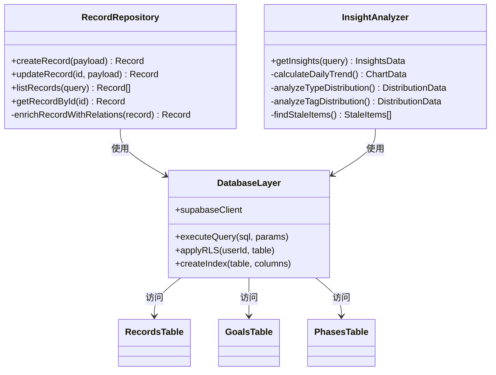
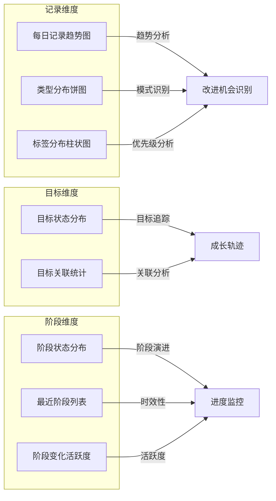
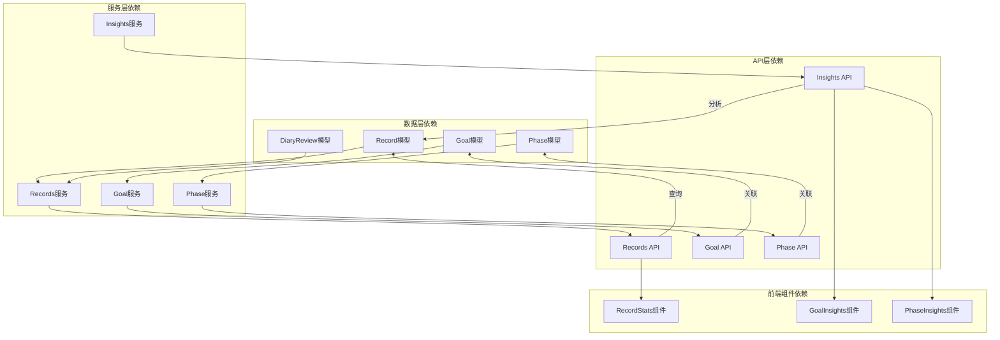

# 日记复盘系统

<cite>
**本文档引用的文件**
- [003_teto_1_4_phases_and_goals.sql](file://sql/003_teto_1_4_phases_and_goals.sql)
- [004_teto_1_4_record_type_convergence.sql](file://sql/004_teto_1_4_record_type_convergence.sql)
- [teto.ts](file://src/types/teto.ts)
- [records.ts](file://src/lib/db/records.ts)
- [route.ts](file://src/app/api/v2/records/route.ts)
- [insights.ts](file://src/lib/db/insights.ts)
- [route.ts](file://src/app/api/v2/insights/route.ts)
- [RecordStats.tsx](file://src/app/(dashboard)/insights/components/RecordStats.tsx)
- [GoalInsights.tsx](file://src/app/(dashboard)/insights/components/GoalInsights.tsx)
- [PhaseInsights.tsx](file://src/app/(dashboard)/insights/components/PhaseInsights.tsx)
- [003_diary_reviews.sql](file://sql/保留存档sql/sql1.0.0/003_diary_reviews.sql)
- [《TETO 1.0 页面结构详细稿（正式版）》.md](file://docs/10-版本归档/TETO 1.0.0/《TETO 1.0 页面结构详细稿（正式版）》.md)
</cite>

## 目录
1. [简介](#简介)
2. [项目结构](#项目结构)
3. [核心组件](#核心组件)
4. [架构概览](#架构概览)
5. [详细组件分析](#详细组件分析)
6. [依赖关系分析](#依赖关系分析)
7. [性能考虑](#性能考虑)
8. [故障排除指南](#故障排除指南)
9. [结论](#结论)
10. [附录](#附录)

## 简介
本系统为TETO的日记复盘功能提供完整的数据模型、API接口与前端展示方案。复盘围绕"今日做了什么、完成度、情绪、问题、明日计划"五大核心要素构建，通过结构化的记录类型与目标-阶段体系，将日常记录转化为可追踪、可分析的个人成长数据资产。

## 项目结构
系统采用前后端分离架构，后端基于Next.js API路由，数据库采用PostgreSQL，通过Supabase客户端访问。核心目录结构如下：



**图表来源**
- [records.ts:1-328](file://src/lib/db/records.ts#L1-L328)
- [insights.ts:1-346](file://src/lib/db/insights.ts#L1-L346)
- [003_teto_1_4_phases_and_goals.sql:1-130](file://sql/003_teto_1_4_phases_and_goals.sql#L1-L130)

**章节来源**
- [records.ts:1-328](file://src/lib/db/records.ts#L1-L328)
- [insights.ts:1-346](file://src/lib/db/insights.ts#L1-L346)

## 核心组件
系统围绕以下核心组件构建复盘功能：

### 数据模型组件
- **记录类型统一**：将历史的情绪、花费、结果等记录类型统一收敛为"发生/计划/想法/总结"四种类型
- **目标-阶段体系**：引入goals和phases表，支持目标驱动的复盘分析
- **复盘专用表**：保留diary_reviews表，专门存储结构化复盘数据

### API组件
- **记录管理API**：提供记录的CRUD操作，支持按日期、类型、标签等多维度过滤
- **洞察分析API**：提供7天/30天趋势、类型分布、标签分布等综合洞察

### 展示组件
- **统计图表**：使用Recharts展示每日记录趋势、类型分布、标签分布
- **目标洞察**：展示目标状态分布和关联统计
- **阶段洞察**：展示阶段状态分布和活跃度分析

**章节来源**
- [teto.ts:12-13](file://src/types/teto.ts#L12-L13)
- [004_teto_1_4_record_type_convergence.sql:1-20](file://sql/004_teto_1_4_record_type_convergence.sql#L1-L20)
- [003_teto_1_4_phases_and_goals.sql:16-45](file://sql/003_teto_1_4_phases_and_goals.sql#L16-L45)

## 架构概览
系统采用分层架构，确保数据一致性与可扩展性：



**图表来源**
- [route.ts:44-86](file://src/app/api/v2/records/route.ts#L44-L86)
- [route.ts:6-32](file://src/app/api/v2/insights/route.ts#L6-L32)
- [records.ts:11-46](file://src/lib/db/records.ts#L11-L46)

系统架构特点：
- **数据一致性**：通过触发器自动维护updated_at字段
- **权限控制**：基于用户ID的行级安全策略
- **索引优化**：针对常用查询条件建立复合索引
- **缓存机制**：热点数据缓存提升响应速度

## 详细组件分析

### 复盘数据模型设计
系统采用混合数据模型，既支持灵活的日常记录，也支持结构化的复盘模板：



**图表来源**
- [teto.ts:37-74](file://src/types/teto.ts#L37-L74)
- [teto.ts:316-354](file://src/types/teto.ts#L316-L354)
- [teto.ts:337-354](file://src/types/teto.ts#L337-L354)
- [003_diary_reviews.sql:1-34](file://sql/保留存档sql/sql1.0.0/003_diary_reviews.sql#L1-L34)

### 复盘模板与数据收集流程
系统提供标准化的复盘模板，确保数据收集的一致性和完整性：

```mermaid
flowchart TD
Start([开始复盘]) --> Template[加载复盘模板]
Template --> DidWhat[记录"今日做了什么"]
DidWhat --> Completion[输入"完成度"]
Completion --> Mood[选择"情绪状态"]
Mood --> Problem[识别"主要问题"]
Problem --> Tomorrow[制定"明日计划"]
Tomorrow --> Save[保存复盘记录]
Save --> Analyze[生成洞察报告]
Analyze --> Review[查看历史对比]
Review --> End([完成])
Save --> |同时| CreateRecord[创建结构化记录]
CreateRecord --> UpdateMetrics[更新指标数据]
UpdateMetrics --> TriggerInsights[触发洞察计算]
```

**图表来源**
- [《TETO 1.0 页面结构详细稿（正式版）》.md:629-736](file://docs/10-版本归档/TETO 1.0.0/《TETO 1.0 页面结构详细稿（正式版）》.md#L629-L736)

复盘模板的核心要素：
- **今日做了什么**：记录具体行动和成果
- **完成度**：量化当日目标完成程度（0-100%）
- **情绪**：记录当日情绪状态
- **问题**：识别阻碍进展的关键因素
- **明日计划**：制定明确的次日行动方案

### 数据存储与查询优化
系统通过多种机制确保数据存储效率和查询性能：



**图表来源**
- [records.ts:11-328](file://src/lib/db/records.ts#L11-L328)
- [insights.ts:14-346](file://src/lib/db/insights.ts#L14-L346)

**章节来源**
- [records.ts:176-300](file://src/lib/db/records.ts#L176-L300)
- [insights.ts:14-346](file://src/lib/db/insights.ts#L14-L346)

### 可视化展示组件
系统提供多层次的可视化展示，帮助用户发现改进机会：



**图表来源**
- [RecordStats.tsx](file://src/app/(dashboard)/insights/components/RecordStats.tsx#L39-L125)
- [GoalInsights.tsx](file://src/app/(dashboard)/insights/components/GoalInsights.tsx#L29-L143)
- [PhaseInsights.tsx](file://src/app/(dashboard)/insights/components/PhaseInsights.tsx#L32-L139)

**章节来源**
- [RecordStats.tsx](file://src/app/(dashboard)/insights/components/RecordStats.tsx#L1-L125)
- [GoalInsights.tsx](file://src/app/(dashboard)/insights/components/GoalInsights.tsx#L1-L143)
- [PhaseInsights.tsx](file://src/app/(dashboard)/insights/components/PhaseInsights.tsx#L1-L139)

## 依赖关系分析
系统各组件间存在清晰的依赖关系，确保功能模块的内聚性和松耦合：



**图表来源**
- [teto.ts:37-74](file://src/types/teto.ts#L37-L74)
- [teto.ts:316-354](file://src/types/teto.ts#L316-L354)
- [teto.ts:337-354](file://src/types/teto.ts#L337-L354)

**章节来源**
- [teto.ts:1-516](file://src/types/teto.ts#L1-L516)

## 性能考虑
系统在设计时充分考虑了性能优化：

### 查询性能优化
- **复合索引策略**：为常用查询条件建立索引，包括用户ID+日期、状态组合等
- **N+1查询避免**：批量预加载关联数据，减少数据库查询次数
- **分页机制**：默认限制查询结果数量，防止大数据集影响性能

### 缓存策略
- **热点数据缓存**：对频繁访问的洞察数据进行缓存
- **增量更新**：通过updated_at字段实现数据变更的增量同步

### 数据一致性保证
- **事务处理**：关键操作使用数据库事务确保数据一致性
- **触发器机制**：自动维护时间戳和统计数据

## 故障排除指南
常见问题及解决方案：

### 数据查询异常
**问题症状**：API返回空数据或错误信息
**排查步骤**：
1. 检查用户认证状态
2. 验证查询参数格式
3. 确认数据权限范围

**解决方案**：
- 确保用户已登录并通过身份验证
- 检查日期格式是否符合YYYY-MM-DD
- 验证用户ID与数据所有权匹配

### 性能问题
**问题症状**：查询响应时间过长
**排查步骤**：
1. 检查数据库索引是否完整
2. 分析查询执行计划
3. 优化查询条件

**解决方案**：
- 为常用查询字段添加适当索引
- 使用分页参数限制结果集大小
- 优化复杂查询的WHERE条件

### 数据不一致
**问题症状**：同一数据在不同接口显示不一致
**排查步骤**：
1. 检查缓存状态
2. 验证数据同步机制
3. 确认事务提交状态

**解决方案**：
- 清理相关缓存数据
- 重新触发数据同步
- 检查数据库触发器状态

**章节来源**
- [route.ts:35-42](file://src/app/api/v2/records/route.ts#L35-L42)
- [records.ts:176-300](file://src/lib/db/records.ts#L176-L300)

## 结论
TETO日记复盘系统通过标准化的数据模型、完善的API接口和丰富的可视化展示，为用户提供了一个完整的个人成长追踪平台。系统的核心优势在于：

1. **结构化复盘**：标准化的五大要素确保复盘质量
2. **数据驱动**：通过洞察分析帮助用户发现改进机会
3. **目标导向**：结合目标-阶段体系实现长期追踪
4. **可视化展示**：多维度图表帮助用户理解数据趋势
5. **性能优化**：合理的架构设计确保系统高效运行

该系统不仅能够帮助用户提升个人效率，更重要的是建立了可持续的自我改进机制，为长期个人发展提供数据支撑。

## 附录

### 复盘质量评估标准
- **完整性**：五大要素是否全部填写
- **准确性**：数据是否真实反映实际情况
- **及时性**：复盘是否在当日或次日完成
- **可执行性**：明日计划是否具体可行
- **反思深度**：问题分析是否触及本质原因

### 数据输入最佳实践
- **实时记录**：尽量在当日完成复盘
- **简洁明了**：使用简短有力的语言描述
- **量化指标**：尽可能使用具体数值
- **客观中立**：避免过度自我批评
- **持续改进**：根据洞察调整行动计划

### 长期追踪应用场景
- **个人成长轨迹**：观察能力提升趋势
- **习惯养成监测**：追踪行为改变过程
- **目标达成评估**：衡量阶段性成果
- **压力管理分析**：识别情绪波动规律
- **效率优化指导**：发现工作模式问题