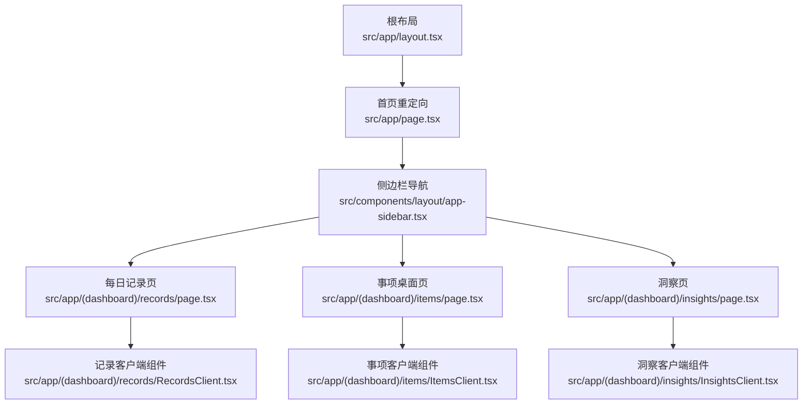
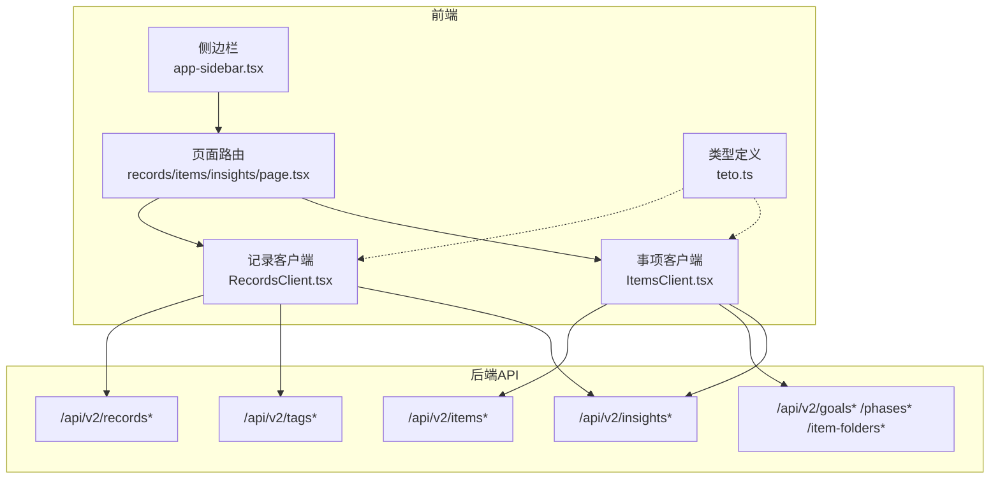
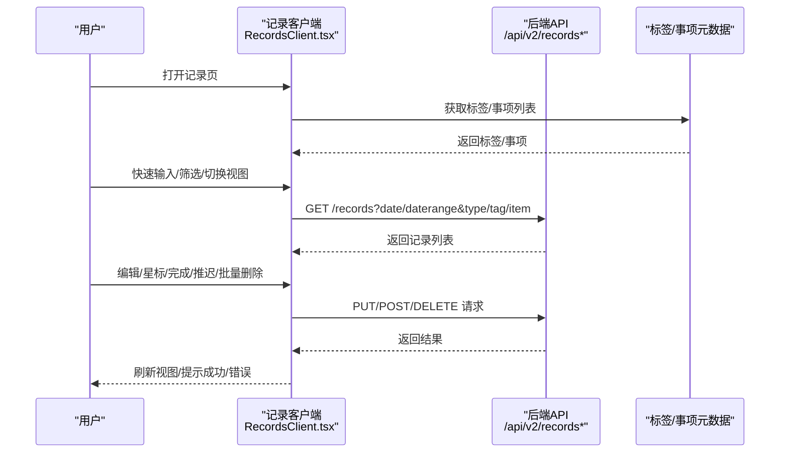
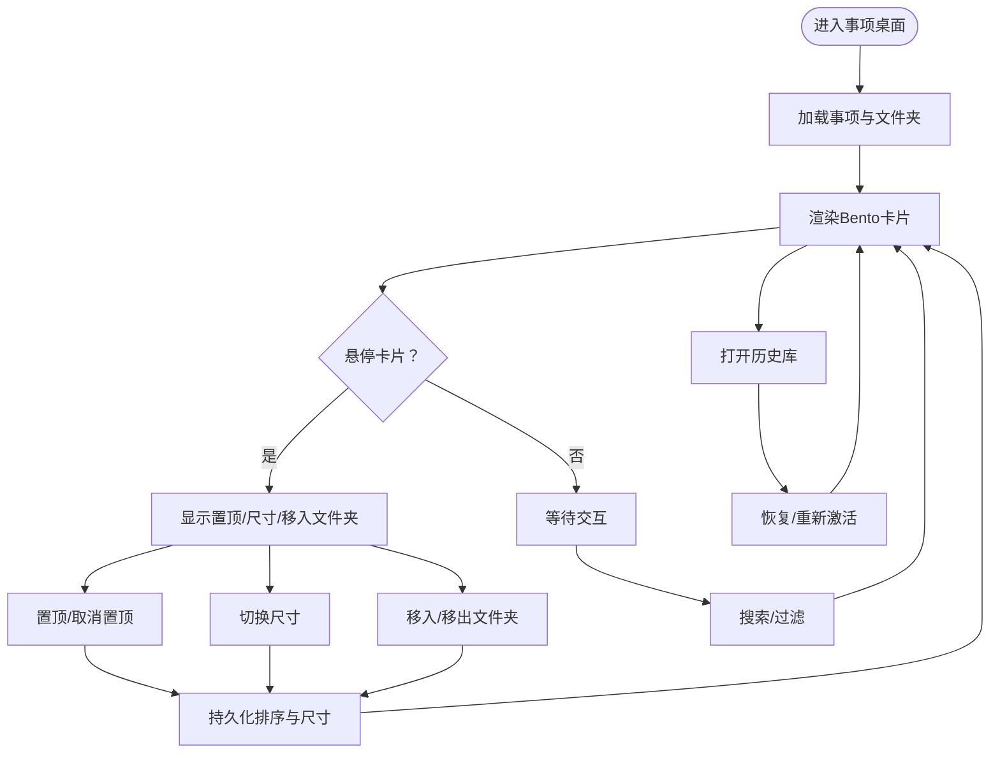
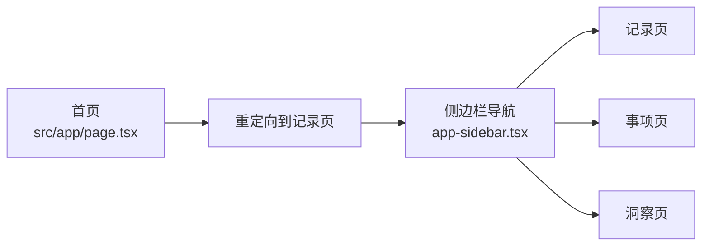
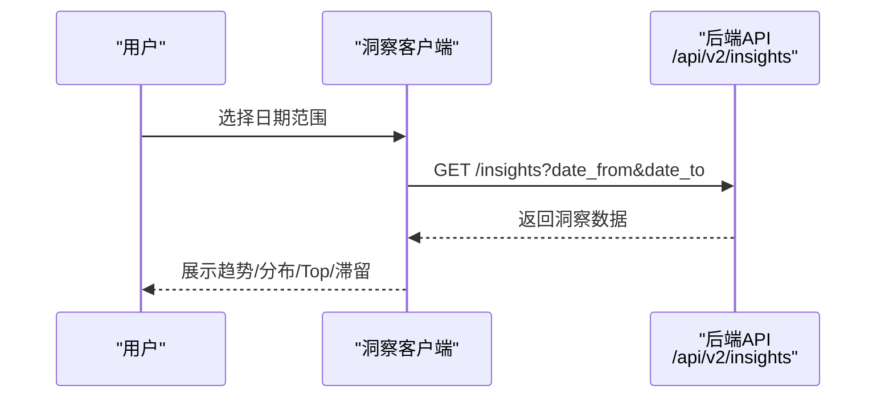
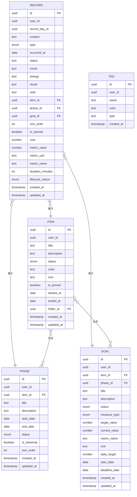
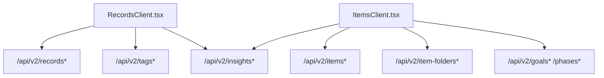

# 核心功能特性

<cite>
**本文引用的文件**   
- [README.md](file://README.md)
- [src/app/layout.tsx](file://src/app/layout.tsx)
- [src/app/page.tsx](file://src/app/page.tsx)
- [src/components/layout/app-sidebar.tsx](file://src/components/layout/app-sidebar.tsx)
- [src/types/teto.ts](file://src/types/teto.ts)
- [src/app/(dashboard)/records/page.tsx](file://src/app/(dashboard)/records/page.tsx)
- [src/app/(dashboard)/records/RecordsClient.tsx](file://src/app/(dashboard)/records/RecordsClient.tsx)
- [src/app/(dashboard)/items/page.tsx](file://src/app/(dashboard)/items/page.tsx)
- [src/app/(dashboard)/items/ItemsClient.tsx](file://src/app/(dashboard)/items/ItemsClient.tsx)
- [src/app/(dashboard)/insights/page.tsx](file://src/app/(dashboard)/insights/page.tsx)
- [public/templates/history-record-import-template.csv](file://public/templates/history-record-import-template.csv)
</cite>

## 目录
1. [引言](#引言)
2. [项目结构](#项目结构)
3. [核心组件](#核心组件)
4. [架构总览](#架构总览)
5. [详细组件分析](#详细组件分析)
6. [依赖分析](#依赖分析)
7. [性能考虑](#性能考虑)
8. [故障排查指南](#故障排查指南)
9. [结论](#结论)
10. [附录](#附录)

## 引言
本文件面向TETO系统的使用者与实施者，系统性梳理并阐释五大核心功能模块：每日记录、日记复盘、项目管理、仪表盘概览与统计分析。文档从功能范围、使用场景、核心价值、模块协同与数据流转、典型使用流程与最佳实践、用户体验与交互理念，以及可视化呈现等方面进行深入说明，帮助不同背景的读者高效理解与落地应用。

## 项目结构
TETO采用Next.js App Router组织前端页面与客户端逻辑，核心页面位于/dashboard目录下，配合统一布局与侧边导航，形成清晰的功能分区与一致的交互体验。

**图表来源**
- [src/app/layout.tsx:1-13](file://src/app/layout.tsx#L1-L13)
- [src/app/page.tsx:1-5](file://src/app/page.tsx#L1-L5)
- [src/components/layout/app-sidebar.tsx:1-147](file://src/components/layout/app-sidebar.tsx#L1-L147)
- [src/app/(dashboard)/records/page.tsx:1-6](file://src/app/(dashboard)/records/page.tsx#L1-L6)
- [src/app/(dashboard)/items/page.tsx:1-6](file://src/app/(dashboard)/items/page.tsx#L1-L6)
- [src/app/(dashboard)/insights/page.tsx:1-6](file://src/app/(dashboard)/insights/page.tsx#L1-L6)

**章节来源**
- [src/app/layout.tsx:1-13](file://src/app/layout.tsx#L1-L13)
- [src/app/page.tsx:1-5](file://src/app/page.tsx#L1-L5)
- [src/components/layout/app-sidebar.tsx:1-147](file://src/components/layout/app-sidebar.tsx#L1-L147)

## 核心组件
- 每日记录：提供“发生/计划/想法/总结”四类记录，支持快速输入、筛选、星标、完成/推迟计划、多选批量删除、单日/多日视图切换与滚动定位。
- 项目管理：以“事项”为核心实体，支持创建、置顶、分组归档、Bento风格卡片、阶段与目标关联、历史归档与检索。
- 仪表盘概览：通过侧边栏导航与页面布局，提供“记录/事项/洞察”的统一入口，首页重定向至记录页，便于快速开始。
- 统计分析：提供7天/30天趋势、记录类型与标签分布、事项活跃度与滞留情况等洞察，支撑日常回顾与长期追踪。
- 数据模型：统一的Record/Item/Tag/Goal/Phase等类型定义，明确字段、枚举与API契约，确保前后端一致性与可演进性。

**章节来源**
- [src/app/(dashboard)/records/RecordsClient.tsx:1-695](file://src/app/(dashboard)/records/RecordsClient.tsx#L1-L695)
- [src/app/(dashboard)/items/ItemsClient.tsx:1-678](file://src/app/(dashboard)/items/ItemsClient.tsx#L1-L678)
- [src/types/teto.ts:1-516](file://src/types/teto.ts#L1-L516)
- [README.md:1-126](file://README.md#L1-L126)

## 架构总览
TETO采用“页面路由 + 客户端组件 + 类型定义 + API路由”的分层架构。页面负责承载客户端组件，客户端组件负责状态管理、UI交互与API调用；类型定义统一数据契约；API路由提供后端能力（由README说明的API端点与数据模型支撑）。

**图表来源**
- [src/app/(dashboard)/records/page.tsx:1-6](file://src/app/(dashboard)/records/page.tsx#L1-L6)
- [src/app/(dashboard)/items/page.tsx:1-6](file://src/app/(dashboard)/items/page.tsx#L1-L6)
- [src/app/(dashboard)/insights/page.tsx:1-6](file://src/app/(dashboard)/insights/page.tsx#L1-L6)
- [src/app/(dashboard)/records/RecordsClient.tsx:1-695](file://src/app/(dashboard)/records/RecordsClient.tsx#L1-L695)
- [src/app/(dashboard)/items/ItemsClient.tsx:1-678](file://src/app/(dashboard)/items/ItemsClient.tsx#L1-L678)
- [src/types/teto.ts:1-516](file://src/types/teto.ts#L1-L516)

## 详细组件分析

### 每日记录模块
- 功能范围
  - 记录类型：发生/计划/想法/总结
  - 输入方式：快速输入、抽屉式编辑、AI辅助标记（挂起状态）
  - 视图模式：单日与多日（多列滚动），支持“回今天”定位
  - 交互能力：筛选（类型/标签/事项）、星标、完成/推迟计划、多选批量删除
  - 数据联动：记录与标签、事项、阶段、目标的关联字段
- 使用场景
  - 快速记录当日发生与计划，形成“发生/计划”双轨
  - 结合“推迟”机制将计划投影到未来日期，维持计划可视化
  - 多日视图用于回顾与对比，快速定位异常日期
- 核心价值
  - 结构化记录降低认知负担，提升复盘效率
  - 星标与筛选提升信息密度与检索效率
  - 完成/推迟闭环强化执行与计划一致性
- 典型流程
  - 单日模式：快速输入 → 编辑详情 → 星标/完成/推迟 → 查看7日趋势
  - 多日模式：滑动浏览 → 筛选定位 → 批量删除不必要记录 → 回到今天
- 最佳实践
  - 优先使用“发生”记录已执行事项，“计划”记录待执行但未发生
  - 对重要计划使用“推迟”而非删除，保留计划轨迹
  - 利用标签与事项建立跨记录关联，便于统计分析
- 用户体验与交互理念
  - 以“记录”为中心的即时反馈（快速输入、抽屉编辑、星标切换）
  - 多日视图的“回今天”锚定，减少用户方向感丢失
  - 批量操作与多选栏降低重复动作成本

**图表来源**
- [src/app/(dashboard)/records/RecordsClient.tsx:177-229](file://src/app/(dashboard)/records/RecordsClient.tsx#L177-L229)
- [src/app/(dashboard)/records/RecordsClient.tsx:301-421](file://src/app/(dashboard)/records/RecordsClient.tsx#L301-L421)

**章节来源**
- [src/app/(dashboard)/records/page.tsx:1-6](file://src/app/(dashboard)/records/page.tsx#L1-L6)
- [src/app/(dashboard)/records/RecordsClient.tsx:1-695](file://src/app/(dashboard)/records/RecordsClient.tsx#L1-L695)
- [src/types/teto.ts:28-74](file://src/types/teto.ts#L28-L74)

### 项目管理模块（事项与阶段）
- 功能范围
  - 事项：创建、置顶、图标/颜色、状态（活跃/推进中/放缓/停滞/已完成/已搁置）
  - 分组：文件夹创建、重命名、移出、拖拽排序
  - 桌面：Bento风格卡片（1x1/2x1/2x2），支持尺寸循环、悬停操作
  - 历史归档：已完成/已搁置的事项独立展示与快速访问
- 使用场景
  - 将长期目标拆解为“事项”，通过阶段与目标驱动量化
  - 以桌面卡片直观掌握当前重点与进展
  - 通过文件夹分组管理相关事项，提升空间记忆效率
- 核心价值
  - 以“事项”为载体，串联记录、阶段与目标，形成闭环
  - 桌面卡片降低信息密度，突出关键状态与最近活动
  - 归档机制避免信息污染，保持工作台清爽
- 典型流程
  - 创建事项 → 设置状态/图标/颜色 → 放入文件夹 → 调整卡片尺寸 → 置顶关注
  - 查看历史库 → 恢复/重新激活 → 重新规划阶段与目标
- 最佳实践
  - 事项命名尽量短小明确，便于卡片识别
  - 使用状态色与图标形成视觉编码，快速判断状态
  - 将相关事项放入同一文件夹，减少跨屏查找
- 用户体验与交互理念
  - 悬停显示操作按钮，避免常驻UI干扰
  - 尺寸循环与置顶满足不同信息密度需求
  - 拖拽排序与持久化，尊重用户的桌面组织习惯

**图表来源**
- [src/app/(dashboard)/items/ItemsClient.tsx:114-484](file://src/app/(dashboard)/items/ItemsClient.tsx#L114-L484)

**章节来源**
- [src/app/(dashboard)/items/page.tsx:1-6](file://src/app/(dashboard)/items/page.tsx#L1-L6)
- [src/app/(dashboard)/items/ItemsClient.tsx:1-678](file://src/app/(dashboard)/items/ItemsClient.tsx#L1-L678)
- [src/types/teto.ts:76-94](file://src/types/teto.ts#L76-L94)

### 仪表盘概览与导航
- 功能范围
  - 侧边栏导航：记录、事项、洞察三大入口
  - 首页重定向：默认跳转至记录页，降低首次使用门槛
  - 登出与版本信息：底部区域提供登出与版本提示
- 使用场景
  - 快速切换功能模块，形成“记录—事项—洞察”的工作流
  - 开发模式标识与用户信息展示，便于调试与运维
- 核心价值
  - 统一入口降低认知负荷，提升任务切换效率
  - 首页直达减少决策成本，提高初始使用效率
- 最佳实践
  - 将高频功能置于侧边栏显眼位置，保持导航一致性
  - 在移动端与桌面端保持相同的导航心智模型

**图表来源**
- [src/app/page.tsx:1-5](file://src/app/page.tsx#L1-L5)
- [src/components/layout/app-sidebar.tsx:16-20](file://src/components/layout/app-sidebar.tsx#L16-L20)

**章节来源**
- [src/app/page.tsx:1-5](file://src/app/page.tsx#L1-L5)
- [src/components/layout/app-sidebar.tsx:1-147](file://src/components/layout/app-sidebar.tsx#L1-L147)

### 统计分析与洞察
- 功能范围
  - 洞察数据：记录概览（7/30天总量、类型分布、标签分布、日频趋势）、事项概览（活跃数量、Top事项、滞留事项）
  - 阶段与目标洞察：阶段状态分布、目标关联情况
  - 日期范围选择：支持自定义时间窗口
- 使用场景
  - 每日/每周回顾：查看趋势与分布，识别异常与改进点
  - 项目健康度评估：基于阶段与目标的完成度与关联度
  - 长期追踪：结合历史数据观察变化轨迹
- 核心价值
  - 数据驱动的自我管理：从经验判断转向事实依据
  - 可视化洞察：降低数据分析门槛，提升决策质量
- 典型流程
  - 选择日期范围 → 查看记录与事项洞察 → 分析滞留与低活跃 → 制定优化计划
- 最佳实践
  - 固定周期回顾（如每日晨会/睡前），形成稳定反馈环
  - 结合“推迟”与“完成”记录，验证计划执行偏差
  - 使用标签与事项建立跨记录关联，提升洞察颗粒度

**图表来源**
- [src/app/(dashboard)/insights/page.tsx:1-6](file://src/app/(dashboard)/insights/page.tsx#L1-L6)
- [src/types/teto.ts:275-299](file://src/types/teto.ts#L275-L299)

**章节来源**
- [src/app/(dashboard)/insights/page.tsx:1-6](file://src/app/(dashboard)/insights/page.tsx#L1-L6)
- [src/types/teto.ts:275-299](file://src/types/teto.ts#L275-L299)

### 数据模型与API契约
- 数据模型
  - 记录Record：包含content、type、status、mood、energy、result、note、item/phase/goal关联、度量字段、生命周期状态等
  - 事项Item：标题、描述、状态、颜色/图标、置顶、起止时间、文件夹归属
  - 标签Tag：名称、颜色、类型
  - 阶段Phase：标题、描述、起止时间、状态、是否历史
  - 目标Goal：标题、描述、状态、度量类型、目标值/当前值、单位、日均目标、起算/截止日期
- API契约
  - 记录：GET/POST/PUT/DELETE，支持批量删除、完成/推迟计划
  - 事项：GET/POST/PUT/DELETE，支持置顶、移动到文件夹
  - 标签/文件夹/阶段/目标：GET/POST/PUT/DELETE
  - 洞察：GET，返回结构化洞察数据
- 设计原则
  - 字段中文化与枚举化，降低理解成本
  - 关联字段明确，支持跨表统计与分析
  - API参数标准化，便于前端组合查询

**图表来源**
- [src/types/teto.ts:28-74](file://src/types/teto.ts#L28-L74)
- [src/types/teto.ts:76-94](file://src/types/teto.ts#L76-L94)
- [src/types/teto.ts:316-354](file://src/types/teto.ts#L316-L354)
- [src/types/teto.ts:356-413](file://src/types/teto.ts#L356-L413)

**章节来源**
- [src/types/teto.ts:1-516](file://src/types/teto.ts#L1-L516)

## 依赖分析
- 组件耦合
  - 页面与客户端组件：页面仅承担承载职责，客户端组件负责状态与交互，耦合度低
  - 客户端组件与API：通过标准化URL与参数契约通信，便于替换与扩展
  - 类型定义：集中于teto.ts，作为前后端契约，提升一致性与可维护性
- 外部依赖
  - UI库：lucide-react提供图标
  - 拖拽：@dnd-kit实现Bento卡片拖拽排序
  - 图表：README提及Recharts用于趋势展示（洞察页）
- 潜在风险
  - 多处异步请求需统一错误处理与加载状态
  - 本地存储键值需版本化管理，避免迁移冲突

**图表来源**
- [src/app/(dashboard)/records/RecordsClient.tsx:177-229](file://src/app/(dashboard)/records/RecordsClient.tsx#L177-L229)
- [src/app/(dashboard)/items/ItemsClient.tsx:140-174](file://src/app/(dashboard)/items/ItemsClient.tsx#L140-L174)

**章节来源**
- [src/app/(dashboard)/records/RecordsClient.tsx:177-229](file://src/app/(dashboard)/records/RecordsClient.tsx#L177-L229)
- [src/app/(dashboard)/items/ItemsClient.tsx:140-174](file://src/app/(dashboard)/items/ItemsClient.tsx#L140-L174)

## 性能考虑
- 渲染性能
  - 多日视图采用虚拟滚动思路（横向滚动容器 + 列宽固定），减少DOM节点数量
  - 本地存储缓存模式与尺寸/排序，避免每次重载重建
- 网络性能
  - 并行加载标签/事项元数据，缩短首屏等待
  - 分批加载历史记录（多日模式），按需增量拉取
- 交互性能
  - 批量删除与完成/推迟操作采用确认与节流，避免误操作与重复请求
  - 洞察数据按日期范围查询，避免全量扫描

## 故障排查指南
- 常见问题
  - 加载失败：检查网络与后端API连通性，确认URL与参数正确
  - 无数据：确认日期范围、筛选条件与权限（RLS）
  - 本地存储异常：清空相关键值（模式/尺寸/排序）后重试
- 建议流程
  - 打开浏览器开发者工具 → Network标签检查请求与响应
  - Console查看错误信息与堆栈
  - 检查本地存储键值是否存在异常
  - 逐步缩小范围：先验证单个API端点，再组合查询

**章节来源**
- [src/app/(dashboard)/records/RecordsClient.tsx:177-195](file://src/app/(dashboard)/records/RecordsClient.tsx#L177-L195)
- [src/app/(dashboard)/items/ItemsClient.tsx:140-174](file://src/app/(dashboard)/items/ItemsClient.tsx#L140-L174)

## 结论
TETO通过“每日记录—事项管理—洞察分析”的闭环设计，将复杂的时间与项目管理简化为可执行、可追踪、可回顾的操作流。其以类型化数据模型与标准化API契约为基础，辅以直观的UI与高效的交互，既适合新手快速上手，也能满足深度用户的长期使用需求。建议在实际使用中坚持“结构化记录、可视化洞察、持续优化”的方法论，最大化系统价值。

## 附录
- 使用流程示例
  - 每日记录：打开记录页 → 快速输入“发生/计划” → 星标重要事项 → 查看7日趋势 → 对比“推迟”后的计划执行
  - 事项管理：创建事项 → 设置状态/图标 → 放入文件夹 → 调整卡片尺寸 → 置顶关注 → 查看历史库
  - 洞察分析：选择日期范围 → 查看记录与事项洞察 → 分析滞留与低活跃 → 制定优化计划
- 最佳实践
  - 保持记录简洁明确，优先结构化字段（类型/状态/度量）
  - 使用标签与文件夹建立层级关系，提升检索效率
  - 定期回顾与调整目标与阶段，确保目标可达与可衡量
- 功能演示要点（文字描述）
  - 每日记录：展示单日/多日视图切换、快速输入、星标、完成/推迟、批量删除
  - 事项桌面：展示Bento卡片、置顶、尺寸循环、文件夹分组、历史库
  - 洞察页：展示7/30天趋势、类型/标签分布、Top事项与滞留分析