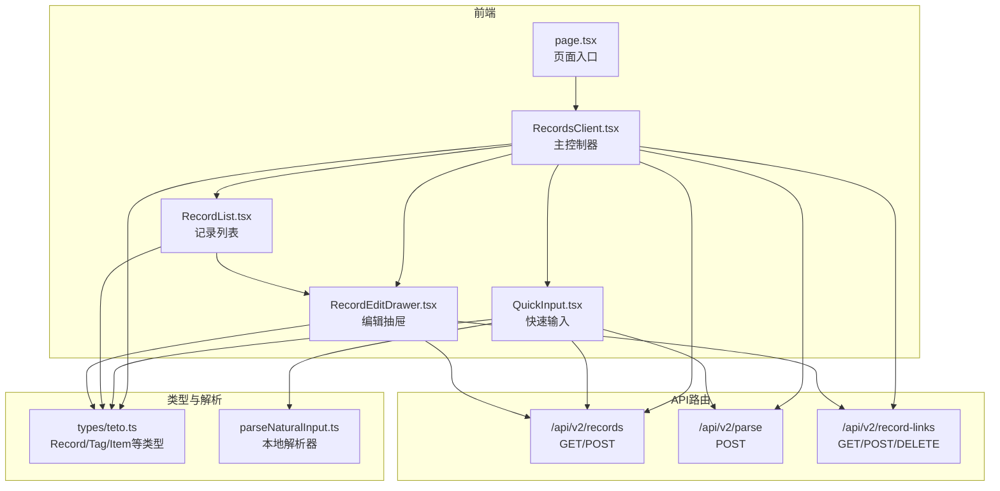
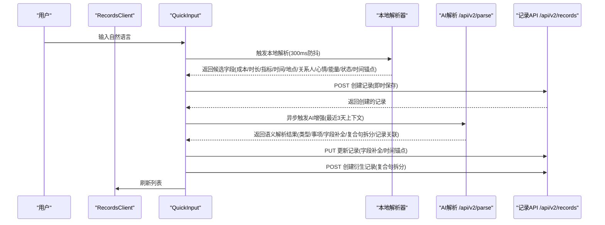
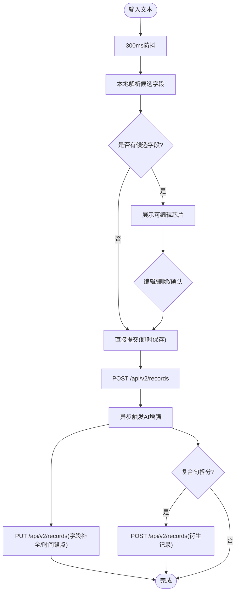
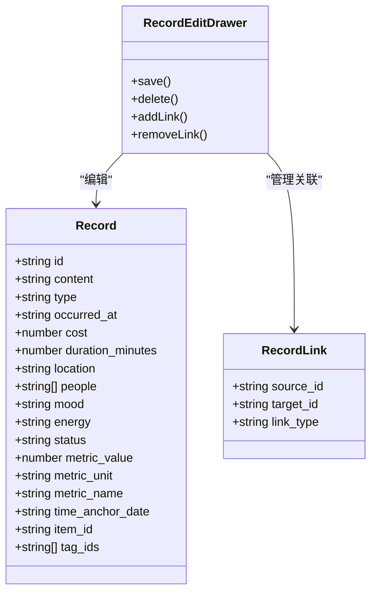
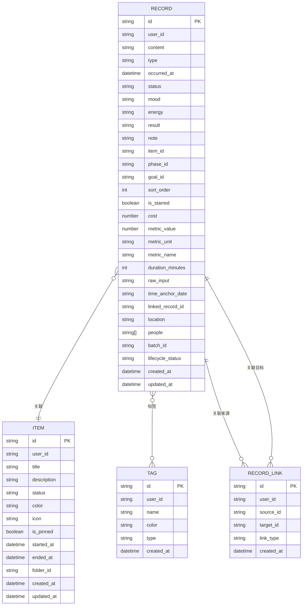
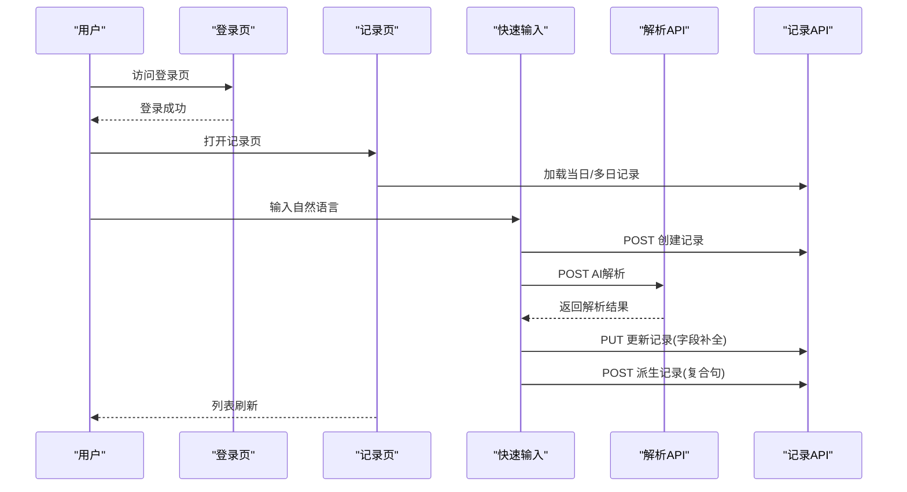
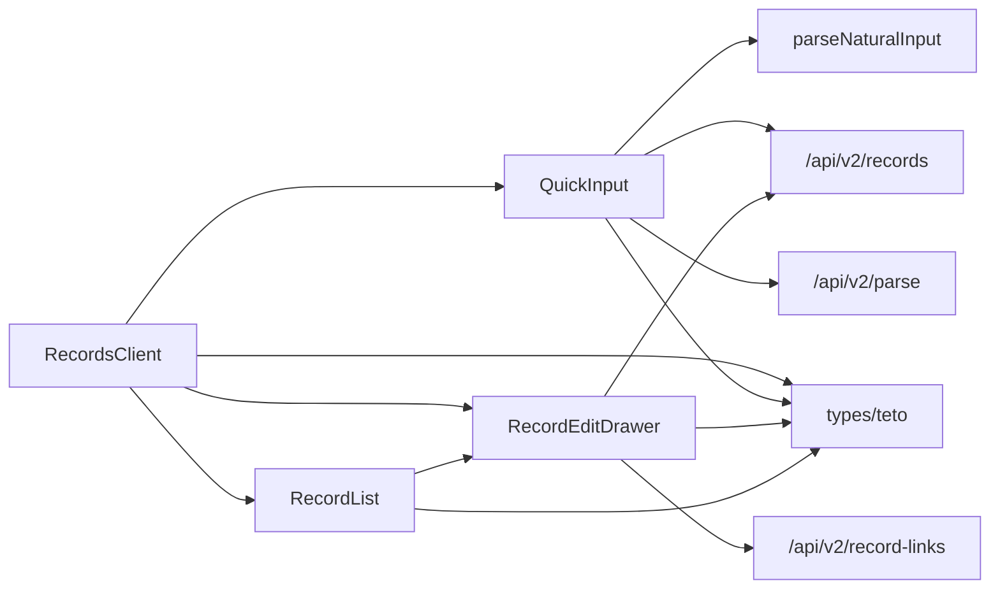

# 每日记录系统

<cite>
**本文引用的文件**
- [src/app/(dashboard)/records/page.tsx](file://src/app/(dashboard)/records/page.tsx)
- [src/app/(dashboard)/records/RecordsClient.tsx](file://src/app/(dashboard)/records/RecordsClient.tsx)
- [src/app/(dashboard)/records/components/QuickInput.tsx](file://src/app/(dashboard)/records/components/QuickInput.tsx)
- [src/app/(dashboard)/records/components/RecordList.tsx](file://src/app/(dashboard)/records/components/RecordList.tsx)
- [src/app/(dashboard)/records/components/RecordEditDrawer.tsx](file://src/app/(dashboard)/records/components/RecordEditDrawer.tsx)
- [src/types/teto.ts](file://src/types/teto.ts)
- [src/lib/utils/parseNaturalInput.ts](file://src/lib/utils/parseNaturalInput.ts)
- [src/app/api/v2/records/route.ts](file://src/app/api/v2/records/route.ts)
- [src/app/api/v2/parse/route.ts](file://src/app/api/v2/parse/route.ts)
- [src/app/api/v2/record-links/route.ts](file://src/app/api/v2/record-links/route.ts)
- [README.md](file://README.md)
- [DATA_RULES.md](file://DATA_RULES.md)
</cite>

## 目录
1. [简介](#简介)
2. [项目结构](#项目结构)
3. [核心组件](#核心组件)
4. [架构总览](#架构总览)
5. [详细组件分析](#详细组件分析)
6. [依赖关系分析](#依赖关系分析)
7. [性能考量](#性能考量)
8. [故障排查指南](#故障排查指南)
9. [结论](#结论)
10. [附录](#附录)

## 简介
本文件面向TETO系统的“每日记录”功能，提供从概念到实现、从前端到后端的完整说明。重点涵盖：
- 每日记录的核心概念与13项固定行为数据的含义与填写方法
- 快速输入功能的使用方式与AI增强机制
- 记录列表的展示逻辑与编辑功能
- 记录数据的存储结构、验证规则与数据完整性保障
- 使用流程示例（从登录到完成记录）
- 最佳实践建议与用户体验优化
- 记录数据与其他功能模块（项目进度、统计分析）的关联关系
- 常见问题解决方案

## 项目结构
每日记录功能位于仪表盘下的records模块，采用客户端组件驱动的交互模式，配合API路由实现数据持久化与解析增强。

**图表来源**
- [src/app/(dashboard)/records/page.tsx](file://src/app/(dashboard)/records/page.tsx#L1-L6)
- [src/app/(dashboard)/records/RecordsClient.tsx](file://src/app/(dashboard)/records/RecordsClient.tsx#L1-L696)
- [src/app/(dashboard)/records/components/QuickInput.tsx](file://src/app/(dashboard)/records/components/QuickInput.tsx#L1-L956)
- [src/app/(dashboard)/records/components/RecordList.tsx](file://src/app/(dashboard)/records/components/RecordList.tsx#L1-L87)
- [src/app/(dashboard)/records/components/RecordEditDrawer.tsx](file://src/app/(dashboard)/records/components/RecordEditDrawer.tsx#L1-L561)
- [src/app/api/v2/records/route.ts:1-86](file://src/app/api/v2/records/route.ts#L1-L86)
- [src/app/api/v2/parse/route.ts:1-43](file://src/app/api/v2/parse/route.ts#L1-L43)
- [src/app/api/v2/record-links/route.ts:1-100](file://src/app/api/v2/record-links/route.ts#L1-L100)
- [src/types/teto.ts:37-74](file://src/types/teto.ts#L37-L74)
- [src/lib/utils/parseNaturalInput.ts:72-421](file://src/lib/utils/parseNaturalInput.ts#L72-L421)

**章节来源**
- [src/app/(dashboard)/records/page.tsx](file://src/app/(dashboard)/records/page.tsx#L1-L6)
- [README.md:1-126](file://README.md#L1-L126)

## 核心组件
- RecordsClient.tsx：主控制器，负责模式切换（单日/多日）、日期导航、筛选、加载记录、批量操作、编辑抽屉控制等。
- QuickInput.tsx：快速输入与本地解析，支持即时保存、AI增强、复合句拆分、语义字段编辑。
- RecordList.tsx：记录列表渲染，含时间线、类型颜色、星标、多选、完成/推迟操作入口。
- RecordEditDrawer.tsx：记录编辑抽屉，支持标签、事项、结构化详情（花费、时长、地点、关系人、心情、能量、状态、指标）以及记录关联管理。
- 类型系统：Record/Tag/Item/RecordLink等类型定义，确保前后端一致的数据契约。
- 本地解析：parseNaturalInput.ts，提供成本、时长、指标、时间、地点、关系人、心情、能量、状态、时间锚点等字段的本地识别与候选值生成。
- API路由：/api/v2/records（查询/创建）、/api/v2/parse（AI语义解析）、/api/v2/record-links（记录关联）。

**章节来源**
- [src/app/(dashboard)/records/RecordsClient.tsx](file://src/app/(dashboard)/records/RecordsClient.tsx#L56-L696)
- [src/app/(dashboard)/records/components/QuickInput.tsx](file://src/app/(dashboard)/records/components/QuickInput.tsx#L101-L956)
- [src/app/(dashboard)/records/components/RecordList.tsx](file://src/app/(dashboard)/records/components/RecordList.tsx#L31-L87)
- [src/app/(dashboard)/records/components/RecordEditDrawer.tsx](file://src/app/(dashboard)/records/components/RecordEditDrawer.tsx#L57-L561)
- [src/types/teto.ts:12-192](file://src/types/teto.ts#L12-L192)
- [src/lib/utils/parseNaturalInput.ts:72-421](file://src/lib/utils/parseNaturalInput.ts#L72-L421)
- [src/app/api/v2/records/route.ts:7-86](file://src/app/api/v2/records/route.ts#L7-L86)
- [src/app/api/v2/parse/route.ts:12-43](file://src/app/api/v2/parse/route.ts#L12-L43)
- [src/app/api/v2/record-links/route.ts:13-100](file://src/app/api/v2/record-links/route.ts#L13-L100)

## 架构总览
每日记录系统采用“前端客户端组件 + API路由”的前后端分离架构。前端负责交互与本地解析，后端负责数据持久化与AI语义解析。记录数据通过Record类型统一表达，支持结构化详情与记录关联。

**图表来源**
- [src/app/(dashboard)/records/RecordsClient.tsx](file://src/app/(dashboard)/records/RecordsClient.tsx#L198-L230)
- [src/app/(dashboard)/records/components/QuickInput.tsx](file://src/app/(dashboard)/records/components/QuickInput.tsx#L127-L151)
- [src/lib/utils/parseNaturalInput.ts:72-421](file://src/lib/utils/parseNaturalInput.ts#L72-L421)
- [src/app/api/v2/parse/route.ts:12-43](file://src/app/api/v2/parse/route.ts#L12-L43)
- [src/app/api/v2/records/route.ts:44-86](file://src/app/api/v2/records/route.ts#L44-L86)

## 详细组件分析

### 快速输入组件 QuickInput
- 本地解析：300ms防抖，识别成本、时长、指标、时间、地点、关系人、心情、能量、状态、时间锚点、复合句拆分建议等，并以芯片形式展示，支持编辑与删除。
- 即时保存：根据本地解析结果，立即调用记录API创建记录，同时异步触发AI增强。
- AI增强：获取最近3天记录作为上下文，调用解析API，实现字段补全、记录关联、复合句拆分与衍生记录创建。
- 复合句拆分：当检测到复合句时，自动拆分为多条记录，建立“派生自”关联，提升记录粒度与可追溯性。
- 时间锚点：支持“前天/昨天/今天/明天/后天/大后天/上周/下周/某月某日/周X”等关键词解析为具体日期。

**图表来源**
- [src/app/(dashboard)/records/components/QuickInput.tsx](file://src/app/(dashboard)/records/components/QuickInput.tsx#L127-L151)
- [src/app/(dashboard)/records/components/QuickInput.tsx](file://src/app/(dashboard)/records/components/QuickInput.tsx#L306-L557)
- [src/lib/utils/parseNaturalInput.ts:72-421](file://src/lib/utils/parseNaturalInput.ts#L72-L421)
- [src/app/api/v2/records/route.ts:44-86](file://src/app/api/v2/records/route.ts#L44-L86)
- [src/app/api/v2/parse/route.ts:12-43](file://src/app/api/v2/parse/route.ts#L12-L43)

**章节来源**
- [src/app/(dashboard)/records/components/QuickInput.tsx](file://src/app/(dashboard)/records/components/QuickInput.tsx#L101-L956)
- [src/lib/utils/parseNaturalInput.ts:72-421](file://src/lib/utils/parseNaturalInput.ts#L72-L421)

### 记录列表与编辑
- 列表渲染：RecordList按时间线展示，支持紧凑模式；RecordItem承载每条记录的卡片，包含类型颜色、时间、星标、多选、完成/推迟入口。
- 编辑抽屉：RecordEditDrawer提供结构化详情编辑（花费、时长、地点、关系人、心情、能量、状态、指标），支持标签与事项选择、记录关联管理（添加/删除）。
- 关联管理：通过RecordLink类型与API路由实现，支持多种关联类型（完成、派生、推迟、相关）。

**图表来源**
- [src/types/teto.ts:37-74](file://src/types/teto.ts#L37-L74)
- [src/types/teto.ts:114-121](file://src/types/teto.ts#L114-L121)
- [src/app/(dashboard)/records/components/RecordEditDrawer.tsx](file://src/app/(dashboard)/records/components/RecordEditDrawer.tsx#L57-L561)

**章节来源**
- [src/app/(dashboard)/records/components/RecordList.tsx](file://src/app/(dashboard)/records/components/RecordList.tsx#L31-L87)
- [src/app/(dashboard)/records/components/RecordEditDrawer.tsx](file://src/app/(dashboard)/records/components/RecordEditDrawer.tsx#L57-L561)
- [src/types/teto.ts:37-74](file://src/types/teto.ts#L37-L74)

### 记录数据模型与存储
- Record类型包含内容、类型、发生时间、状态、心情、能量、结果、备注、事项、阶段、目标、排序、星标、成本、指标（值/单位/名称）、时长、原始输入、解析语义、时间锚点、链接记录、地点、关系人、批次ID、生命周期状态、标签等字段。
- API路由对POST创建进行必填校验（content、date），并对item_id归属进行校验，确保数据完整性与权限控制。
- 记录关联通过RecordLink实现，支持多种类型，便于跨记录的语义关联与数据互补。

**图表来源**
- [src/types/teto.ts:37-74](file://src/types/teto.ts#L37-L74)
- [src/types/teto.ts:96-103](file://src/types/teto.ts#L96-L103)
- [src/types/teto.ts:76-94](file://src/types/teto.ts#L76-L94)
- [src/types/teto.ts:114-121](file://src/types/teto.ts#L114-L121)
- [src/app/api/v2/records/route.ts:44-86](file://src/app/api/v2/records/route.ts#L44-L86)

**章节来源**
- [src/types/teto.ts:37-74](file://src/types/teto.ts#L37-L74)
- [src/app/api/v2/records/route.ts:44-86](file://src/app/api/v2/records/route.ts#L44-L86)

### 使用流程示例（从登录到完成记录）
- 登录：通过认证回调路由完成登录。
- 进入记录页：访问“记录”页面，加载RecordsClient。
- 选择模式：单日/多日模式切换，多日模式默认展示前后两天。
- 快速输入：在输入框中输入自然语言，观察候选芯片，确认后即时保存。
- AI增强：后台异步触发解析API，进行字段补全、时间锚点解析、记录关联与复合句拆分。
- 查看与编辑：在列表中点击记录打开编辑抽屉，修改结构化详情、标签、事项与关联。
- 完成/推迟：对“计划”记录执行完成或推迟操作，系统生成相应记录并建立关联。
- 批量操作：开启多选模式，批量删除选中记录。

**图表来源**
- [src/app/api/v2/records/route.ts:7-86](file://src/app/api/v2/records/route.ts#L7-L86)
- [src/app/api/v2/parse/route.ts:12-43](file://src/app/api/v2/parse/route.ts#L12-L43)
- [src/app/(dashboard)/records/RecordsClient.tsx](file://src/app/(dashboard)/records/RecordsClient.tsx#L198-L230)

**章节来源**
- [src/app/api/v2/records/route.ts:7-86](file://src/app/api/v2/records/route.ts#L7-L86)
- [src/app/api/v2/parse/route.ts:12-43](file://src/app/api/v2/parse/route.ts#L12-L43)
- [src/app/(dashboard)/records/RecordsClient.tsx](file://src/app/(dashboard)/records/RecordsClient.tsx#L56-L696)

## 依赖关系分析
- 组件耦合：RecordsClient作为中枢，依赖QuickInput、RecordList、RecordEditDrawer；QuickInput依赖本地解析器与API；RecordEditDrawer依赖记录关联API与类型系统。
- 外部依赖：Supabase（认证与数据存储）、AI解析服务（DeepSeek）。
- 数据一致性：通过Record类型与API路由的字段约束、权限校验与RLS策略保障。

**图表来源**
- [src/app/(dashboard)/records/RecordsClient.tsx](file://src/app/(dashboard)/records/RecordsClient.tsx#L1-L12)
- [src/app/(dashboard)/records/components/QuickInput.tsx](file://src/app/(dashboard)/records/components/QuickInput.tsx#L1-L10)
- [src/app/(dashboard)/records/components/RecordList.tsx](file://src/app/(dashboard)/records/components/RecordList.tsx#L1-L4)
- [src/app/(dashboard)/records/components/RecordEditDrawer.tsx](file://src/app/(dashboard)/records/components/RecordEditDrawer.tsx#L1-L6)
- [src/types/teto.ts:1-10](file://src/types/teto.ts#L1-L10)
- [src/lib/utils/parseNaturalInput.ts:1-11](file://src/lib/utils/parseNaturalInput.ts#L1-L11)
- [src/app/api/v2/records/route.ts:1-5](file://src/app/api/v2/records/route.ts#L1-L5)
- [src/app/api/v2/parse/route.ts:1-5](file://src/app/api/v2/parse/route.ts#L1-L5)
- [src/app/api/v2/record-links/route.ts:1-5](file://src/app/api/v2/record-links/route.ts#L1-L5)

**章节来源**
- [src/app/(dashboard)/records/RecordsClient.tsx](file://src/app/(dashboard)/records/RecordsClient.tsx#L1-L12)
- [src/types/teto.ts:1-10](file://src/types/teto.ts#L1-L10)

## 性能考量
- 防抖与增量加载：快速输入本地解析使用300ms防抖，减少无效请求；多日模式按批加载日期列，补偿滚动偏移，避免重绘。
- 异步增强：AI增强采用fire-and-forget模式，不影响用户输入体验。
- 列表渲染：时间线与卡片结构简洁，避免深层嵌套DOM，提升滚动性能。
- 批量操作：多选与批量删除减少多次网络往返。

[本节为通用指导，无需特定文件引用]

## 故障排查指南
- 登录相关错误：API路由对未登录场景返回401，检查认证回调与环境变量配置。
- 创建记录失败：检查必填字段（content、date），以及事项归属校验。
- AI解析失败：解析API对空输入返回400，对DeepSeek错误返回502，检查输入与网络。
- 记录关联异常：确认link_type合法、source_id与target_id不同、record_id参数正确。

**章节来源**
- [src/app/api/v2/records/route.ts:35-84](file://src/app/api/v2/records/route.ts#L35-L84)
- [src/app/api/v2/parse/route.ts:25-41](file://src/app/api/v2/parse/route.ts#L25-L41)
- [src/app/api/v2/record-links/route.ts:23-98](file://src/app/api/v2/record-links/route.ts#L23-L98)

## 结论
每日记录系统通过“快速输入 + 本地解析 + AI增强 + 记录关联”的组合，实现了高效、智能、可追溯的日常数据采集。其清晰的组件边界、严格的类型约束与API校验，确保了数据完整性与用户体验。结合项目管理与统计分析模块，记录数据可进一步支撑长期目标与进度追踪。

[本节为总结性内容，无需特定文件引用]

## 附录

### 13项固定行为数据说明与填写方法
- 内容：记录事件的简要描述（必填）。
- 类型：发生/计划/想法/总结（由输入推断或手动选择）。
- 发生时间：HH:mm或时间段，支持“早上/中午/下午/晚上/深夜”等关键词。
- 成本：¥金额或“花费/消费/付了”等关键词识别。
- 时长：分钟/小时/中文数字“半小时/三个半小时”等识别。
- 地点：在XX/到XX/去XX等句式后识别。
- 关系人：和/跟/与/同XX等识别，逗号分隔。
- 心情：开心/平静/烦躁/焦虑/难过/感动等识别。
- 能量：低/高识别。
- 状态：进行中/已完成/已暂停等识别。
- 指标：数值+单位+对象（如“跑5公里”、“写100字”）。
- 事项：通过输入关键词模糊匹配，自动推荐关联事项。
- 标签：多选分类，便于检索与统计。

**章节来源**
- [src/lib/utils/parseNaturalInput.ts:72-421](file://src/lib/utils/parseNaturalInput.ts#L72-L421)
- [src/types/teto.ts:37-74](file://src/types/teto.ts#L37-L74)

### 数据规则与完整性保障
- 数据真源：记录为原始事实真源，统计分析基于任务配置与原始记录统一计算。
- 字段校验：创建记录API强制校验content与date；item_id归属校验防止越权。
- 关联完整性：记录关联类型受控，禁止自关联，支持双向字段互补。

**章节来源**
- [DATA_RULES.md:17-31](file://DATA_RULES.md#L17-L31)
- [src/app/api/v2/records/route.ts:44-86](file://src/app/api/v2/records/route.ts#L44-L86)
- [src/app/api/v2/record-links/route.ts:23-49](file://src/app/api/v2/record-links/route.ts#L23-L49)

### 与其他模块的关联
- 项目进度：记录可关联到事项（Item），通过Item聚合统计（总成本、总时长、指标汇总）。
- 统计分析：记录类型分布、标签分布、日均数量等指标由洞察API提供。
- 复盘与目标：记录可作为复盘素材，目标与阶段模块可反向关联记录以评估进展。

**章节来源**
- [src/types/teto.ts:76-94](file://src/types/teto.ts#L76-L94)
- [src/types/teto.ts:276-299](file://src/types/teto.ts#L276-L299)