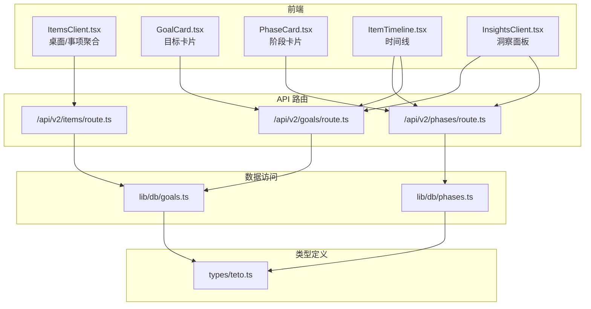
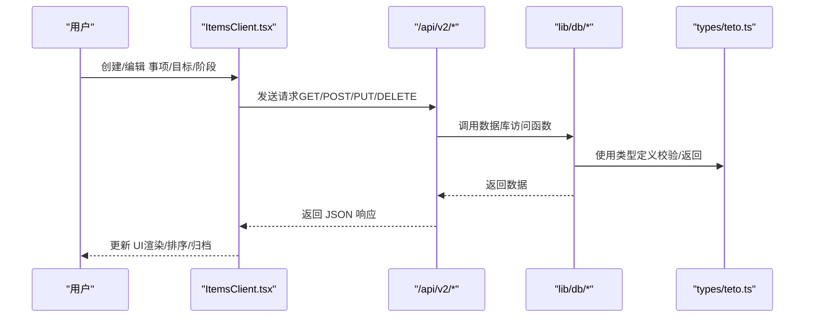
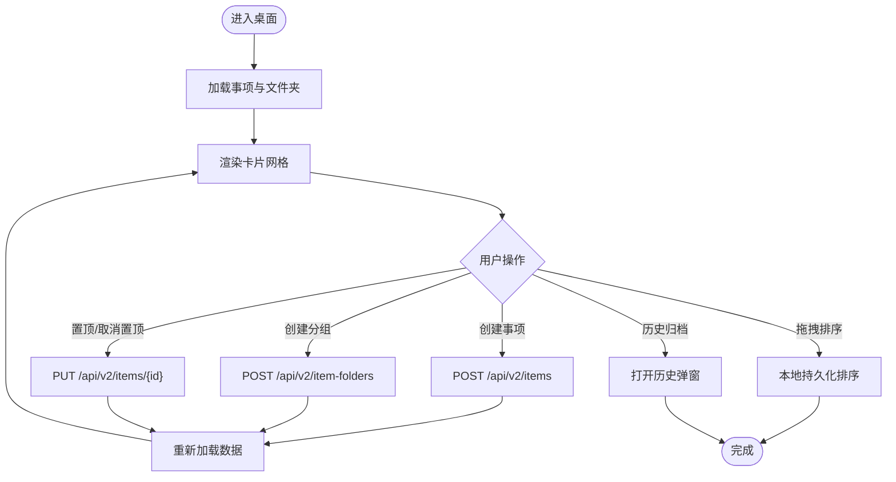
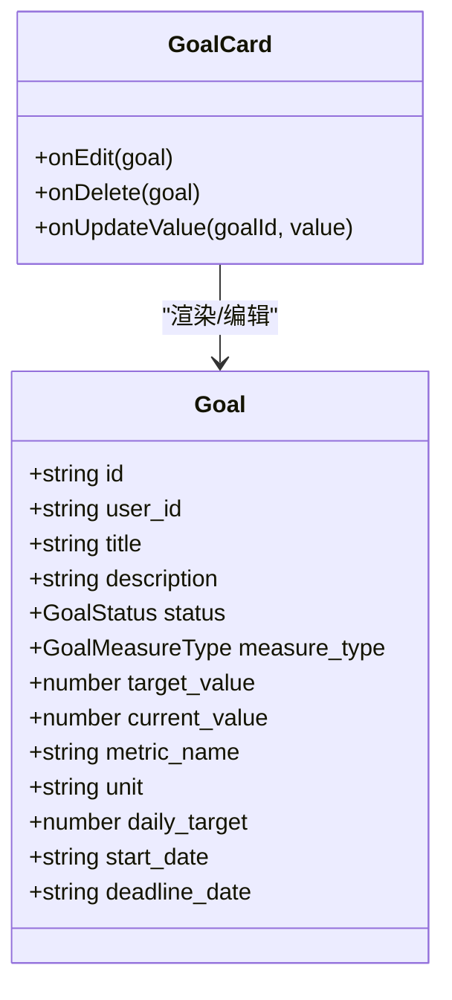
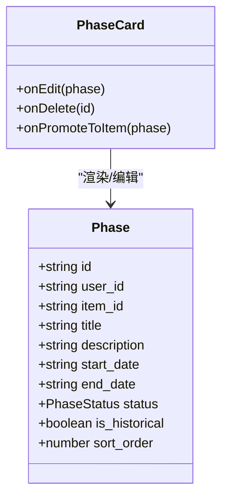
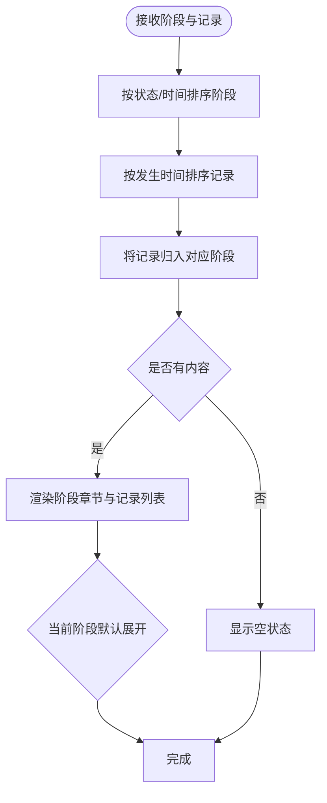
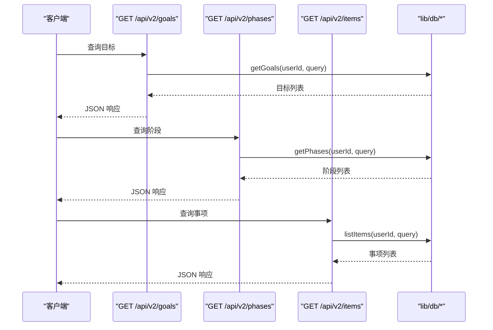
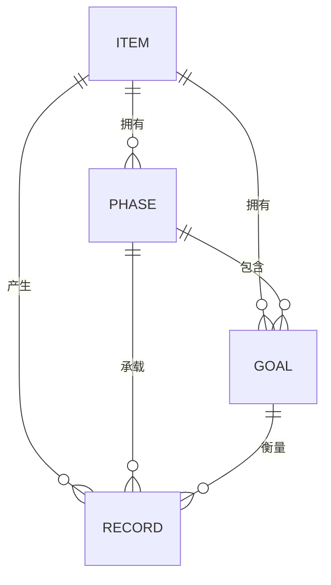
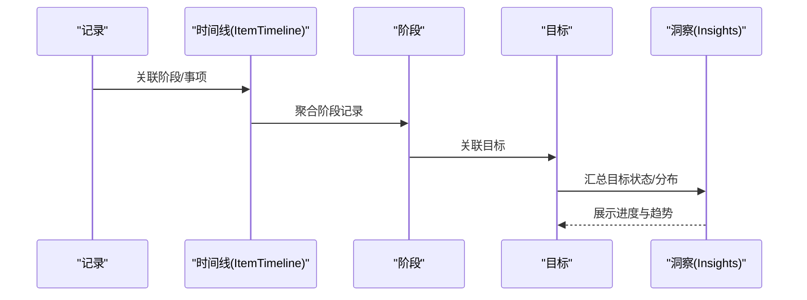
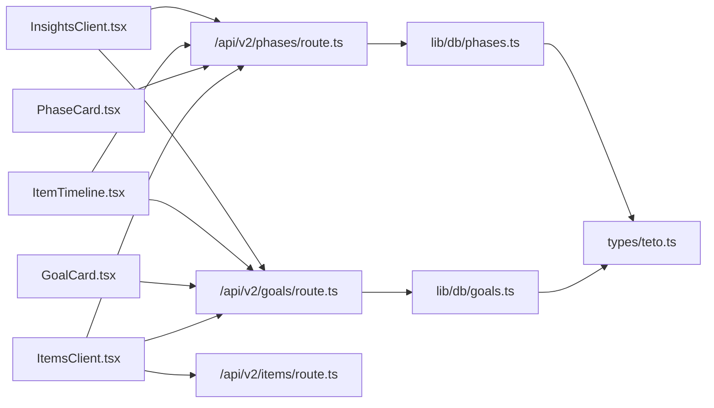

# 项目管理系统

<cite>
**本文引用的文件**
- [ItemsClient.tsx](file://src/app/(dashboard)/items/ItemsClient.tsx)
- [GoalCard.tsx](file://src/app/(dashboard)/items/components/GoalCard.tsx)
- [PhaseCard.tsx](file://src/app/(dashboard)/items/components/PhaseCard.tsx)
- [ItemTimeline.tsx](file://src/app/(dashboard)/items/components/ItemTimeline.tsx)
- [route.ts（目标）](file://src/app/api/v2/goals/route.ts)
- [route.ts（阶段）](file://src/app/api/v2/phases/route.ts)
- [route.ts（事项）](file://src/app/api/v2/items/route.ts)
- [teto.ts（类型定义）](file://src/types/teto.ts)
- [goals.ts（数据库访问）](file://src/lib/db/goals.ts)
- [phases.ts（数据库访问）](file://src/lib/db/phases.ts)
- [InsightsClient.tsx](file://src/app/(dashboard)/insights/InsightsClient.tsx)
- [1.4 思路2.md](file://docs/01-生效版本/TETO 1.4/1.4 思路2.md)
- [TETO 1.0 数据表设计（正式版）.md](file://docs/10-版本归档/TETO 1.0.0/《TETO 1.0 数据表设计（正式版）》.md)
- [TETO 1.0 页面结构详细稿（正式版）.md](file://docs/10-版本归档/TETO 1.0.0/《TETO 1.0 页面结构详细稿（正式版）》.md)
</cite>

## 目录
1. [简介](#简介)
2. [项目结构](#项目结构)
3. [核心组件](#核心组件)
4. [架构总览](#架构总览)
5. [详细组件分析](#详细组件分析)
6. [依赖分析](#依赖分析)
7. [性能考量](#性能考量)
8. [故障排查指南](#故障排查指南)
9. [结论](#结论)
10. [附录](#附录)

## 简介
本文件面向 TETO 系统的项目管理能力，聚焦“目标-阶段-记录”的长期目标管理体系，覆盖从项目创建、目标设定、阶段划分到进度跟踪与可视化的完整流程。文档同时梳理数据模型设计理念、组件交互与 API 调用链路，并提供最佳实践与实用技巧，帮助用户高效管理长期目标。

## 项目结构
TETO 的项目管理采用“前端组件 + Next.js App Router API 路由 + Supabase 数据访问层”的分层架构：
- 前端层：桌面视图（ItemsClient）、目标/阶段/时间线组件、洞察面板
- API 层：/api/v2 下的目标、阶段、事项等路由
- 数据访问层：lib/db 下的 goals.ts、phases.ts 等封装
- 类型定义：统一在 types/teto.ts 中声明实体与查询参数

图表来源
- [ItemsClient.tsx:114-484](file://src/app/(dashboard)/items/ItemsClient.tsx#L114-L484)
- [GoalCard.tsx:21-114](file://src/app/(dashboard)/items/components/GoalCard.tsx#L21-L114)
- [PhaseCard.tsx:28-125](file://src/app/(dashboard)/items/components/PhaseCard.tsx#L28-L125)
- [ItemTimeline.tsx:147-242](file://src/app/(dashboard)/items/components/ItemTimeline.tsx#L147-L242)
- [route.ts（目标）:1-49](file://src/app/api/v2/goals/route.ts#L1-L49)
- [route.ts（阶段）:1-72](file://src/app/api/v2/phases/route.ts#L1-L72)
- [route.ts（事项）:1-47](file://src/app/api/v2/items/route.ts#L1-L47)
- [goals.ts:1-198](file://src/lib/db/goals.ts#L1-L198)
- [phases.ts:1-186](file://src/lib/db/phases.ts#L1-L186)
- [teto.ts:315-426](file://src/types/teto.ts#L315-L426)

章节来源
- [ItemsClient.tsx:114-484](file://src/app/(dashboard)/items/ItemsClient.tsx#L114-L484)
- [route.ts（目标）:1-49](file://src/app/api/v2/goals/route.ts#L1-L49)
- [route.ts（阶段）:1-72](file://src/app/api/v2/phases/route.ts#L1-L72)
- [route.ts（事项）:1-47](file://src/app/api/v2/items/route.ts#L1-L47)
- [teto.ts:315-426](file://src/types/teto.ts#L315-L426)

## 核心组件
- 事项桌面 ItemsClient：聚合展示事项、支持创建/置顶/分组/拖拽排序、历史归档查看
- 目标组件 GoalCard：展示目标状态与度量，支持数值型目标的当前值编辑
- 阶段组件 PhaseCard：展示阶段时间范围与状态，支持编辑/删除/升级为事项
- 时间线 ItemTimeline：按阶段聚合记录，支持展开/收起与编辑阶段
- API 路由：目标/阶段/事项的 CRUD 与查询
- 数据访问：goals.ts、phases.ts 对 Supabase 的封装
- 类型定义：统一的目标、阶段、查询参数与响应结构

章节来源
- [ItemsClient.tsx:114-484](file://src/app/(dashboard)/items/ItemsClient.tsx#L114-L484)
- [GoalCard.tsx:21-114](file://src/app/(dashboard)/items/components/GoalCard.tsx#L21-L114)
- [PhaseCard.tsx:28-125](file://src/app/(dashboard)/items/components/PhaseCard.tsx#L28-L125)
- [ItemTimeline.tsx:147-242](file://src/app/(dashboard)/items/components/ItemTimeline.tsx#L147-L242)
- [route.ts（目标）:1-49](file://src/app/api/v2/goals/route.ts#L1-L49)
- [route.ts（阶段）:1-72](file://src/app/api/v2/phases/route.ts#L1-L72)
- [route.ts（事项）:1-47](file://src/app/api/v2/items/route.ts#L1-L47)
- [teto.ts:315-426](file://src/types/teto.ts#L315-L426)

## 架构总览
TETO 的项目管理遵循“先现实，后组织”的主链路：记录发生 → 补充状态 → 标记成果 → 关联目标/容器 → 判断目标接近度 → 复盘。目标与阶段作为“容器视角”的阶段性抽象，与具体记录形成“时间-事件-成果-目标”的闭环。

图表来源
- [ItemsClient.tsx:140-278](file://src/app/(dashboard)/items/ItemsClient.tsx#L140-L278)
- [route.ts（目标）:6-48](file://src/app/api/v2/goals/route.ts#L6-L48)
- [route.ts（阶段）:7-71](file://src/app/api/v2/phases/route.ts#L7-L71)
- [route.ts（事项）:6-46](file://src/app/api/v2/items/route.ts#L6-L46)
- [goals.ts:10-197](file://src/lib/db/goals.ts#L10-L197)
- [phases.ts:10-185](file://src/lib/db/phases.ts#L10-L185)
- [teto.ts:315-426](file://src/types/teto.ts#L315-L426)

## 详细组件分析

### 事项桌面 ItemsClient：创建、分组、置顶与拖拽
- 功能要点
  - 加载事项与文件夹，聚合统计（阶段数、记录数、最近活跃）
  - 支持创建事项与文件夹、重命名文件夹、删除文件夹
  - 置顶/取消置顶、切换卡片尺寸、拖拽排序（本地持久化）
  - 历史归档查看（已完成/已搁置）
  - 搜索过滤
- 关键交互
  - 通过 /api/v2/items 获取事项列表
  - 通过 /api/v2/item-folders 获取/创建/更新/删除文件夹
  - 通过 /api/v2/items/{id} 更新事项（置顶/移动到文件夹）

图表来源
- [ItemsClient.tsx:140-278](file://src/app/(dashboard)/items/ItemsClient.tsx#L140-L278)
- [route.ts（事项）:6-46](file://src/app/api/v2/items/route.ts#L6-L46)

章节来源
- [ItemsClient.tsx:114-484](file://src/app/(dashboard)/items/ItemsClient.tsx#L114-L484)
- [route.ts（事项）:1-47](file://src/app/api/v2/items/route.ts#L1-L47)

### 目标组件 GoalCard：目标设定与进度度量
- 功能要点
  - 展示目标标题、状态、描述
  - 数值型目标显示进度条与目标值
  - 支持编辑当前值（数值校验）
- 设计理念
  - 目标状态：进行中/已达成/已暂停/已放弃
  - 度量类型：布尔/数值；数值目标支持目标值与当前值对比生成进度

图表来源
- [teto.ts:315-335](file://src/types/teto.ts#L315-L335)
- [GoalCard.tsx:21-114](file://src/app/(dashboard)/items/components/GoalCard.tsx#L21-L114)

章节来源
- [GoalCard.tsx:21-114](file://src/app/(dashboard)/items/components/GoalCard.tsx#L21-L114)
- [teto.ts:303-335](file://src/types/teto.ts#L303-L335)

### 阶段组件 PhaseCard：阶段划分与状态管理
- 功能要点
  - 展示阶段标题、时间范围、状态与历史标记
  - 支持编辑/删除；可将阶段升级为事项（UI 留位）
- 设计理念
  - 阶段必须隶属于某个事项，不允许孤立存在
  - 状态：进行中/已结束/停滞；历史阶段带有特殊样式

图表来源
- [teto.ts:337-354](file://src/types/teto.ts#L337-L354)
- [PhaseCard.tsx:28-125](file://src/app/(dashboard)/items/components/PhaseCard.tsx#L28-L125)

章节来源
- [PhaseCard.tsx:28-125](file://src/app/(dashboard)/items/components/PhaseCard.tsx#L28-L125)
- [teto.ts:307-354](file://src/types/teto.ts#L307-L354)
- [1.4 思路2.md:890-920](file://docs/01-生效版本/TETO 1.4/1.4 思路2.md#L890-L920)

### 时间线 ItemTimeline：阶段-记录聚合与导航
- 功能要点
  - 按阶段聚合记录，支持展开/收起
  - 未归入阶段的记录单独列出
  - 当前阶段高亮，支持编辑阶段
- 设计理念
  - 先记录，后组织；阶段是对时间段内现实的概括
  - 时间线作为“阶段-记录”的可视化索引

图表来源
- [ItemTimeline.tsx:147-212](file://src/app/(dashboard)/items/components/ItemTimeline.tsx#L147-L212)

章节来源
- [ItemTimeline.tsx:147-242](file://src/app/(dashboard)/items/components/ItemTimeline.tsx#L147-L242)

### API 与数据访问：目标/阶段/事项
- 目标 API
  - GET /api/v2/goals：支持按 status/item_id/phase_id 查询
  - POST /api/v2/goals：创建目标（含度量与基准字段）
- 阶段 API
  - GET /api/v2/phases：支持按 item_id/status/is_historical 查询
  - POST /api/v2/phases：创建阶段（校验事项归属）
- 事项 API
  - GET /api/v2/items：支持按 status/is_pinned 查询
  - POST /api/v2/items：创建事项

图表来源
- [route.ts（目标）:6-28](file://src/app/api/v2/goals/route.ts#L6-L28)
- [route.ts（阶段）:7-29](file://src/app/api/v2/phases/route.ts#L7-L29)
- [route.ts（事项）:6-26](file://src/app/api/v2/items/route.ts#L6-L26)
- [goals.ts:10-40](file://src/lib/db/goals.ts#L10-L40)
- [phases.ts:10-40](file://src/lib/db/phases.ts#L10-L40)

章节来源
- [route.ts（目标）:1-49](file://src/app/api/v2/goals/route.ts#L1-L49)
- [route.ts（阶段）:1-72](file://src/app/api/v2/phases/route.ts#L1-L72)
- [route.ts（事项）:1-47](file://src/app/api/v2/items/route.ts#L1-L47)
- [goals.ts:1-198](file://src/lib/db/goals.ts#L1-L198)
- [phases.ts:1-186](file://src/lib/db/phases.ts#L1-L186)

### 数据模型设计：目标、阶段、里程碑的关系
- 核心实体
  - Goal：目标，可关联 item_id 或 phase_id，支持布尔/数值度量
  - Phase：阶段，必须隶属于 item_id，支持历史标记
  - Record：具体记录，可关联 item_id/phase_id/goal_id
- 关系约束
  - 阶段必须隶属于事项（1.4 思路明确）
  - 目标可通过 item_id/phase_id 反向关联
  - 记录作为“现实事件”承载度量与时间锚点
- 量化引擎字段
  - metric_name、unit、daily_target、start_date、deadline_date 等用于目标推进的基准与预测

图表来源
- [teto.ts:315-354](file://src/types/teto.ts#L315-L354)
- [1.4 思路2.md:890-920](file://docs/01-生效版本/TETO 1.4/1.4 思路2.md#L890-L920)

章节来源
- [teto.ts:315-426](file://src/types/teto.ts#L315-L426)
- [1.4 思路2.md:890-920](file://docs/01-生效版本/TETO 1.4/1.4 思路2.md#L890-L920)

### 进度跟踪与可视化：从记录到阶段到目标
- 记录层面
  - 每条记录可携带 metric_value/unit，作为阶段/目标的度量来源
- 阶段层面
  - ItemTimeline 将记录按阶段归档，支持当前阶段高亮与编辑
- 目标层面
  - GoalCard 展示目标状态与进度，数值型目标以进度条直观呈现
- 洞察面板
  - InsightsClient 提供阶段状态分布、目标分布等统计视图

图表来源
- [ItemTimeline.tsx:147-212](file://src/app/(dashboard)/items/components/ItemTimeline.tsx#L147-L212)
- [GoalCard.tsx:21-114](file://src/app/(dashboard)/items/components/GoalCard.tsx#L21-L114)
- [InsightsClient.tsx:39-149](file://src/app/(dashboard)/insights/InsightsClient.tsx#L39-L149)

章节来源
- [ItemTimeline.tsx:147-242](file://src/app/(dashboard)/items/components/ItemTimeline.tsx#L147-L242)
- [GoalCard.tsx:21-114](file://src/app/(dashboard)/items/components/GoalCard.tsx#L21-L114)
- [InsightsClient.tsx:39-149](file://src/app/(dashboard)/insights/InsightsClient.tsx#L39-L149)

### 项目生命周期管理：从立项到完成的最佳实践
- 立项
  - 创建事项作为长期主题容器
  - 定义阶段（start_date/end_date），明确阶段性目标
- 执行
  - 日常记录：在记录页创建，关联事项/阶段/目标
  - 目标度量：数值型目标定期更新 current_value
- 监控
  - 使用时间线查看阶段进展
  - 使用洞察面板观察状态分布与趋势
- 收尾
  - 阶段结束后标记“已结束”
  - 目标达成后标记“已达成”，沉淀经验

章节来源
- [1.4 思路2.md:852-877](file://docs/01-生效版本/TETO 1.4/1.4 思路2.md#L852-L877)
- [TETO 1.0 页面结构详细稿（正式版）.md:914-991](file://docs/10-版本归档/TETO 1.0.0/《TETO 1.0 页面结构详细稿（正式版）》.md#L914-L991)

### 实用技巧与经验分享
- 用“阶段”承载时间段内的持续现实，避免将所有长期内容塞成普通日记录
- 目标优先用数值型，便于自动化进度计算与预测
- 使用“历史阶段”标记已完成的阶段，保持当前阶段清晰
- 定期回顾洞察，关注阶段状态分布与目标达成趋势

章节来源
- [1.4 思路2.md:838-877](file://docs/01-生效版本/TETO 1.4/1.4 思路2.md#L838-L877)
- [TETO 1.0 数据表设计（正式版）.md:346-410](file://docs/10-版本归档/TETO 1.0.0/《TETO 1.0 数据表设计（正式版）》.md#L346-L410)

## 依赖分析
- 组件耦合
  - ItemsClient 依赖 API 路由与本地状态，耦合度适中
  - GoalCard/PhaseCard/ItemTimeline 依赖类型定义与 API 路由
- 数据访问
  - goals.ts、phases.ts 对 Supabase 的封装，提供查询/创建/更新/删除
- 外部依赖
  - Next.js App Router、@dnd-kit（拖拽）、recharts（洞察）

图表来源
- [ItemsClient.tsx:114-484](file://src/app/(dashboard)/items/ItemsClient.tsx#L114-L484)
- [GoalCard.tsx:21-114](file://src/app/(dashboard)/items/components/GoalCard.tsx#L21-L114)
- [PhaseCard.tsx:28-125](file://src/app/(dashboard)/items/components/PhaseCard.tsx#L28-L125)
- [ItemTimeline.tsx:147-242](file://src/app/(dashboard)/items/components/ItemTimeline.tsx#L147-L242)
- [InsightsClient.tsx:39-149](file://src/app/(dashboard)/insights/InsightsClient.tsx#L39-L149)
- [route.ts（目标）:1-49](file://src/app/api/v2/goals/route.ts#L1-L49)
- [route.ts（阶段）:1-72](file://src/app/api/v2/phases/route.ts#L1-L72)
- [route.ts（事项）:1-47](file://src/app/api/v2/items/route.ts#L1-L47)
- [goals.ts:1-198](file://src/lib/db/goals.ts#L1-L198)
- [phases.ts:1-186](file://src/lib/db/phases.ts#L1-L186)
- [teto.ts:315-426](file://src/types/teto.ts#L315-L426)

章节来源
- [teto.ts:315-426](file://src/types/teto.ts#L315-L426)

## 性能考量
- 前端
  - 本地持久化排序与尺寸，减少重复请求
  - 按需渲染（折叠/展开），降低 DOM 压力
- 后端
  - API 查询参数过滤，避免全表扫描
  - 数据访问层统一排序与限制，保证响应稳定

## 故障排查指南
- 401 未授权
  - 确认登录状态与用户上下文
- 400 参数错误
  - 检查必填字段（如 title、item_id）
- 404 资源不存在或归属不符
  - 校验资源是否存在且属于当前用户
- 500 服务器错误
  - 查看后端错误堆栈与 Supabase 返回信息

章节来源
- [route.ts（目标）:21-27](file://src/app/api/v2/goals/route.ts#L21-L27)
- [route.ts（阶段）:54-60](file://src/app/api/v2/phases/route.ts#L54-L60)
- [route.ts（事项）:33-35](file://src/app/api/v2/items/route.ts#L33-L35)

## 结论
TETO 的项目管理以“记录-阶段-目标”为核心，通过桌面卡片、时间线与洞察面板形成完整的可视化闭环。目标与阶段的数据模型清晰地分离了“现实事件”与“容器视角”，既满足长期目标管理，又兼顾短期执行效率。配合 API 的标准化查询与前端的本地优化，系统具备良好的可扩展性与用户体验。

## 附录
- 术语
  - 事项：长期主题容器
  - 阶段：某段时间内的持续现实概括
  - 目标：对方向的量化表达
  - 记录：具体发生事件
- 参考文档
  - 1.4 思路：阶段必须隶属于事项
  - 1.0 页面：项目列表、详情、进度更新与预测

章节来源
- [1.4 思路2.md:890-920](file://docs/01-生效版本/TETO 1.4/1.4 思路2.md#L890-L920)
- [TETO 1.0 页面结构详细稿（正式版）.md:914-991](file://docs/10-版本归档/TETO 1.0.0/《TETO 1.0 页面结构详细稿（正式版）》.md#L914-L991)