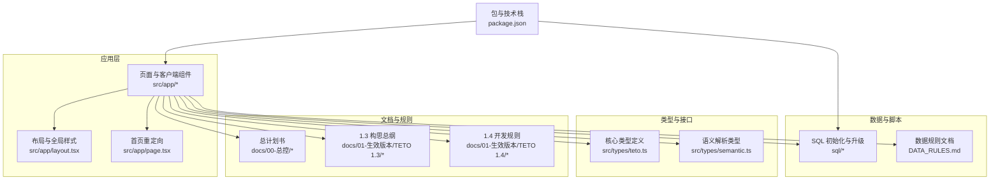
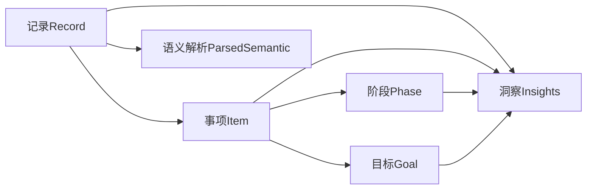
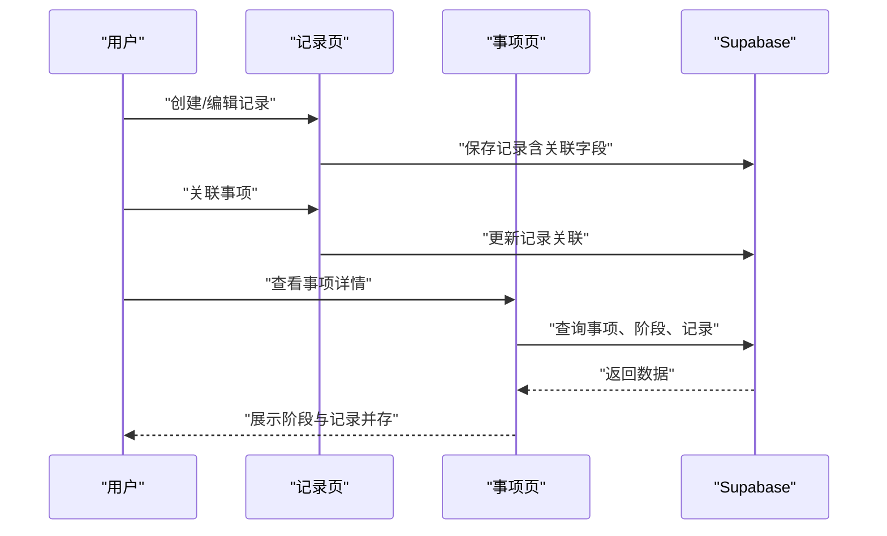
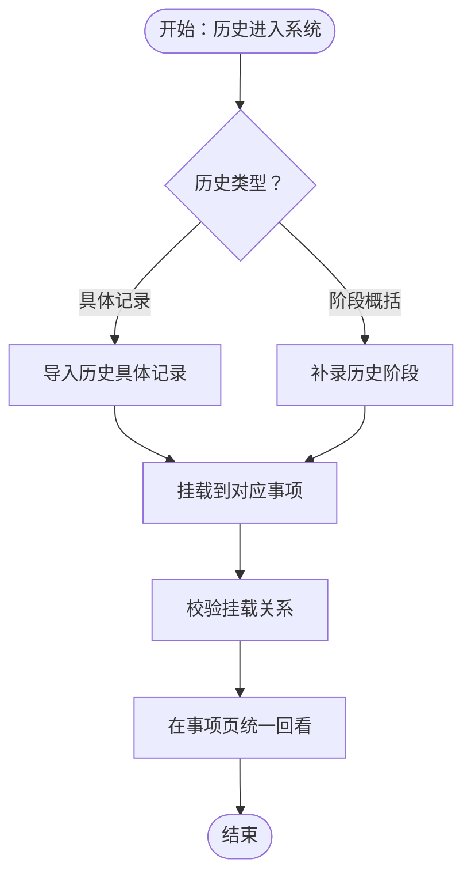
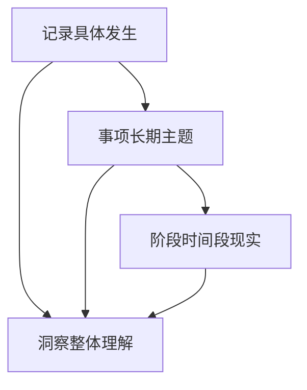
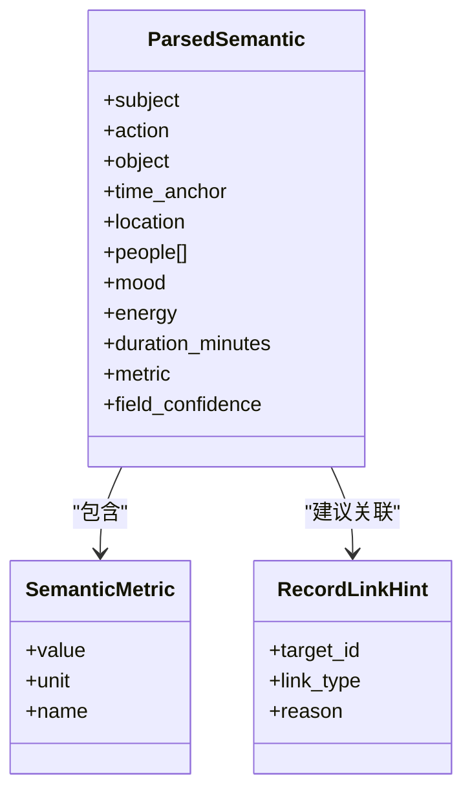
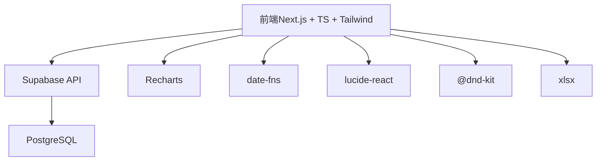

# 项目介绍

<cite>
**本文引用的文件**
- [README.md](file://README.md)
- [DATA_RULES.md](file://DATA_RULES.md)
- [package.json](file://package.json)
- [src/app/page.tsx](file://src/app/page.tsx)
- [src/app/layout.tsx](file://src/app/layout.tsx)
- [src/types/teto.ts](file://src/types/teto.ts)
- [src/types/semantic.ts](file://src/types/semantic.ts)
- [docs/00-总控/TETO 项目总计划书（终极总纲版／Ultimate Final）.md](file://docs/00-总控/TETO 项目总计划书（终极总纲版／Ultimate Final）.md)
- [docs/01-生效版本/TETO 1.3/《TETO 1.3 构思总纲》.md](file://docs/01-生效版本/TETO 1.3/《TETO 1.3 构思总纲》.md)
- [docs/01-生效版本/TETO 1.4/TETO 1.4 开发规则.md](file://docs/01-生效版本/TETO 1.4/TETO 1.4 开发规则.md)
</cite>

## 目录
1. [引言](#引言)
2. [项目结构](#项目结构)
3. [核心组件](#核心组件)
4. [架构总览](#架构总览)
5. [详细组件分析](#详细组件分析)
6. [依赖分析](#依赖分析)
7. [性能考量](#性能考量)
8. [故障排查指南](#故障排查指南)
9. [结论](#结论)
10. [附录](#附录)

## 引言
TETO 是一个通过“每日坚持记录、量化个人时间与行为、跟踪任务与项目进度，并结合日记复盘与自然语言分析来预测未来结果、能力发展和长期走向”的个人成长与管理系统。它不是简单的待办工具，而是以“记录—事项—洞察”为核心骨架，逐步形成“连续人生现实”的理解系统。

- 为什么需要这样一个工具
  - 现实世界每天发生的事情是混合且复杂的，传统“任务打卡”式的记录难以承载真实的工作流与复盘需求。
  - 仅靠记忆与模糊感受，无法形成可验证的趋势与预测，导致长期路径偏移却不得知。
  - 需要一个既能承接“具体发生”，又能组织“长期主题”，还能表达“时间段现实”的系统，帮助用户建立良好的记录习惯、提升自我认知能力、优化时间管理。

- 核心使命与愿景
  - 使命：帮助用户把“每天做了什么”转化为“每天如何分配时间、如何推动目标、如何预测未来”。
  - 愿景：成为能对个人行为、时间、任务、项目、复盘、知识、能力、财务与长期发展路径进行持续记录、结构分析、结果预测与策略优化的系统平台。

- 目标用户与使用场景
  - 第一目标用户：你自己（项目第一原则）。
  - 第二目标用户：希望做长期自我量化、管理学习与项目、通过记录预测未来、把笔记、复盘、任务与项目打通的人群。
  - 优先使用场景：学习成长 > 工作管理 > 职业发展 > 生活管理。

- 解决的核心痛点
  - 记录不自然：记录入口过于僵化，无法贴近日常工作流。
  - 规则不透明：目标、比较口径、类型、统计参与规则分散，导致展示口径漂移。
  - 数据链路不透明：系统不可控，不知道“数据在哪里填、规则在哪里改、结果从哪里来”。
  - 无法承接历史：过去的数据与现在割裂，缺乏统一骨架。

- 业务价值与社会意义
  - 业务价值：通过“记录—事项—洞察”的真实闭环，帮助用户形成可持续使用的个人现实系统，提升长期效率与决策质量。
  - 社会意义：推动“个人量化”从“工具化”走向“系统化”，帮助更多人用数据驱动自我进化。

- 差异化优势
  - 以“记录”为第一入口，强调“先记录，再组织，再理解”。
  - 明确区分“记录”“事项”“阶段”，阶段必须隶属于事项，历史导入必须接入同一骨架。
  - 强调“连续性优先、轻输入优先、人可理解优先”，避免复杂 AI 与过度抽象。

**章节来源**
- [docs/00-总控/TETO 项目总计划书（终极总纲版／Ultimate Final）.md:1-120](file://docs/00-总控/TETO 项目总计划书（终极总纲版／Ultimate Final）.md#L1-L120)
- [docs/00-总控/TETO 项目总计划书（终极总纲版／Ultimate Final）.md:276-350](file://docs/00-总控/TETO 项目总计划书（终极总纲版／Ultimate Final）.md#L276-L350)
- [docs/01-生效版本/TETO 1.4/TETO 1.4 开发规则.md:31-76](file://docs/01-生效版本/TETO 1.4/TETO 1.4 开发规则.md#L31-L76)
- [docs/01-生效版本/TETO 1.4/TETO 1.4 开发规则.md:120-141](file://docs/01-生效版本/TETO 1.4/TETO 1.4 开发规则.md#L120-L141)
- [docs/01-生效版本/TETO 1.4/TETO 1.4 开发规则.md:508-573](file://docs/01-生效版本/TETO 1.4/TETO 1.4 开发规则.md#L508-L573)

## 项目结构
TETO 采用 Next.js App Router 的现代前端架构，配合 Supabase 提供认证与数据库服务。项目分为应用层、类型与接口层、文档与规则层，以及 SQL 初始化与升级脚本。

**图表来源**
- [src/app/layout.tsx:1-13](file://src/app/layout.tsx#L1-L13)
- [src/app/page.tsx:1-5](file://src/app/page.tsx#L1-L5)
- [src/types/teto.ts:1-516](file://src/types/teto.ts#L1-L516)
- [src/types/semantic.ts:1-66](file://src/types/semantic.ts#L1-L66)
- [DATA_RULES.md:1-174](file://DATA_RULES.md#L1-L174)
- [docs/00-总控/TETO 项目总计划书（终极总纲版／Ultimate Final）.md:1-120](file://docs/00-总控/TETO 项目总计划书（终极总纲版／Ultimate Final）.md#L1-L120)
- [docs/01-生效版本/TETO 1.3/《TETO 1.3 构思总纲》.md:1-210](file://docs/01-生效版本/TETO 1.3/《TETO 1.3 构思总纲》.md#L1-L210)
- [docs/01-生效版本/TETO 1.4/TETO 1.4 开发规则.md:1-800](file://docs/01-生效版本/TETO 1.4/TETO 1.4 开发规则.md#L1-L800)
- [package.json:1-44](file://package.json#L1-L44)

**章节来源**
- [README.md:1-126](file://README.md#L1-L126)
- [package.json:1-44](file://package.json#L1-L44)

## 核心组件
- 记录（Record）
  - 描述某天某次真实发生的现实内容，是系统第一入口。
  - 支持多种字段：内容、类型、状态、情绪、能量、结果、备注、关联事项/阶段/目标、度量指标、持续时间、生命周期状态等。
  - 支持“原始输入”与“语义解析”字段，便于自然语言输入与结构化融合。

- 事项（Item）
  - 长期主题容器，用于承接用户在现实生活中长期面对、投入、处理、发展的主题。
  - 支持状态、颜色、图标、置顶、起止时间、所属文件夹等属性。

- 阶段（Phase）
  - 某个事项在某段时间里的持续现实概括，必须隶属于事项，不允许独立存在。
  - 支持起止日期、状态、历史标记、排序等。

- 目标（Goal）
  - 与事项/阶段绑定的目标，支持布尔型与数值型两类度量，提供日均目标、起算日、截止日、当前值、累计值、完成率等量化指标。

- 洞察（Insights）
  - 基于记录、事项、阶段与时间范围的结构化理解，提供记录概览、事项概览、阶段洞察与目标洞察等。

- 语义解析（ParsedSemantic）
  - 将自然语言输入解析为主谓宾、时间锚点、地点、人物、情绪、能量、方式、量化指标等，支持记录之间的微关联建议与置信度分级。

**章节来源**
- [src/types/teto.ts:28-74](file://src/types/teto.ts#L28-L74)
- [src/types/teto.ts:76-94](file://src/types/teto.ts#L76-L94)
- [src/types/teto.ts:337-354](file://src/types/teto.ts#L337-L354)
- [src/types/teto.ts:316-335](file://src/types/teto.ts#L316-L335)
- [src/types/teto.ts:275-299](file://src/types/teto.ts#L275-L299)
- [src/types/semantic.ts:17-66](file://src/types/semantic.ts#L17-L66)

## 架构总览
TETO 的系统本质是“面向个人连续人生现实的现实系统”。其核心链路为：记录现实 → 归入事项 → 形成或补录阶段 → 回看长期变化 → 生成洞察。

**图表来源**
- [docs/01-生效版本/TETO 1.4/TETO 1.4 开发规则.md:358-383](file://docs/01-生效版本/TETO 1.4/TETO 1.4 开发规则.md#L358-L383)
- [src/types/teto.ts:28-74](file://src/types/teto.ts#L28-L74)
- [src/types/teto.ts:76-94](file://src/types/teto.ts#L76-L94)
- [src/types/teto.ts:316-354](file://src/types/teto.ts#L316-L354)
- [src/types/teto.ts:275-299](file://src/types/teto.ts#L275-L299)

## 详细组件分析

### 记录与事项：从“具体发生”到“长期主题”
- 记录页职责
  - 快速输入当下现实、浏览今天与最近的记录流、编辑记录、基础筛选、关联事项、提供从记录进入事项的入口。
  - 保持“具体发生”本位，不把阶段与记录混为一谈。
- 事项页职责
  - 展示事项基本信息、关联记录、阶段列表，支持新建/编辑阶段，展示近期与历史变化，承接长期回看。
  - 事项页必须成为“长期主题容器”，而非简单列表页。

**图表来源**
- [docs/01-生效版本/TETO 1.4/TETO 1.4 开发规则.md:385-485](file://docs/01-生效版本/TETO 1.4/TETO 1.4 开发规则.md#L385-L485)
- [src/types/teto.ts:28-74](file://src/types/teto.ts#L28-L74)
- [src/types/teto.ts:76-94](file://src/types/teto.ts#L76-L94)

**章节来源**
- [docs/01-生效版本/TETO 1.4/TETO 1.4 开发规则.md:385-485](file://docs/01-生效版本/TETO 1.4/TETO 1.4 开发规则.md#L385-L485)

### 阶段与历史导入：从“时间段现实”到“连续人生”
- 阶段定义
  - 阶段是某个事项在某段时间里的持续现实概括，必须隶属于事项，不允许独立存在。
- 历史导入
  - 历史进入系统的两条主路径：历史具体记录（导入记录）、历史阶段补录（补录阶段）。
  - 历史导入后必须在事项页统一回看，且必须接入同一骨架，不另起系统。

**图表来源**
- [docs/01-生效版本/TETO 1.4/TETO 1.4 开发规则.md:302-356](file://docs/01-生效版本/TETO 1.4/TETO 1.4 开发规则.md#L302-L356)
- [src/types/teto.ts:337-354](file://src/types/teto.ts#L337-L354)

**章节来源**
- [docs/01-生效版本/TETO 1.4/TETO 1.4 开发规则.md:302-356](file://docs/01-生效版本/TETO 1.4/TETO 1.4 开发规则.md#L302-L356)

### 洞察：从“数据分布”到“现实理解”
- 洞察页职责
  - 看记录分布、看事项活跃情况、看阶段变化、看近期与历史的衔接，帮助用户理解自己的现实结构。
  - 洞察不追求炫目可视化，不取代事项页，不成为复杂 AI 解释系统。
- 数据理解顺序
  - 先记录，再事项，再阶段，再洞察；先具体发生，再长期主题，再时间段概括，再整体理解。

**图表来源**
- [docs/01-生效版本/TETO 1.4/TETO 1.4 开发规则.md:458-485](file://docs/01-生效版本/TETO 1.4/TETO 1.4 开发规则.md#L458-L485)
- [docs/01-生效版本/TETO 1.4/TETO 1.4 开发规则.md:690-706](file://docs/01-生效版本/TETO 1.4/TETO 1.4 开发规则.md#L690-L706)
- [src/types/teto.ts:275-299](file://src/types/teto.ts#L275-L299)

**章节来源**
- [docs/01-生效版本/TETO 1.4/TETO 1.4 开发规则.md:458-485](file://docs/01-生效版本/TETO 1.4/TETO 1.4 开发规则.md#L458-L485)
- [docs/01-生效版本/TETO 1.4/TETO 1.4 开发规则.md:690-706](file://docs/01-生效版本/TETO 1.4/TETO 1.4 开发规则.md#L690-L706)

### 语义解析与自然语言输入
- 语义解析（ParsedSemantic）
  - 支持主谓宾、时间锚点、地点、人物、情绪、能量、方式、量化指标等字段抽取。
  - 提供记录之间的微关联建议与置信度分级，便于后续 AI 协作与自动结构化。
- 自然语言输入
  - 支持日记/复盘输入，自动提取时间片段、任务与项目推进，与结构化记录叠加、对照与融合。

**图表来源**
- [src/types/semantic.ts:17-66](file://src/types/semantic.ts#L17-L66)

**章节来源**
- [src/types/semantic.ts:17-66](file://src/types/semantic.ts#L17-L66)

## 依赖分析
- 技术栈
  - 前端：Next.js 16.2.0（App Router）、TypeScript、Tailwind CSS、Recharts、date-fns。
  - 后端：Supabase（认证 + PostgreSQL）。
  - 其他：lucide-react、@dnd-kit、xlsx、node-fetch 等。
- 数据与规则
  - 数据规则文档明确了“真源”“页面职责”“统计口径”等，确保系统可追溯、可验证。
  - SQL 脚本提供初始化与升级路径，保证数据库结构与业务规则一致。

**图表来源**
- [package.json:15-32](file://package.json#L15-L32)
- [README.md:13-21](file://README.md#L13-L21)

**章节来源**
- [package.json:15-32](file://package.json#L15-L32)
- [README.md:13-21](file://README.md#L13-L21)
- [DATA_RULES.md:1-174](file://DATA_RULES.md#L1-L174)

## 性能考量
- 记录页与事项页的查询需遵循“先记录，再事项，再阶段”的数据理解顺序，避免反向依赖导致的复杂计算。
- 洞察页应聚焦“人可理解”的结构化理解，避免复杂公式与过度可视化带来的渲染压力。
- 历史导入流程应尽量减少跨层级关系校验的开销，优先保证“导入后可验证”。

[本节为通用指导，无需特定文件引用]

## 故障排查指南
- 记录无法保存或显示异常
  - 检查记录字段是否符合类型定义，尤其是生命周期状态、度量指标、持续时间等。
  - 确认 Supabase RLS 策略已启用，用户只能访问自己的数据。
- 事项与阶段关系错误
  - 确认阶段必须隶属于事项，且导入历史阶段时未独立存在。
- 洞察数据为空或不一致
  - 确认记录、事项、阶段数据已真实存在，且页面职责与数据理解顺序正确。
- 自然语言解析不准确
  - 检查语义解析字段是否正确填充，必要时降低置信度阈值并提示用户确认。

**章节来源**
- [src/types/teto.ts:28-74](file://src/types/teto.ts#L28-L74)
- [src/types/teto.ts:337-354](file://src/types/teto.ts#L337-L354)
- [src/types/semantic.ts:17-66](file://src/types/semantic.ts#L17-L66)
- [README.md:81-91](file://README.md#L81-L91)

## 结论
TETO 通过“记录—事项—洞察”的真实闭环，将“具体发生”“长期主题”“时间段现实”“历史连续性”有机整合，形成一个以“连续人生现实”为核心的个人成长系统。它不仅帮助用户建立良好的记录习惯、提升自我认知能力、优化时间管理，更提供了可验证、可追溯、可理解的长期价值。

[本节为总结性内容，无需特定文件引用]

## 附录
- 快速入门要点
  - 首页重定向至记录页，保持“记录”为第一入口。
  - 使用 Supabase 初始化数据库与认证，确保 RLS 策略启用。
  - 遵循“记录—事项—洞察”的数据理解顺序，避免结构过重与规则过死。
- 版本与规划
  - 1.3：建立“记录—规则—展示”三层逻辑，使系统“做顺”。
  - 1.4：补上“阶段”和“历史导入”，使系统“连续人生现实”成立。

**章节来源**
- [src/app/page.tsx:1-5](file://src/app/page.tsx#L1-L5)
- [README.md:22-53](file://README.md#L22-L53)
- [docs/01-生效版本/TETO 1.3/《TETO 1.3 构思总纲》.md:166-176](file://docs/01-生效版本/TETO 1.3/《TETO 1.3 构思总纲》.md#L166-L176)
- [docs/01-生效版本/TETO 1.4/TETO 1.4 开发规则.md:781-787](file://docs/01-生效版本/TETO 1.4/TETO 1.4 开发规则.md#L781-L787)