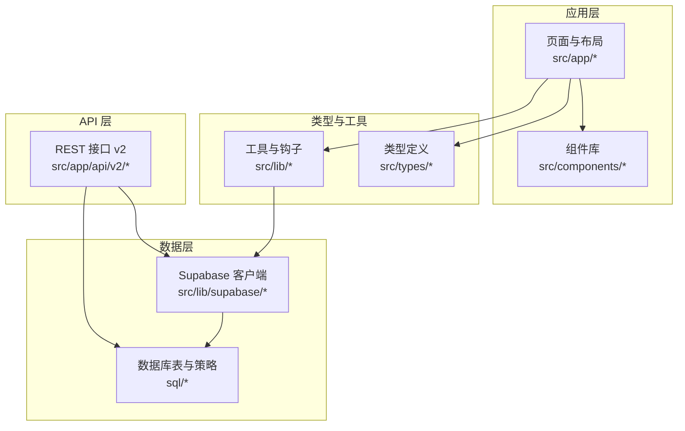
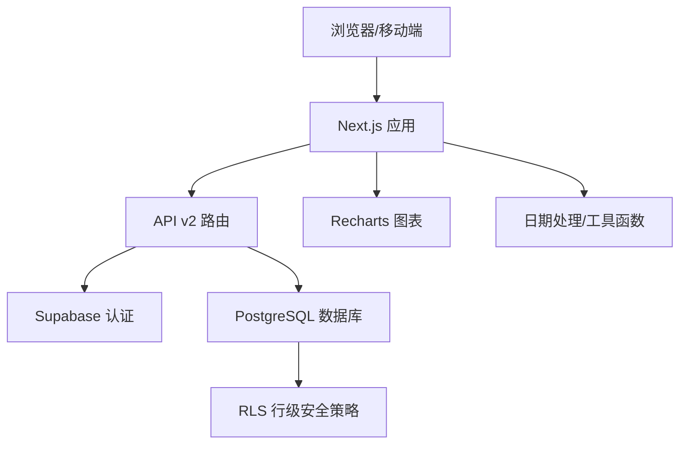
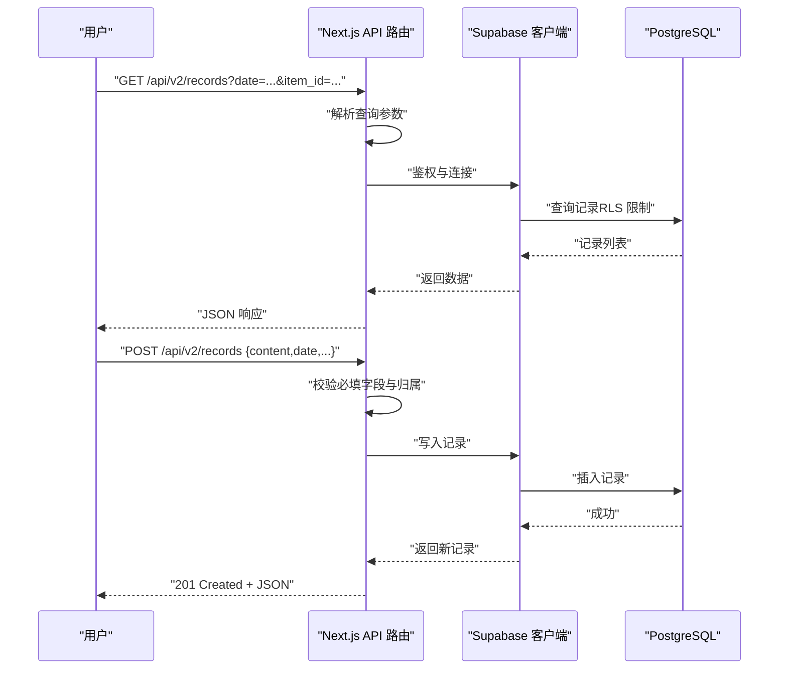
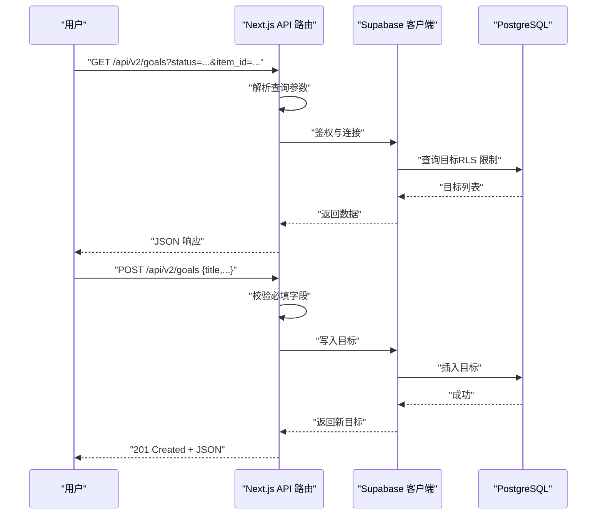
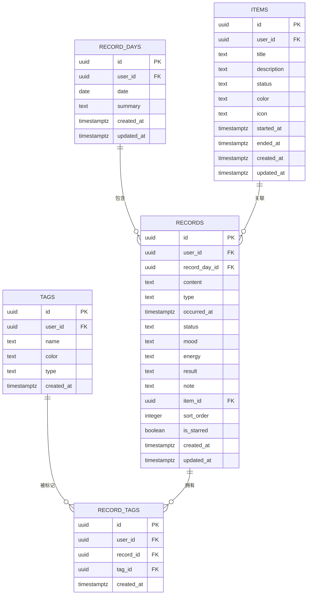
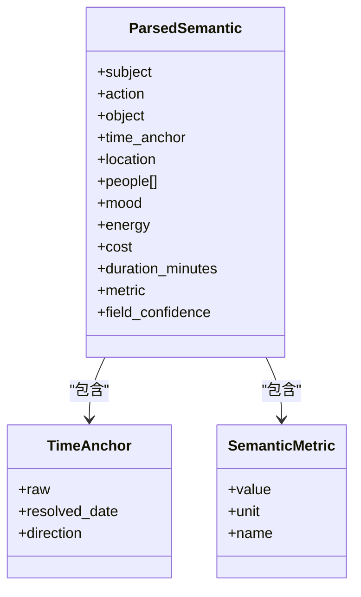
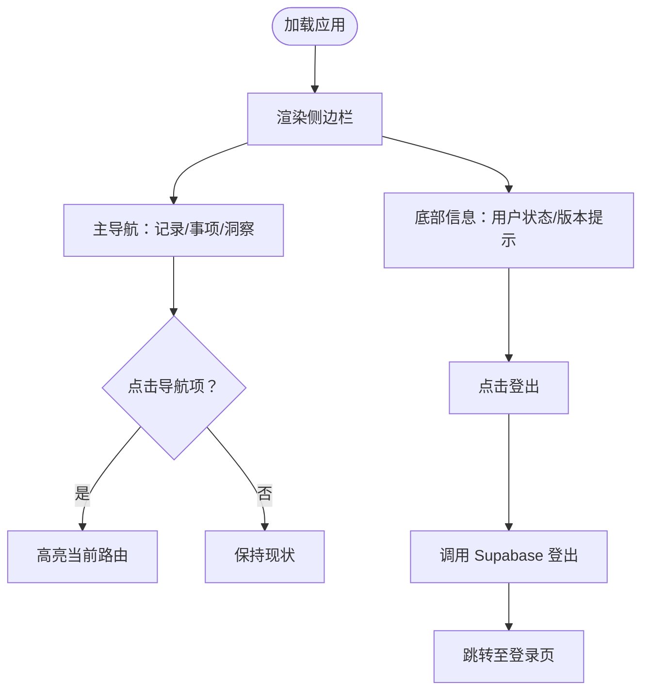
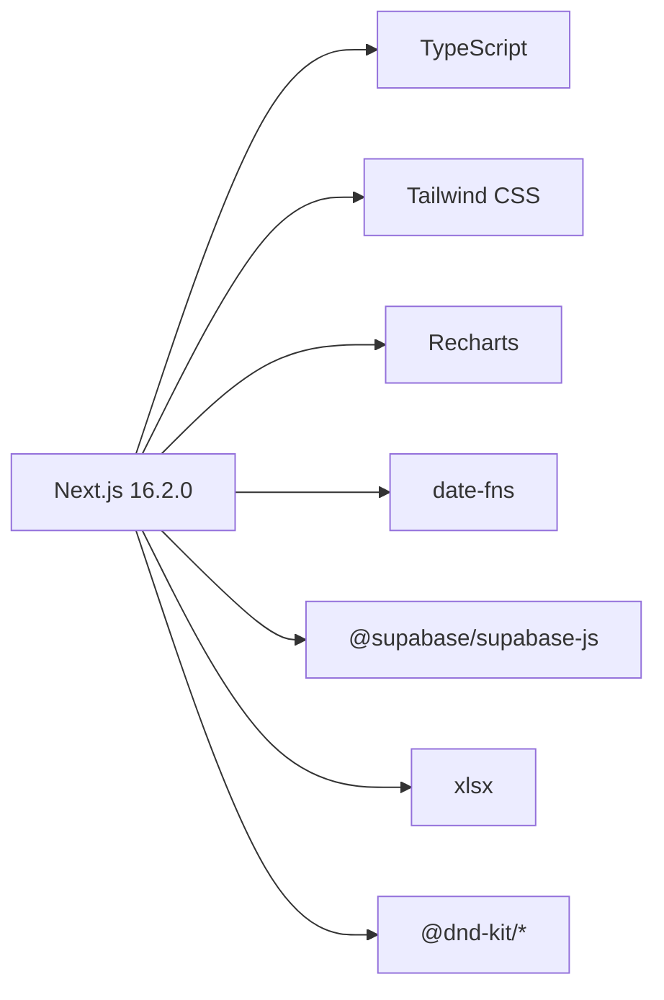

# 项目概述

<cite>
**本文引用的文件**
- [README.md](file://README.md)
- [package.json](file://package.json)
- [src/app/layout.tsx](file://src/app/layout.tsx)
- [src/app/page.tsx](file://src/app/page.tsx)
- [src/lib/supabase/client.ts](file://src/lib/supabase/client.ts)
- [src/components/layout/app-sidebar.tsx](file://src/components/layout/app-sidebar.tsx)
- [src/types/teto.ts](file://src/types/teto.ts)
- [src/types/semantic.ts](file://src/types/semantic.ts)
- [src/app/api/v2/records/route.ts](file://src/app/api/v2/records/route.ts)
- [src/app/api/v2/goals/route.ts](file://src/app/api/v2/goals/route.ts)
- [DATA_RULES.md](file://DATA_RULES.md)
- [sql/001_teto_1_3_records_model.sql](file://sql/001_teto_1_3_records_model.sql)
</cite>

## 目录
1. [简介](#简介)
2. [项目结构](#项目结构)
3. [核心组件](#核心组件)
4. [架构总览](#架构总览)
5. [详细组件分析](#详细组件分析)
6. [依赖分析](#依赖分析)
7. [性能考虑](#性能考虑)
8. [故障排查指南](#故障排查指南)
9. [结论](#结论)
10. [附录](#附录)

## 简介
TETO 是一个面向个人效率提升的记录与分析系统，帮助用户：
- 记录每日行为与事件，支持多种记录类型与语义解析
- 管理长期目标与阶段性计划，形成“目标-阶段-事项”的结构化路径
- 进行结构化复盘，沉淀经验与改进点
- 通过可视化洞察，获得趋势与分布的统计反馈

系统采用现代全栈方案：前端使用 Next.js 16.2.0 + TypeScript + Tailwind CSS，后端通过 Supabase 提供认证与数据库服务，并以 Recharts 展示统计图表。项目强调“数据真源”与“可解释的统计”，避免重复存储与二次数据源。

## 项目结构
项目采用 Next.js App Router 的目录组织方式，核心模块包括：
- 应用层：页面路由、布局与全局样式
- 组件层：通用 UI 与布局组件（侧边栏、移动端顶栏等）
- 类型层：统一的数据模型与 API 类型定义
- 服务层：数据库访问、认证与 Supabase 客户端封装
- API 层：v2 REST 接口，提供记录、目标、洞察等能力
- 数据层：PostgreSQL 表结构与 RLS 策略，保证用户数据隔离

**图示来源**
- [src/app/layout.tsx:1-13](file://src/app/layout.tsx#L1-L13)
- [src/components/layout/app-sidebar.tsx:1-147](file://src/components/layout/app-sidebar.tsx#L1-L147)
- [src/lib/supabase/client.ts:1-9](file://src/lib/supabase/client.ts#L1-L9)
- [src/app/api/v2/records/route.ts:1-86](file://src/app/api/v2/records/route.ts#L1-L86)
- [src/app/api/v2/goals/route.ts:1-49](file://src/app/api/v2/goals/route.ts#L1-L49)
- [sql/001_teto_1_3_records_model.sql:1-300](file://sql/001_teto_1_3_records_model.sql#L1-L300)

**章节来源**
- [src/app/layout.tsx:1-13](file://src/app/layout.tsx#L1-L13)
- [src/app/page.tsx:1-5](file://src/app/page.tsx#L1-L5)

## 核心组件
- 记录系统：支持“发生/计划/想法/总结”等记录类型，具备情绪、能量、结果、备注等上下文字段，以及成本与时长等度量字段；记录可关联到事项与阶段，并支持批量与链接能力。
- 事项与阶段：以“阶段-目标-事项”为主线，支撑长期目标的分解与追踪。
- 语义解析：对自然语言输入进行结构化解析，提取主谓宾、时间锚点、地点、人物、量化指标等，辅助自动分类与关联建议。
- 统计洞察：提供 7/30 天趋势、类型与标签分布、事项活跃度与滞留度等指标，支持按日期范围筛选。
- 认证与数据隔离：基于 Supabase 的认证与 RLS，确保每条记录只属于当前登录用户。

**章节来源**
- [src/types/teto.ts:1-516](file://src/types/teto.ts#L1-L516)
- [src/types/semantic.ts:1-66](file://src/types/semantic.ts#L1-L66)
- [DATA_RULES.md:1-174](file://DATA_RULES.md#L1-L174)

## 架构总览
系统采用前后端分离的全栈架构：
- 前端：Next.js App Router 提供页面路由与 SSR/SSG 能力，Tailwind CSS 实现快速样式迭代，Recharts 用于统计图表渲染。
- 后端：Supabase 提供认证、数据库与实时能力；API 层通过 Next.js API Routes 暴露 v2 REST 接口，统一鉴权与数据访问。
- 数据模型：围绕“记录日-记录-事项-阶段-目标-标签”建立核心实体，配合 RLS 与索引保障安全性与性能。

**图示来源**
- [README.md:13-21](file://README.md#L13-L21)
- [src/lib/supabase/client.ts:1-9](file://src/lib/supabase/client.ts#L1-L9)
- [src/app/api/v2/records/route.ts:1-86](file://src/app/api/v2/records/route.ts#L1-L86)
- [sql/001_teto_1_3_records_model.sql:19-300](file://sql/001_teto_1_3_records_model.sql#L19-L300)

## 详细组件分析

### 记录与事项 API 流程
记录与目标的增删改查通过 API v2 实现，流程如下：

**图示来源**
- [src/app/api/v2/records/route.ts:1-86](file://src/app/api/v2/records/route.ts#L1-L86)
- [src/lib/supabase/client.ts:1-9](file://src/lib/supabase/client.ts#L1-L9)
- [sql/001_teto_1_3_records_model.sql:66-85](file://sql/001_teto_1_3_records_model.sql#L66-L85)

**章节来源**
- [src/app/api/v2/records/route.ts:1-86](file://src/app/api/v2/records/route.ts#L1-L86)

### 目标管理 API 流程
目标的查询与创建遵循类似的鉴权与校验流程：

**图示来源**
- [src/app/api/v2/goals/route.ts:1-49](file://src/app/api/v2/goals/route.ts#L1-L49)
- [src/lib/supabase/client.ts:1-9](file://src/lib/supabase/client.ts#L1-L9)

**章节来源**
- [src/app/api/v2/goals/route.ts:1-49](file://src/app/api/v2/goals/route.ts#L1-L49)

### 数据模型与关系
核心实体围绕“记录日-记录-事项-阶段-目标-标签”展开，具备明确的约束与索引，确保数据一致性与查询性能。

**图示来源**
- [sql/001_teto_1_3_records_model.sql:18-109](file://sql/001_teto_1_3_records_model.sql#L18-L109)

**章节来源**
- [sql/001_teto_1_3_records_model.sql:1-300](file://sql/001_teto_1_3_records_model.sql#L1-L300)
- [src/types/teto.ts:28-121](file://src/types/teto.ts#L28-L121)

### 语义解析与记录类型
系统支持对自然语言输入进行结构化解析，提取主谓宾、时间锚点、地点、人物、量化指标等，辅助自动分类与关联建议。记录类型涵盖“发生/计划/想法/总结”等，便于区分不同性质的记录。

**图示来源**
- [src/types/semantic.ts:18-43](file://src/types/semantic.ts#L18-L43)

**章节来源**
- [src/types/semantic.ts:1-66](file://src/types/semantic.ts#L1-L66)
- [src/types/teto.ts:12-74](file://src/types/teto.ts#L12-L74)

### 侧边栏与导航
应用侧边栏提供统一的导航入口与登出能力，支持展开/收起，适配桌面与移动端场景。

**图示来源**
- [src/components/layout/app-sidebar.tsx:16-147](file://src/components/layout/app-sidebar.tsx#L16-L147)

**章节来源**
- [src/components/layout/app-sidebar.tsx:1-147](file://src/components/layout/app-sidebar.tsx#L1-L147)

## 依赖分析
- 前端框架与工具
  - Next.js 16.2.0：App Router 提供页面路由与 SSR/SSG
  - TypeScript：类型安全与开发体验
  - Tailwind CSS：实用优先的样式框架
  - Recharts：轻量级图表库
  - date-fns：日期处理
- 服务端与数据库
  - Supabase：认证与 PostgreSQL 数据库
  - xlsx：Excel 导入能力（用于历史数据导入）
- 交互与拖拽
  - @dnd-kit：拖拽排序能力

**图示来源**
- [package.json:15-42](file://package.json#L15-L42)

**章节来源**
- [package.json:1-44](file://package.json#L1-L44)
- [README.md:13-21](file://README.md#L13-L21)

## 性能考虑
- 数据库层面
  - 使用 RLS 保障数据隔离的同时，需关注查询条件与索引命中情况，避免全表扫描
  - 对常用过滤字段（如 user_id、occurred_at、item_id）建立索引，提升查询性能
- 前端层面
  - 利用 Next.js App Router 的并行数据流与缓存策略，减少重复请求
  - 图表组件按需渲染，避免一次性加载过多数据
- API 层面
  - 对大列表查询增加 limit 与分页控制，防止超大数据集返回
  - 对高频接口启用客户端缓存与去抖策略

[本节为通用指导，无需特定文件引用]

## 故障排查指南
- 认证相关
  - 若出现“请先登录”或“获取用户信息失败”，检查环境变量是否正确配置，以及 Supabase 回调地址设置
- 数据访问
  - 若记录/目标返回 404 或 401，请确认当前用户是否拥有对应资源的访问权限
- 数据库初始化
  - 请按顺序执行初始化 SQL 脚本，并确保 RLS 已启用
- 开发模式
  - 如需跳过登录验证，可在环境变量中开启开发模式并指定测试用户 ID

**章节来源**
- [src/app/api/v2/records/route.ts:35-41](file://src/app/api/v2/records/route.ts#L35-L41)
- [src/app/api/v2/goals/route.ts:21-27](file://src/app/api/v2/goals/route.ts#L21-L27)
- [README.md:54-90](file://README.md#L54-L90)

## 结论
TETO 通过清晰的数据真源与统一的 API 设计，为个人效率追踪提供了从“记录-事项-洞察”的闭环体验。其技术栈选择兼顾易用性与可扩展性，适合初学者快速上手，也为后续的功能演进（如阶段目标、量化引擎、导入能力等）预留了空间。

[本节为总结性内容，无需特定文件引用]

## 附录

### 技术栈概览与选择理由
- Next.js 16.2.0：现代化全栈框架，App Router 提供更好的路由与数据流控制
- TypeScript：强类型提升开发效率与可维护性
- Tailwind CSS：实用优先的样式系统，快速搭建界面
- Supabase：一体化认证与数据库服务，降低运维成本
- Recharts：专注图表的轻量库，易于集成与定制
- date-fns：体积小、按需引入的日期处理库

**章节来源**
- [README.md:13-21](file://README.md#L13-L21)
- [package.json:15-42](file://package.json#L15-L42)

### 数据规则与统计口径
- 数据真源：任务配置、今日记录为真源；统计分析基于真源统一计算
- 统计口径：支持日/周/月/累计统计，不同类型任务采用不同的聚合规则
- 不支持内容：时间点型任务、上限型任务、复杂情绪统计等

**章节来源**
- [DATA_RULES.md:1-174](file://DATA_RULES.md#L1-L174)

### 版本与演进
- 1.0：基础记录、事项与洞察能力
- 1.3：三页重构与记录模型升级
- 1.4：阶段与目标体系、记录类型收敛、状态中文化迁移、文件夹与度量字段等

**章节来源**
- [README.md:1-126](file://README.md#L1-L126)
- [sql/001_teto_1_3_records_model.sql:1-10](file://sql/001_teto_1_3_records_model.sql#L1-L10)