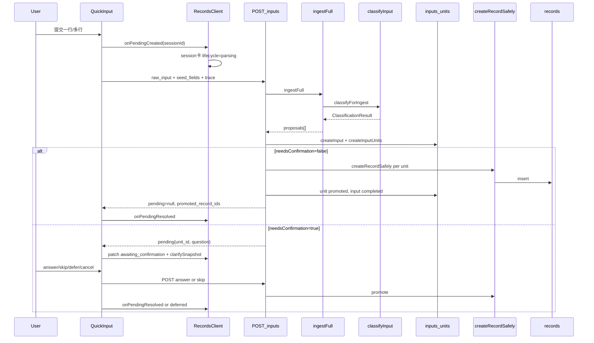

# 记录模块实现总结报告 — 撰写计划

## 交付物

- 新建 `[docs/01-生效版本/TETO 1.6/记录模块实现总结报告.md](docs/01-生效版本/TETO%201.6/记录模块实现总结报告.md)`
- 与现有 `[记录模块.md](docs/01-生效版本/TETO%201.6/记录模块.md)`（产品白话）、`[记录模块流程图.md](docs/01-生效版本/TETO%201.6/记录模块流程图.md)`（理想流程图）互补：**本报告以当前仓库代码为准**，标注实现与文档差异（若有）

## 报告结构（目录）

1. **范围与前提**
  - 主入口：记录页 `[RecordsClient.tsx](src/app/(dashboard)`/records/RecordsClient.tsx) + `[QuickInput.tsx](src/app/(dashboard)`/records/components/QuickInput.tsx)
  - 主 API：`POST /api/v2/inputs`、澄清 `answer` / `skip` / `cancel`、正式态 `records` CRUD
  - 开关：`[resolveIngestV2ForClient](src/lib/ingest/ingest-v2.ts)` — 开发/`NEXT_PUBLIC_INGEST_V2`/`feature_flags.ingest_v2`；关闭时 QuickInput **直接报错**，不走旧 `/api/v2/parse` 直建
  - 数据双态：`inputs` + `input_units`（输入态）→ `records`（正式态），类型见 `[src/types/inputs.ts](src/types/inputs.ts)`
2. **核心概念表**
  - `client_session_id` / 时间轴卡 `session:{uuid}` / `parsed_semantic._session_ui.lifecycle`
  - `Input.status`：`pending` | `clarifying` | `completed` | `cancelled` | …
  - `InputUnit.status`：`pending_clarify` | `ready` | `promoted` | `cancelled` | …
  - `PendingQuestion.clarify_class`：`compound_confirm` | `boundary_confirm` | `field_clarify`
  - `metadata.primary_unit_id`（`keep_single` 时选哪条 unit 晋升）
3. **端到端总览图**（mermaid sequence）

1. **分步详解**（每步两栏：用户可见 / 系统内部）

| 步骤                 | 用户可见                             | 系统内部                                                                                                                                                                                                                             |
| ------------------ | -------------------------------- | -------------------------------------------------------------------------------------------------------------------------------------------------------------------------------------------------------------------------------- |
| **S0 提交前**         | 芯片预览（本地 `parseNaturalInput`，非入库） | 仅 UI 状态；与 AI 清分无关                                                                                                                                                                                                                |
| **S1 点击发送**        | 输入框清空；时间轴出现「解析中」会话卡              | 每行 `crypto.randomUUID()` → `session:{id}`；`[handlePendingCreated](src/app/(dashboard)`/records/RecordsClient.tsx) 写入 `sessionStorage`                                                                                            |
| **S2 POST inputs** | 卡片仍显示解析中                         | `[inputs/route.ts](src/app/api/v2/inputs/route.ts)`：`withTrace` → `ingestFull` → `createInput`；写 `decision_logs`；`primary_unit_id` 写入 metadata                                                                                   |
| **S3 AI 清分**       | 无（后台）                            | `[classify-input.ts](src/lib/ai/classify-input.ts)`：DeepSeek `parseSemantic` → 规则 fallback → 事项匹配 → 复合句/歧义 → `ClarificationIssue[]`                                                                                              |
| **S4 映射提案**        | 无                                | `[pipeline.ts](src/lib/ingest/pipeline.ts)` + `[field-mapper.ts](src/lib/ingest/field-mapper.ts)` → `CreateRecordPayload`；`[clarification-planner.ts](src/lib/ingest/clarification-planner.ts)` 为每 unit 选最高优先级 `PendingQuestion` |
| **S5a 直过**         | 会话卡消失；时间轴出现正式记录                  | `needsConfirmation=false`：`[resolveTemporalFields](src/lib/utils/record-unit-mapper.ts)` + `[createRecordSafely](src/lib/domain/record-service.ts)`；多 unit 共享 `batch_id`；unit→`promoted`                                         |
| **S5b 需澄清**        | QuickInput 绿条澄清 UI；卡标「待确认」       | `input.status=clarifying`；响应 `pending`；前端 `[buildClarifyFromPostResponse](src/app/(dashboard)`/records/components/QuickInput.tsx)                                                                                                |
| **S6 答题**          | 按 `clarify_class` 四钮/二钮/字段题      | `[answer/route.ts](src/app/api/v2/inputs/[id]/answer/route.ts)`：合并 `proposed_fields`；`split`/`keep_single`/`cancel`/`defer`/`confirm` 分支                                                                                         |
| **S7 跳过**          | 「跳过此题」后可能直接入库                    | `[skip/route.ts](src/app/api/v2/inputs/[id]/skip/route.ts)`：缺字段仍 `createRecordSafely`，`review_status=unchecked`，`record_quality_tag=partial`                                                                                     |
| **S8 收起 defer**    | 卡标「已收起」；点卡可恢复澄清                  | `defer` **仅 API 返回**，不改 DB；前端 `lifecycle=deferred` + `sessionStorage` 快照                                                                                                                                                         |
| **S9 失败**          | 卡标「失败」+ 错误摘要                     | HTTP 4xx/5xx 或空响应 → `onPendingSessionPatch({ lifecycle: 'failed' })`                                                                                                                                                             |
| **S10 编辑已入库**      | 抽屉展示原文/时间只读块                     | `GET/PUT /api/v2/records/[id]`；可选 `explain`、`correct`；**不经过 inputs 主链**                                                                                                                                                          |

1. **澄清题型与后端分支**（对照实现，非仅 `_confirm`）

- **compound_confirm**（`split` / `keep_single` / `cancel` / `defer`）：`[clarification-planner.ts](src/lib/ingest/clarification-planner.ts)` `compound_uncertain`；`split` 时 `splitConfirmed` 批量 promote 所有 `ready` unit；`keep_single` 用 `metadata.primary_unit_id` 选 unit，其余 `cancelled`
- **boundary_confirm** / **low_confidence**：`confirm` 与 `rewrite`；`rewrite`/`cancel` 整 input 未 promote unit 全部 `cancelled`
- **field_clarify**：`item_id` / `metric:`* / `duration_minutes` 等；答完再 `createRecordSafely`

1. **九条验收场景**（从 `[.cursor/plans/ingest-v2-quickinput-consolidation.md](.cursor/plans/ingest-v2-quickinput-consolidation.md)` 摘录为报告附录，每场景：输入示例 → 期望 UI → 期望 DB/API 状态）
2. **观测与排错**
  - `trace_id` 贯穿请求头；`trace_summaries` / `decision_logs` / Debug 页 `[debug/trace](src/app/(dashboard)`/debug/trace/page.tsx)
  - 记录 explain：`[GET /api/v2/records/:id/explain](src/app/api/v2/records/[id]/explain/route.ts)`
3. **与旧路径/其他入口的差异**
  - QuickInput：**仅** `/api/v2/inputs`（V2 关闭则阻断）
  - `POST /api/v2/parse`：仍存在于 `[parse/route.ts](src/app/api/v2/parse/route.ts)`，供编辑抽屉「重新解析」等，**不是** QuickInput 主链
  - `HistoryImport` / `inputs/import`：lightweight ingest（报告内简要一句）
4. **关键文件索引**（表格，便于维护）

## 撰写原则

- 中文叙述；技术名词保留英文（Input、Unit、trace_id）
- 每个步骤写清：**前端状态机**（`SessionLifecycle`）与 **后端状态机**（`Input`/`InputUnit`）的对应关系
- 不编造未实现能力；与 `[记录模块.md](docs/01-生效版本/TETO%201.6/记录模块.md)` 冲突处以代码为准并脚注说明

## 实施步骤（Agent 模式确认后执行）

1. 按上述目录撰写完整 Markdown（约 4000–6000 字，含 2–3 张 mermaid）
2. 交叉核对：`inputs/route.ts`、`answer/route.ts`、`QuickInput.runIngestJob`、`RecordsClient` 会话卡逻辑
3. 不修改 `sql/`；不跑全量测试（纯文档）

